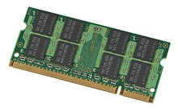

# WEEK 2 NOTES

 

## The Modern Computer

* **Ports**: Connection points that we can connect devices to that extend the functionality of our computer.

  

* **CPU (Central Processing Unit)**: The brain of our computer, it does all the calculations and data processing.

  

* **RAM (Random Access Memory)**: Our computer's short-term memory.

  

* **Hard drive**: Holds all of our data, which includes all of our music, pictures, applications.
* **Motherboard**: The body of circulatory system of the computer that connects all the pieces together.

  

* **Programs**: Instructions that tell the computer what to do.
* There are 3 different cache levels in a CPU: L1, L2, and L3.
* **L1, L2, L3** L1 is the smallest and fastest cache.

  

* **Clock speed**: The maximum number of clock cycles that it can handle in a certain time period.

 

## Components
* **Computer Memory**

  

* When you select your CPU, you'll need to make sure it's **compatible** with your **motherboard** -- the circuit board that connects all the components together.
* There are lots of types of RAM, and the one that's commonly found in computers is **DRAM**, or dynamic random-access memory.
* There are also different types of memory sticks that **DRAM** chips can be put on. The more modern **DIMM** sticks, which usually stands for **Dual Inline Memory Module**, have different sizes of pins on them.
* In today's system, we use another type of RAM, called **double data rate SDRAM** or **DDR SDRAM** for short.
* **Peripherals**: External devices we connect to our computer, like a mouse, keyboard, and monitor.
* **Expansion slots**: Give us the ability to increase the functionality of our computer
* As general rule, be sure to use the proper voltage for your electronics.
* **Wattage**: The amount of volts and amps that a device needs.
* You can power most basic desktops with a 500W power supply.
* **System on a Chip (SoC)**: Packs the CPU, RAM, and sometimes even the storage onto a single chip.
* **Charge cycle**: One full charge and discharge of a battery.
* **Peripherals**: Anything that you connect to your computer externally that adds functionality.
* **Universal Serial Bus (USB)**: The most popular connections for our gadgets.
* **Types:**
    * USB A—’normal’ USB interface
    * Mini USB—for some cameras
    * Micro USB—for some phones
    * USB C—New interface model that plugs in in either direction.

* **Speed:**
    * USB 2.0 - Transfer speeds of 480 Mb/s.
    * USB 3.0 - Transfer speeds of 5 Gb/s.
    * USB 3.1 - Transfer speeds of 10 Gb/s.

MB is **megabyte** or **unit of data storage**, while Mb/s is a **megabit per second**, which is a **unit of data transfer rate**.
As **1 byte** is **8 bits**, so to transfer a 1MB file in a second, needs an 8 Mb/s connection speed.

 

* **Heat sink**: Used to dissipate heat from a CPU.
* **Thermal paste** : Used to better connect our CPU and heat sink.
* **Factory reset**: Removes all data, apps, and costumizations from the device.

**Overclocking** is the process of forcing your computer to run faster than it's intended to go. You can overclock both your CPU and graphics card, which can help you run advanced programs on an older PC. Although overclocking is largely safe, it's possible to run into overheating and crashing issues.

**Unified Extensible Firmware Interface** (**UEFI**) to support the handoff of system control from the SoC firmware boot loader to the OS. The UEFI environment is a minimal boot OS upon which devices are booted and the Windows 10 OS runs.
