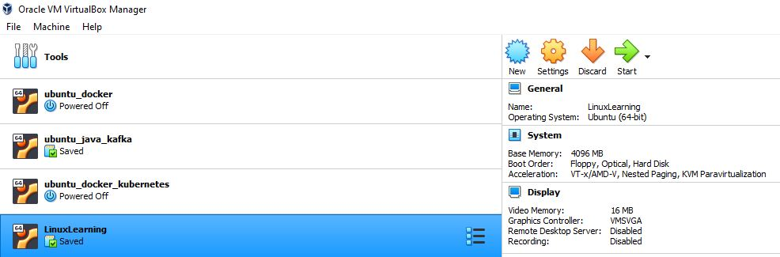

# WEEK 3 NOTES

 

## What's an Operating System?

* **Remote connection**: Allows to connect/manage multiple machines from anywhere in the world. To rum remote connection in windows run mstsc:

  

* **Secure shell (SSH)**: A protocol implemented by other programs to securely access one computer from another. The standard TCP port for SSH is **22**
* **Virtual private network (VPN)**: xtends a private network across a public network and enables users to send and receive data across shared or public networks as if their computing devices were directly connected to the private network.
* **PuTTY**: A free, open source software that you can use to make remote connections through several network protocols, including SSH.
* **Resilient File System** (**ReFS**), codenamed "Protogon", is a Microsoft proprietary file system introduced with Windows Server 2012 with the intent of becoming the "next generation" file system after NTFS.

  

* An **operating system** (**OS**) is system software that manages computer hardware, software resources, and provides common services for computer programs.
* Our kernel optimizes **memory usage** and makes sure our applications have enough memory to run
* **I/O management**: Anything that can give us input, or that we can use for output of data.
* We write data to our hard drive in the form of data blocks.
* **Block storage**: Block storage, sometimes referred to as block-level storage, is a technology that is used to store data files on Storage Area Networks (SANs) or cloud-based storage environments.
* **File extension**: is a suffix at the end of a computer file that tells us what type of file it is in certain operating system.
* **Process**: A program that's executing, like our internet browser or text editor.
* **Program**: An application that we can run, like MS Word.
* **Time slice**: The period of time for which a process is allowed to run uninterrupted in a pre-emptive multitasking operating system.
* **Kernel**: The kernel is a computer program at the core of a computer's operating system and has complete control over everything in the system.
* **Virtual memory**: Virtual Memory is a storage allocation scheme in which secondary memory can be addressed as though it were part of the main memory.
* **I/O devices**: Devices that perform input and output.

  

* When you're troubleshooting or solving a problem with a **slow machine**, it's usually some sort of **hardware resource deficiency**.
* **Shell**: A program that interprets text commands and send them to the OS to execute.
* **Logs**: Files that record system events on our computer, just like a system's diary.
* **BIOS/UEFI**: A low-level software that initializes our computer's hardware to makesure everything is good to go.
* **Bootloader**: A boot loader, also called a boot manager, is a small program that places the operating system (OS) of a computer into memory.

 

## Installing an Operationg System

* The **operating systems** in use by an organization have a lot to do with the **applications** and **systems** that they need to run.
* Modern operating systems do a pretty good job of supporting common hardware.
* As an IT Support Specialist, you'll **install** operating system **many times**, so using **one** single disk **won't** be time **efficient** or **scalable**.
* **Virtual machine (VM)**: Just a copy of a real machine. Via Oracle VM we can install Unix on Win. 

  

## Chrome OS

* Chrome OS is a Gentoo Linux-based operating system designed by Google. It is derived from the free software Chromium OS and uses the Google Chrome web browser as its principal user interface. Unlike Chromium OS, Chrome OS is proprietary software.
* Unlike other operating systems, Chrome OS has one main purpose: to be secure and simple way to user to interact with the web.
* Chrome OS machines are iterchangeable because most data is stored in the cloud, not locally.
* Chrome OS user doesn't need to worry about problems or hacks inthe system because it's designed to stay up and running.

  

