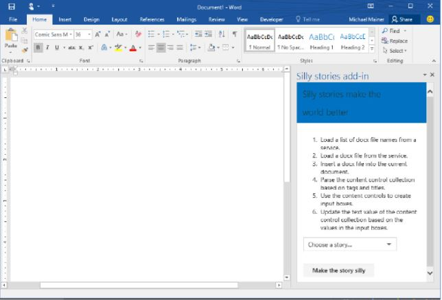
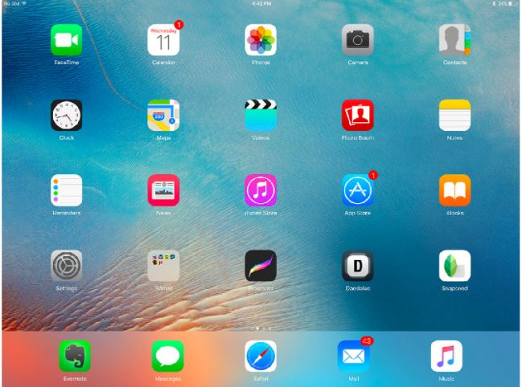

# What is an Operating System?

 

## Question 1

*What are the two main parts that make up an operating system?*

* Kernel and Packages
* Windows and Mac
* Users and Software
* **Kernel and Userspace**

 

## Question 2

*What are the main components of file management? Check all that apply.*

* **File data**
* NTFS
* **File system**
* **Metadata**

 

## Question 3

*Which of these are true? Check all that apply.*

* A program is initially stored in RAM. A process is initially stored in the hard drive.
* **You can have many processes running for one program.**
* A program is a process that is executed. A process is a program that we can run.
* **A program is an application that we can run. A process is a program that is executed.**

 

## Question 4

*What are the characteristics of virtual memory? Check all that apply.*

* **Combination of RAM and hard drive space.**
* **Allows our computer to have more memory than it physically has.**
* **Stores pages that are currently not in use by physical memory.**
* It is where we store pages that are being executed

 

## Question 5

*Which of these is a GUI? Check all that apply.*

  

  

> These are all examples of a GUI.

 

## Question 6

*Which of these are considered I/O devices? Check all that apply.*

* Hard disk drives
* **Web cams**
* **Monitors**
* **Speakers**

 

## Question 7

*What is the last step in booting a computer?*

* Load up drivers.
* Execute the bootloader. 
* Perform a POST.
* **User space is launched.**