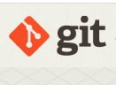

# WEEK 5 NOTES

 

## Introduction to Software

* **Software**: Instructions that tell a computer what to do.
* If **hardware** is the physical stuff that you can pick up and hold.
* **Coding**: The coding is the process of transforming the design of a system into a computer language format.
* **Scripting**: Coding in a scripting language.
* **Scripts**: Mainly used to perform a single or limited range task.
* **Programming**: Coding in a programming language.
* **Programming languages**: Special languages that software developers use to write instructions for computers to execute.
* **Copyright** is a type of intellectual property that gives its owner the exclusive right to make copies of a creative work, usually for a limited time.
* **Application software**: software that performs specific tasks for an end-user.
* **System software**: software designed to provide a platform for other software. Examples of system software include operating systems (OS) like macOS, Linux, Android and Microsoft Windows, computational science software, game engines, search engines, industrial automation, and software as a service applications.
* **Firmware**: Software that's permanently store on a computer component.
* **Assembly language**: Allowed computer scientiests to use human readable instructions, assembled into code, that the machines could understand.
* **Compiled programming languages**: Uses human readable instructions, then send them through a compiler.
* The **script** is run by an interpreter, which interprets the code into CPU instructions just in time to run them.

## Interacting with Software

* **Software bug**: An error in software that cause unexpected results.
* **Git**: A version control system that helps keep track of changes made to files and directories.

  

* **.exe**: A file extension found in Windows for an executable file.
* **Automation**: Makes processes work automatically.
