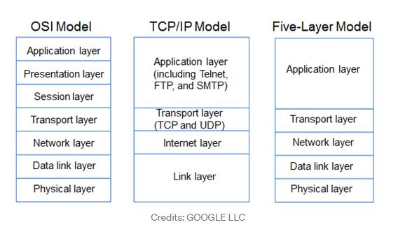
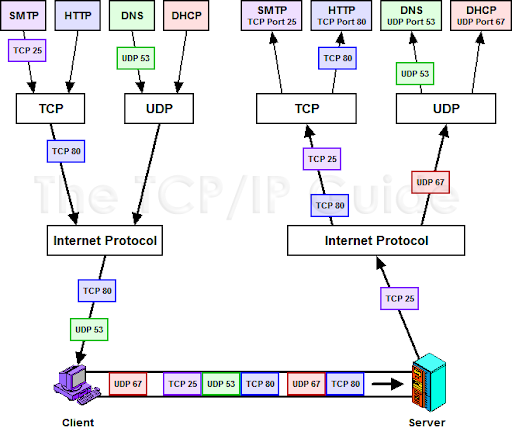
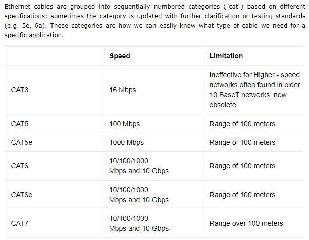
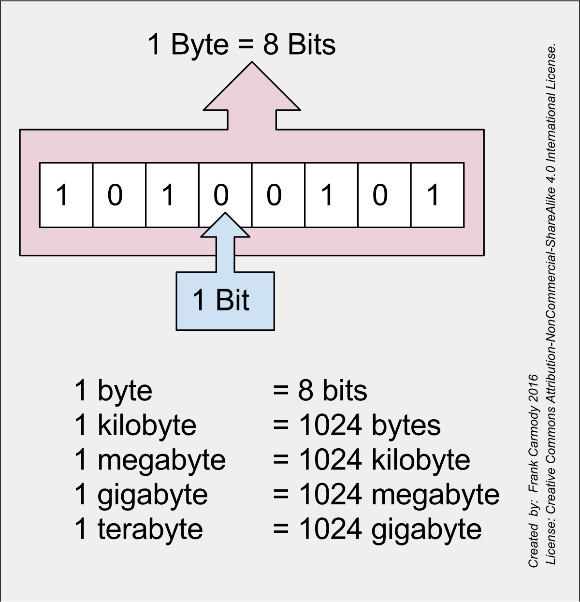
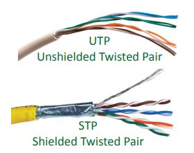
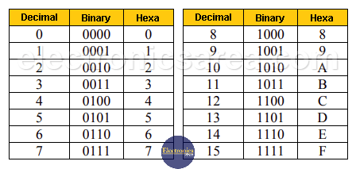
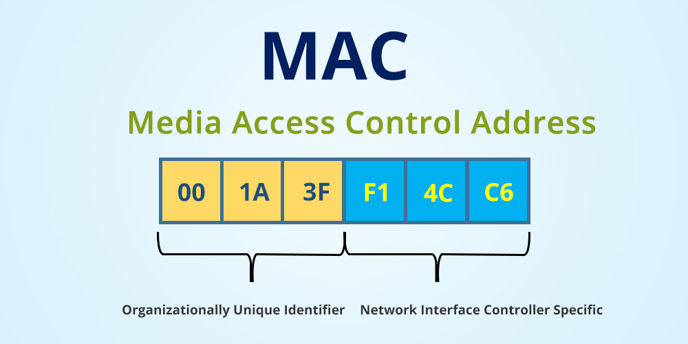
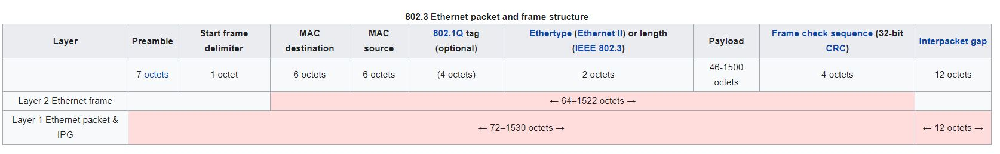
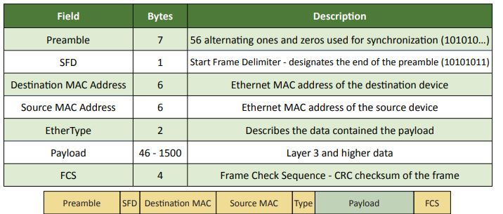

# WEEK 1 NOTES

 

## Layer Models:

  

## The TCP/IP Five-Layer Network Model

* Five-layer model for networking:
  * Physical layer.
  * Data link layer.
  * Network layer.
  * Transport layer.
  * Application layer.

 

**Physical layer**: Represent the physical devices that interconnect computers, is about cabling, connectors and sending signals.
**Data link layer**: Responsible for defining a common way of interpreting these signals so network devices can communicate. **Ethernet** is an example of a transport layer protocol.
The **Ethernet** is the most popular network topology in the world. It's define a protocol responsible for getting data to nodes on the same network or link. The **802.3** committee defines wired network standards that share the same basic frame type and network access method. Each of these variants is under the IEEE 802.3 standard, each with its own identifier. 
**Network layer**: Allows different networks to communicate with each other through device known as **routers**. 
**Data link layer** is responsible for getting data across a single link
**Network layer** is responsible for getting data delivered across a collection of networks. 
**Transport layer**: Sorts out which client and server programs are supposed to get that data. 
   * **TCP**
   * **IP** 
   * **UDP**

  

  

 

## The Basics of Networking Devices

**Cables**: Connect different devices to each other, allowing data to be transmitted over them.
Most network cables used today can be divided into two categories, **copper** and **fiber**.
The most common form of copper twisted-pair cables used in networking are **Cat5**, **Cat5e**, and **Cat6** cables.

  

**Crosstalk**: When an electrical pulse on one wire is accidentally detected on another wire.
**Fiber cables**: Contain individual optical fibers, which are tiny tubes made out of glass about the width of a human hair.
Unlike copper, which uses **electrical voltages**, fiber cables use **pulses of light** to represent the zeros and one of the data they transmit.

**Collision domain**: A network segment where only one device can communicate at a time.
If multiple system try sending data at the same time, the electrical pulse sent across the cable can interfere with each other. This causes these systems to have to wait for a quiet period before they try sending their data again.

**Border Gateway Protocol (BGP)**: Routers share data with each other via this protocol, which lets them learn about the most optimal paths to forward traffic.
In most network topographies, each node is primarily either a server, or a client. 

**Hub**: A physical layer device that allows for connections from many computers at once.
Hub: Hubs are simple devices that direct data packets to all devices connected to the hub, regardless of whether the data packet is destined for the device. This makes them inefficient devices and can create a performance bottleneck on busy networks.
The difference between hubs and switches is in how the devices deal with the data they receive. Whereas a hub forwards the data it receives to all the ports on the device, a switch forwards it to only the port that connects to the destination device. It does this by the MAC address of the devices attached to it and then by matching the destination MAC address in the data it receives.

A **switch** is very similar to a **hub** since you can connect many devices to it so they can communicate.  The difference is that while a hub is a layer one or **physical layer** device, a switch is a layer two or **data link** device. This means that a switch can actually inspect the contents of the ethernet protocol data being sent around the network. Switch: Switches work at layer 2 of OSI model, which is Data Link Layer. A switch looks at the destination MAC address before forwarding a frame. It may be noted that there are some layer 3 switches. Though these devices are called switches, they typically do the routing. When we say switches, we mean layer 2 switches (or simple switches). A switch uses OSI layer 2 address (MAC Addresses) for forwarding frames. A switch can be used to reduce network traffic by dividing the broadcast domains of a network. Switches are the connectivity points of an Ethernet network. Devices connect to switches via twisted-pair cabling, one cable for each device

**Hub and switches**: The primary devices used to connect on a single network, usually referred to as a **LAN**, or **local area network**.

**Router**: A device that knows how to forward data between independent networks.
  Just like a **switch** can inspect Ethernet data to determine where to send things, a **router** can inspect IP data to determine where to send things. 
  Router: The following are true about routers:

  * Routers work at the network layer of ISO-OSI model and responsible for forwarding packets based on logical address.
  * Routers do not forward broadcasts. Note that typically, switches and hubs forward broadcasts.
  * Routers are required when you have more than one subnet in your network.

 

## The Physical Layer

* **Bit**: The smallest representation of data that a computer can understand; it's a one or a zero.

  

* A standard copper network cable, once connected to devices on both ends, will carry a constant electrical charge. Ones and zeros are sent across those network cables through a process called **modulation**
* **Modulation**: A way of varying the voltage of this carge moving across the cable.
* The most common type of cabling used for connecting computing devices is known as **twisted pair**. It's called a twisted pair cable because it features pairs of copper wires that are twisted together. 

  

* **Duplex communication**: The concept that information can flow in both directions across the cable.
* **Simplex communication**: This process is unidirectional.
* **Full duplex**: Devices on either side of a networking link can both communicate with each other at the exact same time.

 

## The Data Link Layer

The protocol most widely used to send data across individual links is known as **Ethernet**.
**Ethernet** and the **data link** layer provide a means for software at higher levels of the stack to send and receive data. 
If two computers were to send data across the wire at the same time, this would result in literal collisions of the electrical current representing our ones and zeros, leaving the end result unintelligible. 
Ethernet as a protocol solved this problem by using a technique known as carrier sense multiple access with collision detection.
**Carrier sense multiple access/collision detection** (**CSMA/CD**): Used to determine when the communications channel are clear, and when a device is free to transmit data.

* **Hexadecimal** (or hex) is a base 16 system used to simplify how binary is represented.
* **Octet**: In computer networking, any number that can be represented by 8 bits.

  

  

  

  
</p