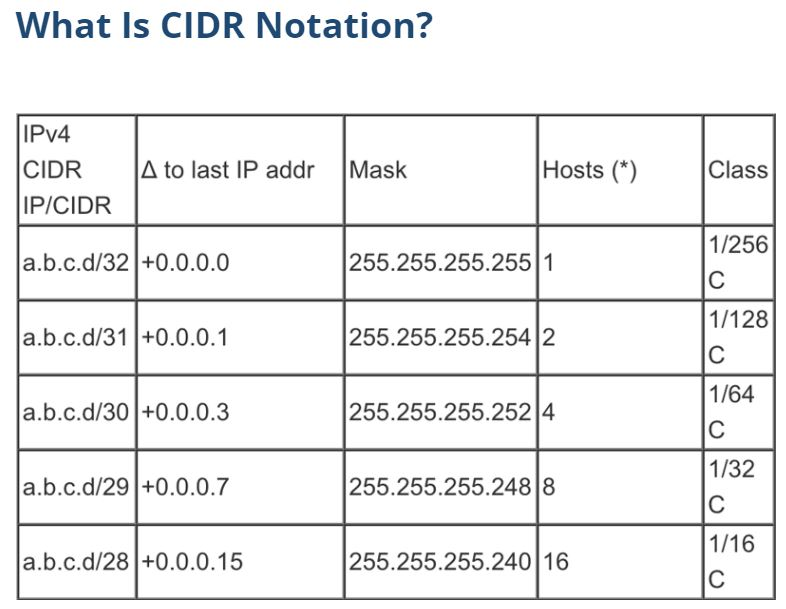

# WEEK 2 NOTES

## The Network Layer

  

 **arp -a**

  

**IP addresses** are a 32 bit long numbers made up of four octets, and each octet is normally described in decimal numbers. 8 bits of data or a single octet can represent all decimal numbers from 0 to 255. 12.30.56.78 is a valid IP address. This format is known as **dotted decimal notation**. 
IP addresses belong to networks, not to the devices attached to those networks.

Dynamic IP addressing, better known as **Dynamic Host Configuration Protocol** (**DHCP**), automatically assigns an IP address whenever a computer connects to
the network. 
DHCP - Dynamic Host Configuration Protocol
* Automated configuration of IP address, subnet mask and other options
* udp/67, udp/68 - Requires a DHCP server
* Dynamic / pooled
* IP addresses are assigned in real-time from a pool
* Each system is given a lease
* Must renew at set intervals
* Reserved
* Addresses are assigned by MAC address
* Quickly manage addresses from one location

 Under the IP protocol, a packet is usually referred to as an **IP datagram**. 
 

  

 
The most common version of **IP** is version 4, or **IPv4**.  
**Header Length field**: Almost always 20 bytes in length when dealing with IPv4. 20 bytes is the minimum length of an IP header.  
**Service Type field**: These 8 bits can be used to specify details about quality of servicem or QoS technologies.  
**Quality of service** (**QoS**) is the description or measurement of the overall performance of a service, such as a telephony or computer network or a cloud computing service, particularly the performance seen by the users of the network. To quantitatively measure quality of service, several related aspects of the network service are often considered, such as packet loss, bit rate, throughput, transmission delay, availability, jitter, etc.  
**Total Length field**: Indicates the total length of the IP datagram it's attached to.  
**Identification field**: A 16-bit number that's used to group messages together.  
The maximum size of a single datagram is the largest number you can represent with 16 bits: 65,535.
If the total amount of data that needs to be sent is larget than what can fit in a single datagram, the IP layer needs to split this data up into many individual packets.
**Flag field**: Used to indicate if a datagram is allowed to be fragmented, or to indicate that the datagram has already been fragmented.  
**Fragmentation**: The process of taking a single IP datagram and splitting it up into several smaller datagrams.  
**Time to Live (TTL) field**: An 8-bit field that indicates how many router hops a datagram can traverse before it's thrown away.  
**Protocol field**: Another 8-bit field that contains data about what transport layer protocol is being used.  
The most common transport layer protocols are **TCP** and **UDP**.  
**Header checksup field**: A checksum of the contents of the entire IP datagram header.  
**IP options field**: An optional field and is used to set special characteristics for datagram primarily used for testing purposes.  
**Padding field**: A series of zeros used to ensure the header is the correct total size.  

  

 

IP addresses can be split into two sections, the **network ID** and the **host ID**.  
In IP address, the network ID would be the first octet, and the host ID would be the second, third and fourth octets.  
There are three primary types of address classes.
  * **Class A** addresses are those where the first octet is used for the network ID and the last three are used for the host ID.
  * **Class B** addresses are where the first two octets are used for the network ID, and the second two are used for the host ID.
  * **Class C** addresses are those the first three octets are used for the network ID, and only the final octet is used for the host ID. 

  

  

In practical terms, this class system has mostly been replaced by a system known as **CIDR** or **Classless inter-domain routing**. 

 

## Subnetting

**Subnetting**: The process of taking a large network and splitting it up into many individual and smaller subnetworks or subnets.  
Incorrect subnetting setups are a common problem you might run into as an IT Support Specialist, so it's important to have a strong understanding of how this works.  
**Network IDs** are used to identify networks, and **Host IDs** are used to identify individual hosts.   

  

**Subnet masks** : 32-bit numbers that are normally written now as four octets in decimal.   
A single 8-bit number can represent 256 different numbers, or more specifically, the numbers 0-255.  
The network ID is always either 8 bit for class A networks, 16 bit for class B networks, or 24 bit for class C networks.  

  

Subnet Mask **255.255.255.0**

  

Binary Math

  

  

* 1 -> true
* 0 -> false

A subnet mask is a way for a computer to use and operators to determine if an IP address exists on the same network. This means that the host ID portion is also known, since it will be anything left out.

  

  

**Demarcation point**: To describe where one network or system ends and another one begins.  

## Routing

  

A **router** is a network device that forwards traffic depending on the destination address of that traffic. A router is a device that has at least two network interfaces, since it has to be connected to two networks to do its job.   

Basic routing example

  

ARP table call in windows:

  

Routing protocols:
* **interior gateway protocols**
* **exterior gateway protocols**:
  * **link state routing protocols**
  * **distance-vector protocols** (old)

* **Interior gateway protocols** are used by routers to share information within a single autonomous system. In networking terms, an autonomous system is a collection of networks that all fall under the control of a single network operator. 

* The way communications happen across all these networks, allowing you to access data from the other side of the planet, is through **routing**.
* The **IANA** or the **Internet Assigned Numbers Authority**, is a non-profit organization that helps manage things like IP address allocation. Along with managing IP address allocation, the **IANA** is also responsible for **ASN**, or **Autonomous System Number** allocation.
* **Autonomous System Number (ASN)**: Numbers assigned to individual autonomous systems.
* **Transport layer**: Allows traffic to be directed to specific network applications.
* **Application layer**: Allows these applications to communicate in a way they understand.
* The primary three ranges of non-routable address space are 10.0.0.0/8, 172.16.0.0/12, and 192.168.0.0/16. These ranges are free for anyone to use for their internal networks. It should be called out that interior gateway protocols will route these address spaces. So, they are appropriate for use within an autonomous system but exterior gateway protocols will not.