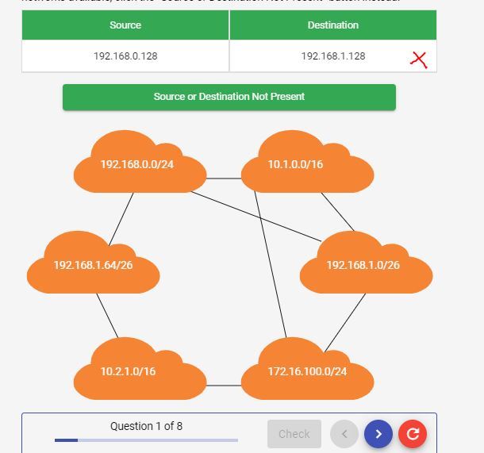
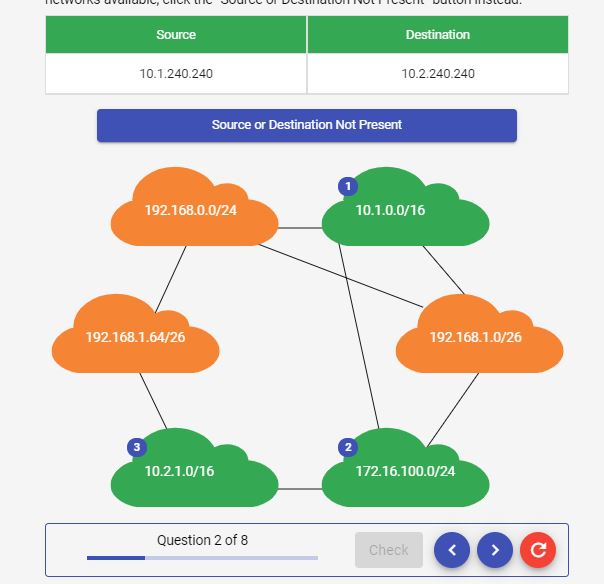
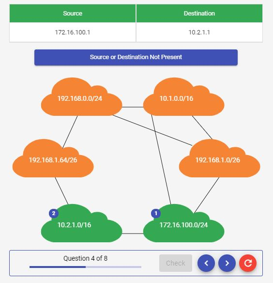
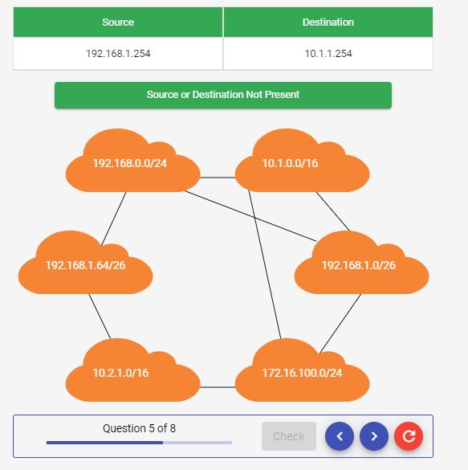
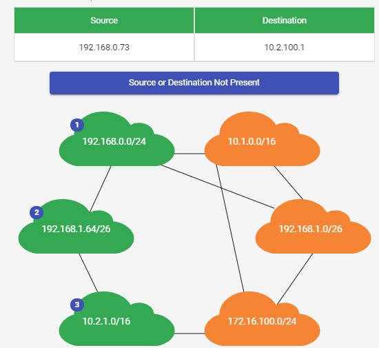

# Routing Paths and Subnets

 

## Question 1

*Route each of these packets from the correct source network to the correct destination network.*

  

 

  

 

  

 

  

 

  

 

  

 

  

 

  

 

