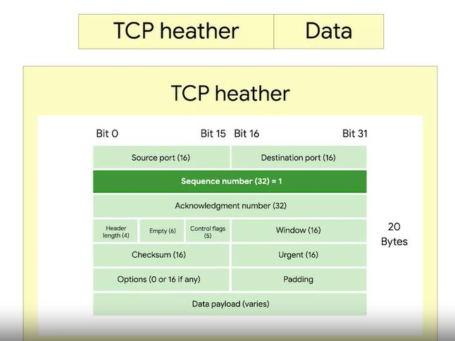

# WEEK 3 NOTES

 

## Introduction:

The first three layers of our Network Model have helped us describe how individual nodes on a network can communicate with other nodes on either their own network or a remote one. The Transport layer allows traffic to be directed to specific network applications. And the Application layer allows these applications to communicate in a way they understand. 

  

## The Transport Layer

* The transport layer has the ability to **multiplex** and **demultiplex**. 
* **Multiplexing** in the transport layer means that nodes on the network have the ability to direct traffic toward many different receiving services. 
* **Demultiplexing** is the same concept, just at the receiving end, it's taking traffic that's all aimed at the same node and delivering it to the proper receiving service.

  

* A **port** is a 16-bit number that's used to direct traffic to specific services running on a networked computer.
* A **server** or service is a program running on a computer waiting to be asked for data. A **client** is another program that is requesting this data.

  

* Ethernet frame encapsulates an IP datagram.
* An IP datagram encapsulates a TCP segment.
* Ethernet frame has a payload section which is really just the entire contents of an IP datagram. 
* An IP datagram has a payload section and this is made up of what's known as a TCP segment. 
* A TCP segment is made up of a TCP header and a data section. 

  

  

 * A **destination port** is the port of the service the traffic is intended for. 
 * A **source port** is a high numbered port chosen from a special section of ports known as ephemeral ports. A source port is required to keep lots of outgoing connections separate.
 * A **sequence number** is a 32-bit number that's used to keep track of where in a sequence of TCP segments this one is expected to be. 
 * An Ethernet frame  limited in size to 1,518 bytes. At the transport layer, TCP splits all of this data up into many segments. 
 * The sequence number in a header is used to keep track of which segment out of many this particular segment might be. 
 * An **acknowledgment** number is the number of the next expected segment. 
 * A **data offset field** is a four-bit number that communicates how long the TCP header for this segment is. This is so that the receiving network device understands where the actual data payload begins. 
 * Then six bits are reserved for the six **TCP control flags**. 
 * A **TCP window** specifies the range of sequence numbers that might be sent before an acknowledgement is required. 
 * A **Checksum** operates just like the checksum fields at the IP and Ethernet level. The checksum is calculated across the entire segment and is compared with the checksum in the header to make sure that there was no data lost or corrupted along the way. 
 * The **Urgent pointer** field is used in conjunction with one of the TCP control flags to point out particular segments that might be more important than others. 
 * An **options field** like the urgent pointer field are rarely used in the real world, but it's sometimes used for more complicated flow control protocols. 
 * A **padding**  is just a sequence of zeros to ensure that the data payload section begins at the expected location.

  

 Six **TCP control flags**
 * The first flag is known as **URG** (Urgent). A value of one here indicates that the segment is considered urgent and that the urgent pointer field has more data about this. This feature of TCP has never really had wide spreaded option and isn't normally seen. 
 * The second flag is **ACK** (Acknowledge). A value of one in this field means that the acknowledgment number field should be examined. 
 * The third flag is **PSH** (Push). This means, that the transmitting device wants the receiving device to push currently- buffered data to the application on the receiving end as soon as possible. 
 * The Fourth flag is **RST** (Reset). This means, that one of the sides in a TCP connection hasn't been able to properly recover from a series of missing or malformed segments. 
 * The fifth flag is **SYN** (Synchronize). It's used when first establishing a TCP connection and make sure the receiving end knows to examine the sequence number field.
 * The six flag is **FIN** (Finish_. When this flag is set to one, it means the transmitting computer doesn't have any more data to send and the connection can be closed.

  

A **handshake** is a way for two devices to ensure that they're speaking the same protocol and will be able to understand each other.

  

  

A **socket** is the instantiation of an endpoint in a potential TCP connection. You can send traffic to any port you want, but you're only going to get a response if a program has opened a socket on that port.  

Seberal TCP sockets states. 
* **LISTEN** means that a TCP socket is ready and listening for incoming connections. Server side only. 
* **SYN_SENT** means that a synchronization request has been sent, but the connection hasn't been established yet. Client side only. 
* **SYN_RECEIVED** means that a socket previously in a listener state, has received a synchronization request and sent a SYN_ACK back. But it hasn't received the final ACK from the client yet. Server side only. 
* **ESTABLISHED** means that the TCP connection is in working order, and both sides are free to send each other data. On both the client and server sides of the connection. * * **FIN_WAIT** means that a FIN has been sent, but the corresponding ACK from the other end hasn't been received yet. 
* **CLOSE_WAIT** means that the connection has been closed at the TCP layer, but that the application that opened the socket hasn't released its hold on the socket yet.
* **CLOSED** means that the connection has been fully terminated, and that no further communication is possible. 

**Ports**
* Ports 1-1023 are referred to as **system ports**, or sometimes as **well-known ports*. These ports represent the official ports for most well-known network services.
* Ports 1024-49151 are known as **registered ports**.  These ports are used for lots of other network services that might not be quite as common as the ones that are on system ports. A good example of a registered port is 3306, which is the port that many databases listen on. 
* Ports 49152-65535 are known as **private** or **ephemeral ports**.  Ephemeral ports can’t be registered with the IANA and are generally used for establishing outbound connections. When a client wants to communicate with a server, the client will be assigned an ephemeral port to be used for just that one connection, while the server listens on a static system or registered port.

A firewall is just a device that blocks traffic that meets certain criteria. 

## The Aplication Layer

For web traffic, the application layer protocol is known as **HTTP**.

  

  

