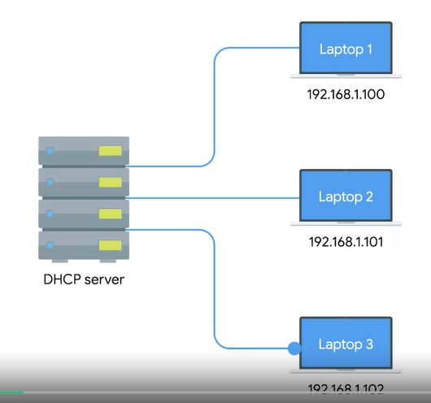

# WEEK 4 NOTES

## Name Resolution

* **IP** address is a 32-bit binary number, but it's normally written out as 4 octets in decimal form since that's easier for humans to read. Y
* **MAC** addresses are 48-bit binary numbers that are normally written out in 6 groupings of 2 hexadecimal digits each.

* **DNS** is a global and highly distributed network service that resolves strings of letters into IP address. DNS is a system that converts domain names into IP addresses.
* **Name resolution** - process of using DNS to turn a domain name into an IP address. 

 

MAC addresses are hard coded and tied to specific pieces of hardware. But the IP address, subnet mask, and gateway for a host must be specifically configured, a DNS server, is the fourth and final part of the standard modern network configuration. 

  

* **Caching** and **recursive** name servers are generally provided by an ISP or your local network.
* **Recursive** name servers are ones that perform full DNS resolution requests. In most cases, your local name server will perform the duties of both, but it's definitely possible for a name server to be either just caching or just recursive.
* All domain names in the global DNS system have a **TTL** (time to live). This is a value in seconds, that can be configured by the owner of a domain name for how long a name server is allowed to cache in entry before it should discard it and perform a full resolution again.

What happens when your local recursive server needs to perform a **full recursive resolution**. 
* The first step is always to contact a root named server, there are 13 total root name servers and they're responsible for directing queries toward the appropriate TLD name server. The root servers will respond to a DNS lookup with the TLD name server that should be queried. 

  

* The TLD name servers will respond again with a redirect, this time informing the computer performing the name lookup with what authoritative name server to contact. Authoritative name servers are responsible for the last two parts of any domain name which is the resolution at which a single organization may be responsible for DNS lookups.

  

* The DNS lookup could be redirected at the authoritative server for which would finally provide the actual IP of the server in question.

  

* **Anycast** is a technique that's used to route traffic to different destinations depending on factors like location, congestion, or link health. Using anycast, a computer can send a data gram to a specific IP but could see it routed to one of many different actual destinations depending on a few factors. 
* **TLD** stands for top level domain and represents the top of the hierarchical DNS name resolution system.

TCP vs UDP

  

  

Resource record types:
* An **A record** is used to point a certain domain name at a certain IPv4 IP address. A single domain name can have multiple A records, too. This allows for a technique known as **DNS round robin** to be used to balance traffic across multiple IPs. 
* A **AAA** - **Quad A** record is very similar to an A record except that it returns in IPv6 address instead of an IPv4 address. 
* A **CNAME** record is used to redirect traffic from one domain to another. In fact, CNAME is just shorthand for canonical name. 
* **MX** record stands for mail exchange and this resource record is used in order to deliver e-mail to the correct server. 
* **SRV** record stands for service record, and it's used to define the location of various specific services. It serves the exact same purpose as the MX resource record type except for one thing, while MX is only for mail services, an SRV record can be defined to return the specifics of many different service types. SRV records are often used to return the records of services like CalDAV, which has a calendar and scheduling service.
* **TXT** record stands for text and was originally intended to be used only for associating some descriptive text with a domain name for human consumption. Over the years as the Internet and services that run on it have become more and more complex, the text record has been increasingly used to convey additional data intended for other computers to process. 
* **NS** or **SOA** records are used to define authority information about DNS zones.
* **PTR** record is the reverse of an A or AAAA record. A PTR record resolves IPv4 or IPv6 addresses to domain names.

*www.google.com*
* The last part of a domain name is known as the **TLD** or **Top Level Domain**. (.com) The most common TLDs are .com, .net, .edu and some country specific.  
**ICANN** is a sister organization to the **IANA**, and together they help define and control both the global IP spaces, along with the global DNS system.
A **domain** is the name commonly used to refer to the second part of a domain name (google). Domains are used to demarcate where control moves from a TLD name server, to an authoritative name server. This is typically under the control of an independent organization, or someone outside of ICANN. Domains can be registered and chosen by any individual or company, but they must all end in one of the predefined TLEs.
That www portion of this is known as the **subdomain**, sometimes referred to as a host name if it's been assigned to only one host.
When you combine all these parts together, you have what's known as a **fully qualified domain name**, or **FQDN**.

* An **authoritative name server** is actually responsible for a specific **DNS zone**. 
* The **root name servers** are responsible for the root zone. 
* Each **TLD name server** is responsible for the zone covering its specific TLD.
* The root and TLD name servers are actually just **authoritative name servers**. 
* The purpose of DNS zones is to allow for easier control over multiple levels of a domain. 
* Zones are configured through what are known as **zone files** simple configuration files that declare all resource records for a particular zone. 
* A zone file has to contain an **SOA** - **Start of Authority** resource record declaration. This SOA record declares the zone and the name of the name server that is authoritative for it. 
* **NS** records which indicate other name servers that may also be responsible for this zone. 

Every single computer on a modern TCP/IP based network needs to have at least four things specifically configured:
* An IP address
* The subnet mask for the local network
* A primary gateway 
* A name server
Three are likely the same on just about every node on the network. The subnet mask, the primary gateway, and DNS server.
But the last item an IP address needs to be different on every single node on the network. 

* **DHCP** or **Dynamic Host Configuration Protocol** comes into play. Listen up, because DHCP is critical to know as an IT support specialist when it comes to troubleshooting networks. DHCP is an application layer protocol that automates the configuration process of hosts on a network. With DHCP, a machine can query a DHCP server when the computer connects to the network and receive all the networking configuration in one go. 

  

  

Standard ways that DHCP can operate:
* **DHCP dynamic allocation** is the most common and it works how we described it just now. A range of IP addresses is set aside for client devices and one of these IPs is issued to these devices when they request one. Under a dynamic allocation the IP of a computer could be different almost every time it connects to the network. 
* **Automatic allocation** is very similar to dynamic allocation, in that a range of IP addresses is set aside for assignment purposes. The main difference here is that, the DHCP server is asked to keep track of which IPs it's assigned to certain devices in the past. Using this information, the DHCP server will assign the same IP to the same machine each time if possible. 
* **Fixed allocation** requires a manually specified list of MAC address and their corresponding IPs. When a computer requests an IP, the DHCP server looks for its MAC address in a table and assigns the IP that corresponds to that MAC address. If the MAC address isn't found, the DHCP server might fall back to automatic or dynamic allocation, or it might refuse to assign an IP altogether. This can be used as a security measure to ensure that only devices that have had their MAC address specifically configured at the DHCP server will ever be able to obtain an IP and communicate on the network. 

The DHCP discovery process has four steps:

  

  

  

  

 First, we have the server discovery step. The DHCP clients sends what's known as a DHCP discover message out onto the network. Since the machine doesn't have an IP and it doesn't know the IP of the DHCP server, a specially crafted broadcast message is formed instead. DHCP listens on UDP port 67 and DHCP discovery messages are always sent from UDP port 68. So the DHCPDISCOVER message is encapsulated in a UDP datagram with a destination port of 67 and a source port of 68. This is then encapsulated inside of an IP datagram with a destination IP of 255.255.255.255, and a source IP of 0.0.0.0. This broadcast message would get delivered to every node on the local area network. And if a DHCP server is present, it would receive this message. 
 Next, the DHCP server would examine its own configuration and would make a decision on what, if any, IP address to offer to the client. This would depend on if it's configured to run with dynamic, automatic or fixed address allocation. The response would be sent as a DHCPOFFER message with a destination port of 68, a source port of 67, a destination broadcast IP of 255.255.255.255, and its actual IP as the source.
 Since the DHCP offer is also a broadcast, it would reach every machine on the network. The original client would recognize that this message was intended for itself. This is because the DHCPOFFER has the field that specifies the MAC address of the client that sent the DHCPDISCOVER message. The client machine would now process this DHCPOFFER to see what IP is being offered to it. Technically, a DHCP client could reject this offer. It's totally possible for multiple DHCP servers to be running on the same network, and for a DHCP client to be configured to only respond to an offer of an IP within a certain range. But this is rare.

 

 **DHCP lease** as it includes an expiration time. A DHCP lease might last for days or only for a short amount of time. Once a lease has expired, the DHCP client would need to negotiate a new lease by performing the entire DHCP discovery process all over again. A client can also release its lease to the DHCP server, which it would do when it disconnects from the network. This would allow the DHCP server to return the IP address that was assigned to its pool of available IPs.

**Network address translation** or **NAT**, is a technique. It takes one IP address and translates it into another.  

NAT is hiding the IP of computer 1 from computer 2. This is known as **IP masquerading** that is an important security concept. The most basic concept at play here is that no one can establish a connection to your computer if they don't know what IP address it has. 

  

**Port preservation** is a technique where the source port chosen by a client, is the same port used by the router. 

  

  

**Port forwarding** is a technique where a specific destination ports can be configured to always be delivered to specific nodes. This technique allows for complete IP masquerading, while still having services that can respond to incoming traffic.

  

**IANA** (**Internet Assigned Numbers Authority**) has  been responsible with assigning address blocks to the five **regional internet registries** or **RIRs**. 
* **AFRINIC** (Africa)
* **ARIN** (the United States, Canada and parts of the Caribbean)
* **APNIC** (most of Asia, Australia and New Zealand and Pacific Island nations)
* **LACNIC** (Central and South America and rest of the Caribbean)
* **RIPE** (Europe, Russia and the Middle East and portions of Central Asia) 

Non-routable address space is largely usable today because of technologies like NAT. All you need is one single IPv4 address and via NAT, a router with that IP can represent lots and lots of computers behind it.

  

* **Virtual private networks** or **VPNs** are a technology that allows for the extension of a private or local network to host that might not work on that same local network. The most common example of VPNs are used is for employees to access their business's network when they're not in the office. VPNs are a tunneling protocol, which means they provision access to something not locally available.  VPNs were one of the first technologies where two-factor authentication became common. 
* **Two-factor authentication** is a technique where more than just a username and password are required to authenticate.

  

  

A **proxy service** is a server that acts on behalf of a client in order to access another service.
A more common use of a **web proxy** today might be to prevent someone from accessing sites, like Twitter, entirely. 
A **reverse proxy** is a service that might appear to be a single server to external clients, but actually represents many servers living behind it. A good example of this is how lots of popular websites are architected today. Another way that reverse proxies are commonly used by popular websites is to deal with **decryption**.