# WEEK 5 NOTES

 

## POST and Dial-up

The devices that connect to the Internet:

  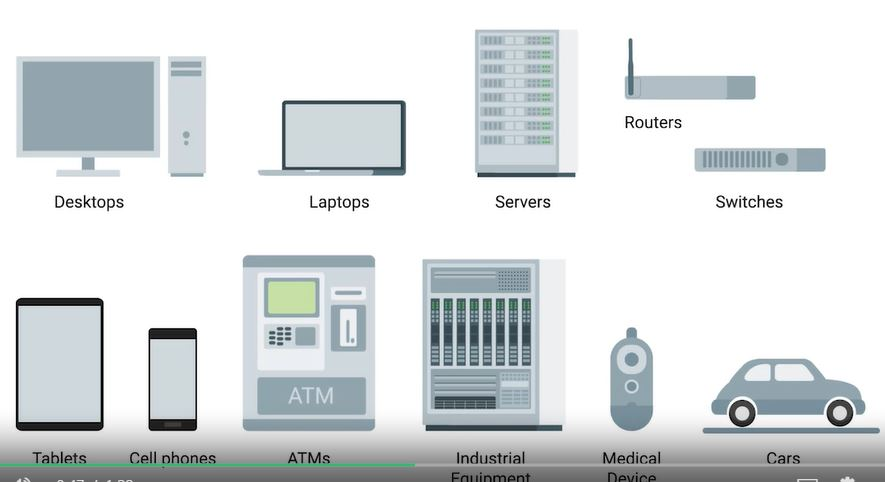

The public **Switched Telephone Network** or **PSTN** is also sometimes referred to as the **Plain Old Telephone Service** or **POTS**. 

A dial-up connection uses POTS for data transfer, and gets its name because the connection is established by actually dialing a phone number. Transferring data across a dial-up connection is done through devices called modems.

## Broadband Connections

* **T-carrier technologies** were originally invented by AT&T in order to transmit multiple phone calls over a single link. Originally, T1 technology was only used to connect different telecom company sites to each other and to connect these companies to other telecom companies. But with the rise of the Internet as a useful business tool in the 1990s, more and more businesses started to pay to have T1 lines installed at their offices to have faster Internet connectivity. 

  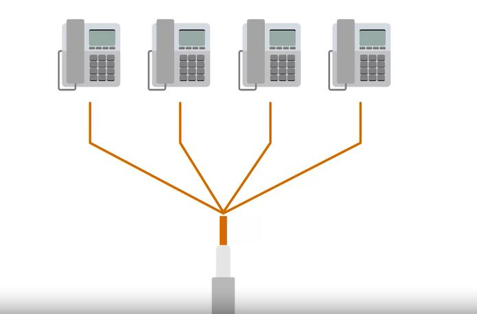

* Now for inter-ISP (Internet service provider) communications, different fiber technologies have all replaced older copper-based ones.

* By operating at a frequency range that didn't interfere with normal phone calls, a technology known as **digital subscriber line** or **DSL** was able to send much more data across the wire than traditional dial-up technologies. To top it all off, this allowed for normal voice phone calls and data transfer to occur at the same time on the same line.
* Like how dial-up uses modems, DSL technologies also use their own modems. But, more accurately, they're known as ***DSLAMs** or **Digital Subscriber Line Access Multiplexers**. Just like dial-up modems, these devices establish data connections across phone lines, but unlike dial-up connections, they're usually long-running. This means that the connection is generally established when the DSLAM is powered on and isn't torn down until the DSLAM is powered off. 

* The two most common types of DSL were ADSL and SDSL. 
* **ADSL**  stands for **Asymmetric Digital Subscriber Line**. ADSL connections feature different speeds for outbound and incoming data. Generally, this means faster download speeds and slower upload speeds. 
* **SDSL** stands for **Symmetric Digital Subscriber Line**. SDSL technology is basically the same as ADSL except the upload and download speeds are the same. At one point, SDSL was mainly used by businesses that hosted servers that needed to send data to clients.
* Further developments in SDSL technology have yielded things like **HDSL** or **High Bit-rate Digital Subscriber Lines**. These are DSL technologies that provision speeds above 1.544 megabits per second. 

 

By using frequencies that don't interfere with television broadcast, cable-based Internet access technologies were able to deliver high speed Internet access across these same cables. This is the technology that we refer to when we say **cable broadband**.

  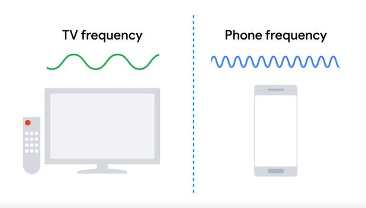

Cable Internet connections are usually managed by what's known as a **cable modem**. This is a device that sits at the edge of a consumer's network and connects it to the **cable modem termination system**, or **CMTS**. The CMTS is what connects lots of different cable connections to an ISP's core network.

 

* **FTTX** stands for fiber to the X, where the X can be one of many things. 
* **FTTN** which means fiber to the neighborhood. This means that fiber technologies are used to deliver data to a single physical cabinet that serves a certain amount of the population. From this cabinet, twisted pair copper or coax might be used for the last length of distance.
* **FTTB** stands for fiber to the building, fiber to the business, or even fiber to the basement, since this is generally where cables to buildings physically enter. FTTB is a setup where fiber technologies are used for data delivery to an individual building. After that, twisted pair copper is typically used to actually connect those inside of the building.
* **FTTH** which stands for fiber to the home. This is used in instances where fiber is actually run to each individual residents in a neighborhood or apartment building. 
* FTTH and FTTB may both also be referred to as **FTTP** fiber to the premises. 
* Instead of a modem, the demarcation point for Fiber Technologies is known as **Optical Network Terminator** or **ONT**. In ONT, converts data from protocols, the fiber network can understand to those that more traditional twisted pair copper networks can understand.

## WANs

Unlike a **LAN** or a **local area network**, **WAN** stands for **wide area network**. A wide area network acts like a single network, but spans across multiple physical locations. WAN technologies usually require that you contract a link across the Internet with your ISP. This ISP handles sending your data from one site to the other. So it could be like all of your computers are in the same physical location.

A typical WAN setup has a few sections. If one network of computers on one side of the country and another network of computers on the other. Each of those networks ends at a demarcation point, which is where the ISP's network takes over. The area between each demarcation point and the ISP's actual core network is called a **local loop**. This local loop would be something like a **T-carrier line** or a high speed optical connection to the provider's local regional office. From there, it would connect out to the ISP's core network and the Internet at large. 

* A popular alternative to WAN technologies are **point-to-point VPNs**. WAN technologies are great for when you need to transport large amounts of data across lots of sites, because Whann technologies are built to be super fast. 
* A point-to-point VPN, also called a **site-to-site VPN**, establishes a VPN tunnel between two sites. This operates a lot like the way that a traditional VPN setup lets individual users act as if they are on the network they're connecting to. It's just that the VPN tunneling logic is handled by network devices at either side, so that users don't all have to establish their own connections. 

  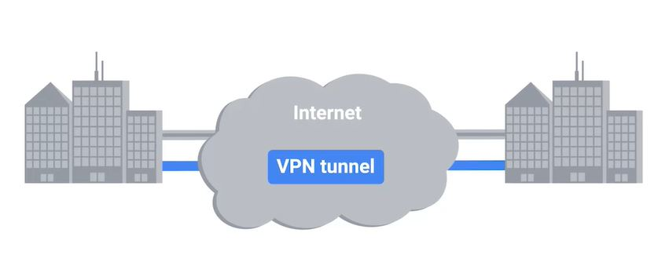

## Wireless Networking 

* **Wireless networking** is a way to network without wires. defined by the IEEE 802.11 standards.
* FM radio transmissions operate between 88 and 108 megahertz. This specific frequency band is called the **FM broadcast band**.
* A **frequency band** is a certain section of the radio spectrum that's been agreed upon to be used for certain communications. WiFi networks operate on a few different frequency bands. Most commonly, the 2.4 gigahertz and 5 gigahertz bands. 
* There are lots of **802.11 specifications** including some that exist just experimentally or for testing. The most common specifications you might run into are 802.11b, 802.11a, 802.11g, 802.11n, and 802.11ac. 
* A networks that operate on the 5Ghz band are almost always faster, but have less of a range. Most of the 2.4Ghz networks are slightly slower and more susceptible to interference, but usually cover a larger area

An 802.11 frame has a number of fields. 
* The first is called the **frame control** field. This field is 16 bits long, and contains a number of sub-fields that are used to describe how the frame itself should be processed. This includes things like what version of the 802.11 was used. 
* The next field is called a **duration** field. It specifies how long the total frame is. So, the receiver knows how long it should expect to have to listen to the transmission. 
* The most common setup includes devices called access points. A **wireless access point** is a device that bridges the wireless and wired portions of a network. A single wireless network might have lots of different access points to cover a large area. Devices on a wireless network will associate with a certain access point. This is usually the one they're physically closest to. But, it can also be determined by all sorts of other things like general signal strength, and wireless interference. Associations isn't just important for the wireless device to talk to a specific access point, it also allows for incoming transmissions to the wireless device to be sent by the right access point. 
There are four **address** fields, because there needs to be room to indicate which wireless access point should be processing the frame. So, we'd have our normal source address field, which would represent the MAC address of the sending device. But, we'd also have the intended destination on the network, along with a receiving address and a transmitter address. The receiver address would be the MAC address of the access point that should receive the frame, and the transmitter address would be the MAC address of whatever has just transmitted the frame. In lots of situations, the destination and receiver address might be the same. Usually, the source and transmitter addresses are also the same. But, depending on exactly how a specific wireless network has been architected, this won't always be the case. Sometimes, wireless access points will relay these frames from one another. Since all addresses in an 802.11 frame are Mac addresses, each of those four fields is 6 bytes long. 
* In between the third and fourth address fields, you'll find the **sequence control field**. The sequence control field is 16 bits long and mainly contains a sequence number used to keep track of ordering the frames. 
* After this is the **data payload** section which has all of the data of the protocols further up the stack. 
* Finally, we have a **frame check sequence** field which contains a checksum used for a cyclical redundancy check. Just like how ethernet does it.

  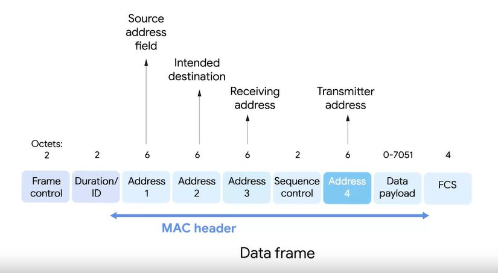

There are a few main ways that a wireless network can be configured. 
There are **ad-hoc** networks where nodes all speak directly to each other. Ad-hoc networks are the simplest of the three, in an ad-hoc network, there isn't really any supporting network infrastructure. Every device involved with the network communicates with every other device within range and all nodes help pass along messages. Even though they're the most simple, ad-hoc networks aren't the most common type of wireless network, but they do have some practical applications. Some smartphones can establish ad-hoc networks with other smartphones in the area so that people can exchange photos, video or contact information. You'll also sometimes see ad-hoc networks used in industrial or warehouse settings, where individual pieces of equipment might need to communicate with each other, but not with anything else. Finally, ad-hoc networks can be powerful tools during disaster situations. If a natural disaster like an earthquake or hurricane knocks out all of the existing infrastructure in an area, disaster relief professionals can use an ad-hoc network to communicate with each other while they perform search and rescue efforts.

  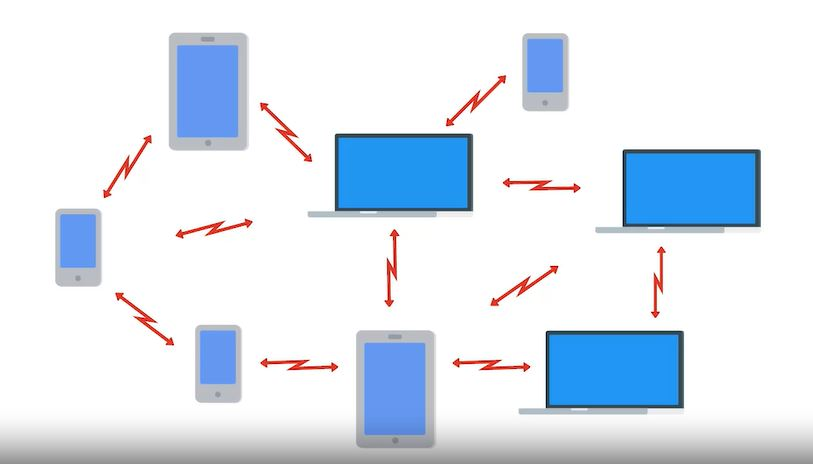

There are **wireless LANS** or **WLANs** where one or more access points act as a bridge between a wireless and a wired network. The most common type of wireless network. A wireless LAN consists of one or more access points, which act as bridges between the wireless and wired networks. The wired network operates as a normal LAN, like the types we've already discussed, the wired LAN contains the outbound internet link. In order to access resources outside of the WLAN, wireless devices would communicate with access points. They then forward traffic along to the gateway router, where everything proceeds like normal. 

  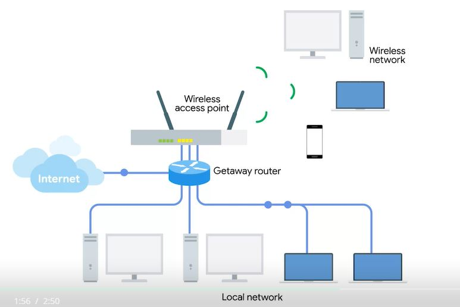

And there are **mesh** networks which are kind of a hybrid of the two. Mesh networks are kind of like ad-hoc networks, since lots of the devices communicate with each other wirelessly, forming a mesh. If you were to draw lines for all the links between all the nodes, most mesh networks you'll run into are made up of only wireless access points and will still be connected to a wired network. This kind of network let's you deploy more access points to the mesh without having to run a cable to each of them. With this kind of setup, you can really increase the performance and range of a wireless network. 

  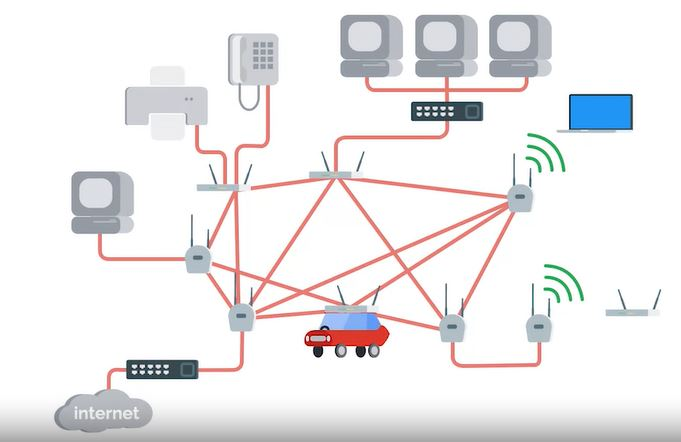

**Channels** are individual, smaller sections of the overall frequency band used by a wireless network. Channels are super important because they help address a very old networking concern, **collision domains** that is any one network segment where one computer can interrupt another.  
The problem caused by collision domains has been mostly reduced on wired networks through devices called **switches**. Switches remember which computers live on which physical interfaces. So traffic is only sent to the node It's intended for.  

Make sure that both your own access points and those of neighboring businesses overlap channels as little as possible.

  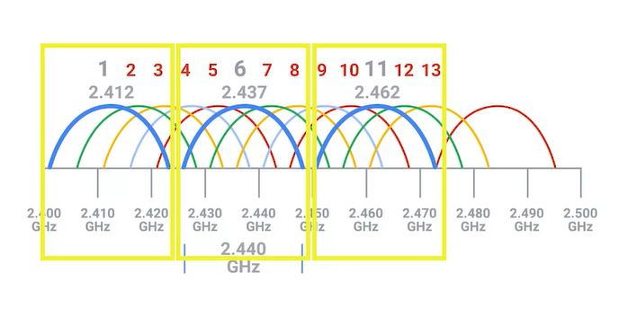

When you're sending data over a wired link, your communication has a certain amount of inherent privacy. The only devices that really know what data is being transmitted are the two nodes on either end of the link. Someone or some device that happens to be in close proximity can't just read the data. With wireless networking, this isn't really the case, since there aren't cables, just radio transmissions being broadcast through the air, anyone within range could hypothetically intercept any transmissions, whether they were intended for them or not. To solve this problem, **WEP** was invented. **WEP** stands for **Wired Equivalent Privacy**, and it's an encryption technology that provides a very low level of privacy. Actually, it's really right there in the name, wired equivalent privacy. Using WEP protects your data a little but it should really only be seen as being as safe as sending unencrypted data over a wired connection. The WEP standard is a really weak encryption algorithm. It doesn't take very long for a bad actor to be able to break through this encryption and read your data. The number of bits in an encryption key corresponds to how secure it is, the more bits in a key the longer it takes for someone to crack the encryption. WEP only uses *40 bits* for its encryption keys and with the speed of modern computers, this can usually be cracked in just a few minutes. WEP was quickly replaced in most places with **WPA** or **Wi-Fi Protected Access**. WPA, by default, uses a *128-bit* key, making it a whole lot more difficult to crack than WEP. Today, the most commonly used encryption algorithm for wireless networks is **WPA2**, an update to the original WPA. WPA2 uses a *256-bit* key make it even harder to crack. Another common way to help secure wireless networks is through **MAC filtering**. With **MAC filtering**, you configure your access points to only allow for connections from a specific set of MAC addresses belonging to devices you trust. This doesn't do anything more to help encrypt wireless traffic being sent through the air, but it does provide an additional barrier preventing unauthorized devices from connecting to the wireless network itself.

Cellular networking or mobile networking are now common all over the world. In some places, using a cellular network for Internet access is the most common way of connecting. At a high level, cellular networks have a lot in common with the 802.11 networks. Just like Wi-Fi, cellular networking operates over radio waves, and there are specific frequency bands specifically reserved for cellular transmissions. One of the biggest differences is that these frequencies can travel over longer distances more easily, usually over many kilometers or miles. Cellular networks are built around the concept of cells. Each cell is assigned a specific frequency band for use. Neighboring cells are set up to use bands that don't overlap, just like how we discussed the optimal setup for a W Lan with multiple access points. In fact, the cell towers that broadcast and receive cellular transmissions can be thought of like access points, just with a much larger range. Lots of devices today use cellular networks for communication. And not just phones, also tablets and some laptops also have cellular antennas. It's become more and more common for high-end automobiles to have built-in cellular access, too. One module down, one final module to go. 

  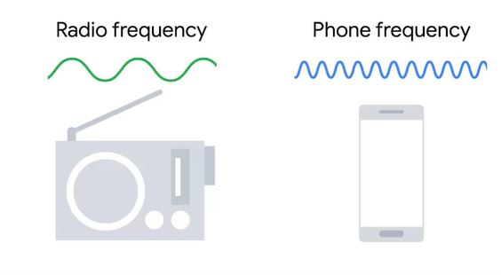

  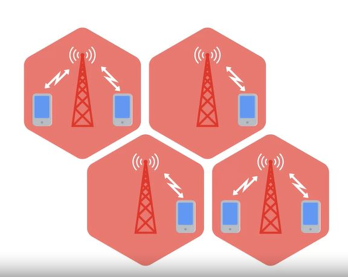

Depending on the device, it might use cellular networks, Wi-Fi, Bluetooth and or one of several Internet of Things or IoT network protocols.  

Mobile devices use wireless networks to communicate with the Internet and with other devices. Depending on the device, it might use cellular networks, Wi-Fi, Bluetooth and or one of several Internet of Things or IoT network protocols. It is pretty common for a mobile device to have multiple network connections at the same time. Both Wi-Fi and cellular data for example. Mobile devices will try to connect to the Internet using the most reliable and least expensive connection available. Many mobile operating systems understand the concept of metered connections. Mobile devices will use other non-metered connections like Wi-Fi. Mobile devices connect to their peripherals using short-range wireless networks. The most common short range wireless network is called **Bluetooth**. You might have used Bluetooth headphones, keyboards, or mice before. When you connect a wireless peripheral to a mobile device, we call that pairing the devices. The two devices exchange information, sometimes including a PIN or password, so that they can remember each other. From then on, the devices will automatically connect to each other when they're both powered on and in range.  

Some mobile devices are what we call Internet of Things (IoT) devices. These devices communicate with each other using Wi-Fi, and/or IoT network protocols. Some of these IoT network protocols are **Z-Wave**, **ZigBee**, and **Thread**. 
 