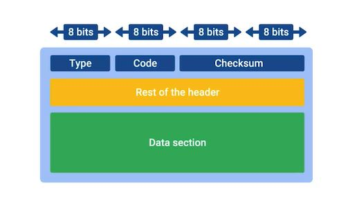
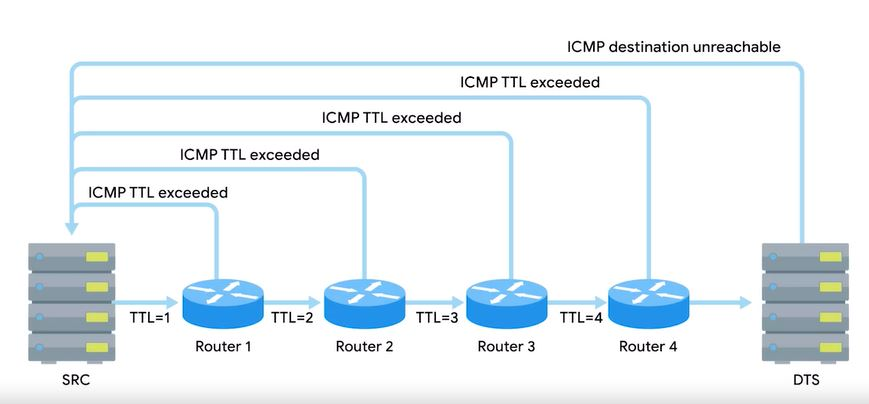
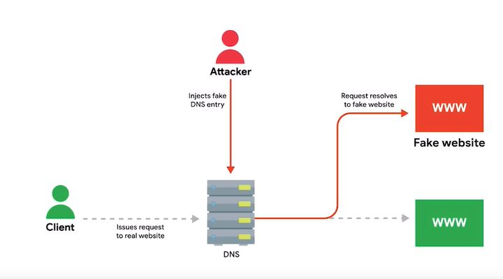
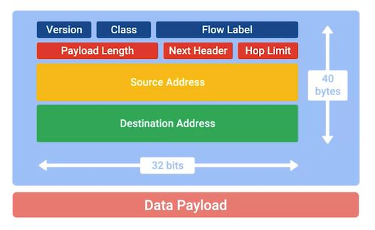
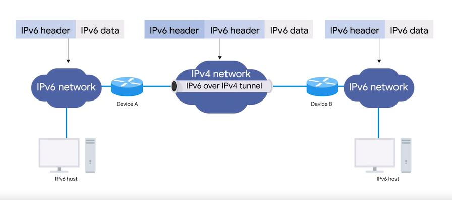

# WEEK 6 NOTES

 

## Introduction

* **Error detection** is the ability for a protocol or program to determine that something went wrong. 
* **Error recovery** is the ability for a protocol or program to attempt to fix it.

## Verifying connectivity

* **ICMP** or **Internet control message protocol** is used to communicate the issues like a network error occurs the device that detects it needs some way to communicate this to the source of the problematic traffic, it could be that a router doesn't know how to route to a destination, or that a certain port isn't reachable, it could even be that the TTL of an IP datagram expired and no further router hops will be attempted.ICMP is mainly used by a router or remote host to communicate why a transmission has failed back to the origin of the transmission. 
* The makeup of an ICMP packet is pretty simple, it has a header with a few fields, and a data section that's used by host to figure out which of their transmissions generated the error. 
* **Type field** 8 bits long which specifies what type of message is being delivered. Some examples are destination unreachable, or time exceeded. 
* **Code field** indicates a more specific reason for the message than just the type, for example of the destination unreachable type there are individual codes for things like destination network unreachable, and destination port unreachable. 
* 16 bit **checksum** that works like every other checksum field we've covered so far.
* 32 bit field **rest of header**. This field is optionally used by some of the specific types and codes to send more data. 
* **Data payload** for an ICMP packet. The payload for an ICMP packet exists entirely so that the recipient of the message knows which of their transmissions cause the error being reported. It contains the entire IP header, and the first 8 bytes of the data payload section of the offending packet. ICMP wasn't really developed for humans to interact with. The point is so that these sorts of error messages can be delivered between networked computers automatically. 

 

* **ping** let's you send a special type of ICMP (Internet Control Message Protocol) message called an **echo request**. An ICMP echo requests essentially just acid destination. If the destination is up and running and able to communicate on the network, it will send back an ICMP echo reply message type.

*Win/Linux*
ping 8.8.8.8

  

* **traceroute** is a utility that lets you discover the paths between two nodes, and gives you information about each hop along the way. The way traceroute works, is through a clever manipulation technique of the TTL field at the IP level.Traceroute uses the TTL field by first setting it to one for the first packet, then two for the second, three for the third and so on. By doing this clever little action, traceroute makes sure that the very first packet sent will be discarded by the first router hop. This results in an ICMP Time Exceeded message, the second packet will make it to the second router, the third will make it to the third, and so on. This continues until the packet finally makes it all the way to its destination. For each hop, traceroute will send three identical packets. The output of a traceroute command is pretty simple. On each line, you'll see the number of the hop and the round trip time for all three packets. You will also see the IP of the device at each hop, and a host name if traceroute can resolve one. On Linux and MacOS, traceroute sends UDP packets to very high port numbers. On Windows, the command has a shortened name **tracert**, and defaults to using ICMP echo request. On all platforms, traceroute has more options than can be specified using command line flags. Two more tools that are similar to traceroute are **mtr** on Linux and MacOS and **pathping** on Windows. These two tools act as long running traceroutes. **mtr** works in real time and will continually update its output with all the current aggregate data about the traceroute. 

  

*Win*
tracert -d 8.8.8.8

*Linux*
traceroute 8.8.8.8

 

Similar:

*Win*
pathping 8.8.8.8

*Linux*
mtr 8.8.8.8

 

To check if things are working at the transport layer - the **Netcat tool**

*Win*
Test-NetConnection google.com

*Linux*
nc google.com 80

## DNS

* **nslookup** -  You execute the nslookup command with the host name following it. And the output displays what server was used to perform the request and the resolution result.

Using public DNS servers is a handy technique for troubleshooting any kind of name resolution problems.
The IP addresses for Level 3s public DNS servers are **4.2.2.1 through 4.2.2.6**. These IPs are easy to remember.
Other easy to remember options are the IPs for Google's public DNS. Google operates public name servers on the IPs **8.8.8.8** and **8.8.4.4**. Unlike the Level 3 IPs, these are officially acknowledged and documented by Google to be used for free by anyone. Most public DNS servers are available globally through anycast. Most public DNS servers also respond to ICMP echo requests, so they're a great choice for testing general internet connectivity using ping.  

Hijacking outbound DNS requests with faulty responses is an easy way to redirect your users to malicious sites.

  

 Domain names need to be globally unique for a global system like this to work. Originally there were only a few registrars. The most notable was a company named **Network Solutions Inc**. It was responsible for the registration of almost all domains that weren't country specific. As the popularity of the Internet grew, there was eventually enough market demand for competition in this space. Finally, the United States government and Network Solutions Inc came to an agreement to let other companies also sell domain names. An important part of domain name registration is that these registrations only exist for a fixed amount of time. 

 The original way that numbered network addresses were correlated with words was through hosts files. 
 A **host file** is a flat file that contains, on each line, a network address followed by the host name. 

 All modern operating systems have hosts files because of the **loopback address** - always points to itself. IPv4 - **127.0.0.1; IPv6 ::1**

 ## The cloud

**Cloud computing** is a technological approach where computing resources are provisioned in a shareable way so that lots of users get what they need when they need it. It's an approach that leans heavily on the idea that companies provide services for each other using these shared resources. 
At the heart of cloud computing is a technology known as **hardware virtualization** - a core concept of how cloud computing technologies work. With virtualization, a single physical machine called a **host** could run many individual virtual instances called **guests**. An operating system expects to be able to communicate with the underlying hardware in certain ways. Hardware virtualization platforms employ what's called a **hypervisor** - a piece of software that runs and manages virtual machines while also offering these guests a virtual operating platform that's indistinguishable from actual hardware. With virtualization, a single physical computer can act as the host for many independent virtual instances. They each run their own independent operating system and, in many ways, are indistinguishable from the same operating systems running on physical hardware.  

* **Public cloud** - a large cluster of machines run by another company. 
* **Private cloud** - entirely used by a single large corporation and generally physically hosted on its own premises.
* **Hybrid cloud** - a term used to describe situations where companies might run things like their most sensitive proprietary technologies on a private cloud while entrusting their less sensitive servers to a public cloud. 

It's a new model in computing where large clusters of machines let us use the total resources available in a better way. The cloud lets you provision a new server in a matter of moments and leverage lots of existing services instead of having to build your own.  

* **Infrastructure as a service** or **IaaS** - you shouldn't have to worry about building your own network or your own servers. You just pay someone else to provide you with that service.
* **Platform as a service** or **PaaS** is a subset of cloud computing where a platform is provided for customers to run their services.
* **Software as a service** or **SaaS** is a way of licensing the use of software to others while keeping that software centrally hosted and managed. 

 ## IPv6

* **IPv4** addresses are 32 bits,
* **IPv6** addresses are 128 bits in size
* The IANA is out of IP addresses.
* 2 ^ 128 is 39 digit long number - **Undecillion**.
IPv4 addresses are written out in four octets of decimal numbers
IPv6 addresses are usually written out as 8 groups of 16-bits each.

  

* Every single IPv6 address that begins with **2001:0db8** has been reserved for documentation, in education, or for books and courses, just like this one. 
* There are two rules when it comes to shortening an IPv6 address. The first is that you can remove any leading zeros from a group. The second is that any number of consecutive groups composed of just zeros can be replaced with two colons.
* Loopback IPv4 - 127.0.0.1; IPv6 ::1
* Addresses beginning with **FE80::** are used for link-local unitcast. 
* IPv6 address had a very simple line between network ID and host ID. The first 64-bits of any IPv6 address is the network ID, and the second 64-bits of any IPv6 address is the host ID. 

* The first field in an **IPv6 header** is the version field. This is a 4-bit field that defines what version of IP is in use. 
* The next field is called the **traffic class** field. This is an 8-bit field that defines the type of traffic contained within the IP datagram and allows for different classes of traffic to receive different priorities. 
* The next field is the **flow label** field. This is a 20-bit field that's used in conjunction with the traffic class field for routers to make decisions about the quality of service level for a specific datagram. 
* Next you have the **payload length** field. This is a 16-bit field that defines how long the data payload section of the datagram is. 
* Then a unique concept to IPv6, and needs a little extra explanation. IPv6 addresses are four times as long as IPv4 addresses. That means they have more ones and zeros, which means that they take longer to transmit across a link. To help reduce the problems with additional data that IPv6 addresses impose on the network, the IPv6 header was built to be as short as possible. One way to do that is to take all of the optional fields and abstract them away from the IPv6 header itself. 
* The next header field defines what kind of header is immediately after this current one. These additional headers are optional, so they're not required for a complete IPv6 datagram. 
* Each of these additional optional headers contain a **next header** field and allow for a chain of headers to be formed if there's a lot of optional configuration.
* Next we have what's called the **hop limit** field. This is an 8-bit field that's identical in purpose to the TTL field in an IPv4 header. 
Finally, we have the **source** and **destination address** fields, which are each a 128 bits. If the next header field specified another header, it would follow at this time. If not, a data payload the same length as specified in the payload length field would follow.

  

IPv6 and IPv4 traffic to coexist at the same time. 
One example of how this can work is with what's known as IPv4 mapped address space. The IPv6 specifications have set aside a number of addresses that can be directly correlated to an IPv4 address. Any IPv6 address that begins with 80 zeros, and is then followed by 16 ones is understood to be part of the IPv4 mapped address space. The remaining 32 bits of the IPv6 address is just the same 32 bits of the IPv4 address it's meant to represent. This gives us a way for IPv4 traffic to travel over an IPv6 network. But probably more important is for IPv6 traffic to have a way to travel over IPv4 networks. The primary way this is achieve today is through IPv6 tunnels. IPv6 tunnels are conceptually pretty simple. They consist of IPv6 tunnels servers on either end of a connection. These IPv6 tunnel servers take incoming IPv6 traffic and encapsulate it within traditional IPv4 datagrams. This is then delivered across the IPv4 Internet space where it's received by another IPv6 tunnel server. That server performs the de-encapsulation and passes the IPv6 traffic further along in the network. Along with IPv6 tunnel technologies, the concept of an IPv6 tunnel broker has also emerged. These are companies that provide IPv6 tunneling endpoints for you, so you don't have to introduce additional equipment to your network.

  

