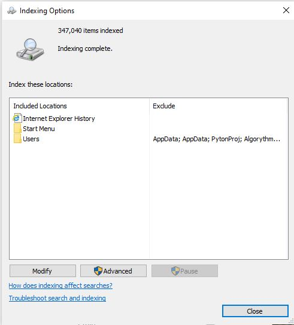
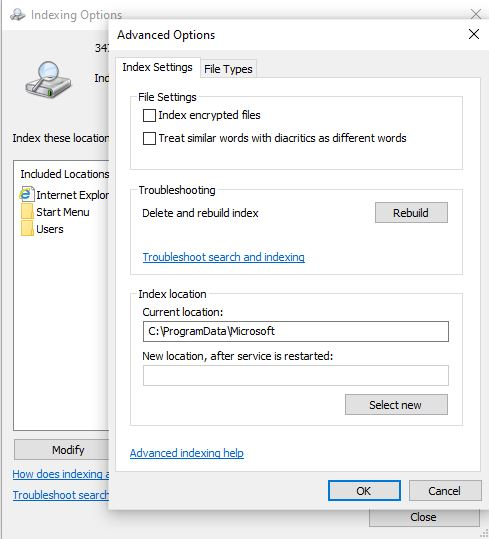
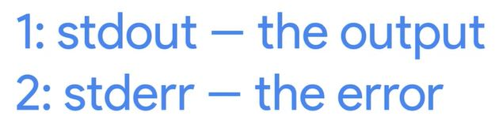

# WEEK 1 NOTES

 

## Basic commands

*Win*
* cmd.exe
* powershell.exe

**List directory command**

*Win*
* ls
* ls c:\\
* Get-ChildItem
* dir
* ls -Force  (also hidden items)

* Get-Help ls  (for help)
* Get-Help ls -Full (for help)

*Linux*
* / (path to the root dir)
* ls
* ls /
* ls --help (for help)
* man ls (for help)

**Linux root directory:**
* /bin - similar to our Windows program files directory.
* /etc - this folder stores some pretty important system configuration files.
* /home - the personal directory for users. 
* /proc - contains information about currently running processes.
* /user - for user installed software. 
* /var - system logs and basically any file that constantly changes in here.

 

An **absolute path** is one that starts from the main directory. 
A **relative path** is the path from your current directory.

 

**Chande Directory**

*Win*
* pwd (print current directory)
* cd .. (change directory one level up)
* cd ~ (go to the home dir)
* TAB completion as help

*Linux*
* pwd (print current directory)
* cd .. (change directory one level up)
* cd ~ (go to the home dir)
* TAB completion as help

**Create new Directory**

*Win*
* mkdir myDir1
* New-Item myDir2
* mkdir 'my dir1'
* mkdir my` dir` 2

*Linux*
* mkdir myDir1
* mkdir 'my dir1'
* mkdir my\ dir1

**Command History**

*Win*
* history
* clear (clear the creen)

*Linux*
* history
* clear (clear the creen)

**Copying Files & Directories**

A **wildcard** is a character that's used to help select files based on a certain pattern. 

*Win*
* cp mFile1 copyOfmFile1
* cp *.jpg C\someDir\  (copy all files with jpg extension)
* cp myDir1 C:\Users\Public\ -Recurse -Verbose (copy dir with their content)
* Copy-Item myDir1 copyOfmyDir1

*Linux*
* cp myFile1 copyOfmyFile1
* cp *.jpg C\someDir\  (copy all files with jpg extension)
* cp -r myDir1 C:\Users\Public\

**Moving and Renaming Files, Directories**

*Win*
* mv myFile1 myFile1Edited (rename)
* mv myFile1 myDir\myFile1 (move)
* Move-Item myDir\myFile1 (move)

*Linux*
* mv myFile1 myFile1Edited (rename)
* mv myFile1 myDir/myFile1 (move)

**Removing Files & Directories**

*Win*
* rm myFile1 (gone for good)
* Remove-Item myFile1 (gone for good)
* rm myImportantFile1 -Force (gone for good)
* rm myDir1 -Recurse (remove dir with the children)

*Linux*
* mv myFile1 myFile1Edited (rename)
* mv myFile1 myDir/myFile1 (move)
* rm -r myDir1 (remove dir with the children)

## File and Text Manipulation

**Display File Content**

*Win*
* cat MyText.txt
* more MyText.txt (page by page; space for the next)
* cat MyText.txt -Head 10 (display first 10 lines)
* cat MyText.txt -Tail 10 (display last 10 lines)
* Get-Content MyText.txt

*Linux*
* cat MyText.txt 
* less MyText.txt (more functionality)
* head MyText.txt (display by-default first 10 lines)
* tail MyText.txt (display by-default last 10 lines)

**Modifying Text Files**

*Win*
* start notepad MyProc.txt (open existing file in notepad for editing)

*Linux*
* gedit MyText.txt (open file in GUI editor)
* nano MyText.txt (open file)
* emacs MyText.txt (open file)
* vim MyText.txt (open file)

*PowerShell aliases**
* Get-Alias ls

**Searching**

  

  

Also we can search via Notepad++

*Win*
* Select-String run MyProcesses.txt (search str in the file)
* Select-String run *.txt (search string in all *.txt in te dir)
* sls run *.txt

*Linux*
* grep run MyProcess.txt
* grep run *.txt

**Input, Output, and the Pipeline**

Each process has three different streams: **standard in**, **standard out**, and **standard error**.  
**Regular expressions** are used to help you do advance pattern based selection.  

*Win*
* echo something > MyNewFile.txt (create file and write content or override existed)
* echo something >> MyNewFile.txt (append or create if not exists)
* cat myFile | sls str (redirect output from cat as input of sls)
* rm secureFile 2> error.txt (redirect error msg)
* rm secureFile 2> $null (discard error msg)

  

*Linux*
* echo something > MyNewFile.txt (create file and write content or override existed) 
* echo something >> MyNewFile.txt (append or create if not exists)
* rm secureFile 2> error.txt (redirect error msg)
* rm secureFile 2> /dev/null (discard error msg)
* ls -al | grep name1 (redirect output from ls as input of grep)

For more PowerShell commands:
https://github.com/PowerShell/PowerShell/tree/master/docs/learning-powershell