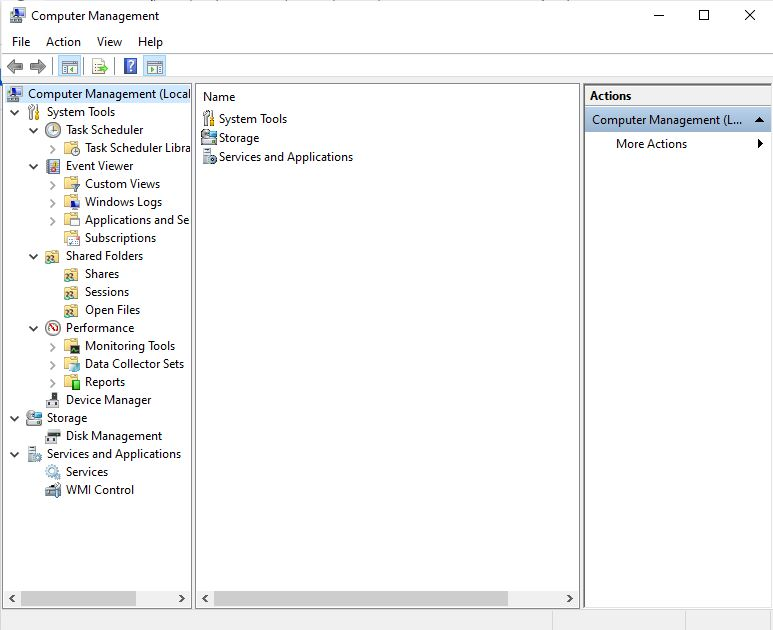
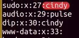
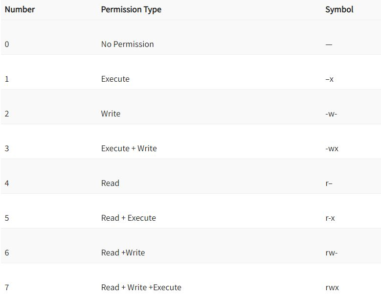
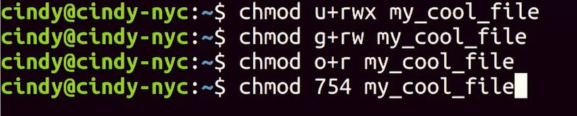

# WEEK 2 NOTES

 

## Users and Groups

A Windows domain is a network of computers, users, files, et cetera, that are added to a central database.
 

  

* At the top of the sidebar - **computer management local**. This means we're managing a single machine locally. In an enterprise environment, you can manage multiple machines in something called a domain. A **Windows domain** is a network of computers, users, files, et cetera, that are added to a central database. If you're an admin of that domain, you can view those accounts and computers from any machine in the domain. 
* Underneath this menu, we have **system tools**.
* **Task Scheduler**: This lets you schedule programs and tasks to run at certain times, like automatically shutting off the computer at 11:00 pm every night.
* **Event Viewer**: This is where our system stores its system logs. We'll do a deep dive on this tool in an upcoming lesson.
* **Shared folders**: This shows the folders that different users on the machine share with each other. 
* **Device Manager**: This is where we go to manage devices to our computer like our network cards, sound cards, monitors, and more.
* Under the **storage** menu, we have a sub menu for disk management. 
* The **services and applications** menu shows us the programs and services that we have available on the system. We can choose to enable or disable services like DNS here. 

* **UAC** or **user access control** this is a feature in Windows that prevents unauthorized changes to a system. These changes have to be approved by the administrator.

 

**View User and Group Information**

*Win*
* Get-LocalUser
* Get-LocalGroup

In Linuc there are **standard users** and there are also **administrators** in Linux. There's also a special user called the **root user** - superuser.

*Linux*
* sudo cut etc/sudoers  (sudo means superuser do. Then asked password of superuser)
* sudo su -  (substitute superuser if not specified)
* cut /etc/group

  

There are four fields here, separated by colons. The first field is the **group name**. In this case, it's seudo. Second field is the **group password**. We don't really need to specify a group password so it defaults to the root password. The **X** here means that the password has been encrypted and store in a separate file. The third field is the **ID of the group** or **group ID**. When our operating system runs a task that involves a group, it uses a group ID instead of group name. Finally, the last field is **lists of users in the group**. The file that contains user information is /etc/password.

*Linux*
* cut /etc/gropasswd (unfo about user)

Most of these accounts aren't actually humans using the computer. They are a bunch of processes that are constantly running on a computer that we need to associate with a user. 

**Password**

*Win*

To reset a password in the Win GUI, go to computer management tool.

*Win*
* net user ira
* net user ira /logonpasswordchg:yes (force user to change passwd)

*Linux*
* passwd ira (change passwd for the user)
* sudo passwd -e ira  (force user change passwd in th enxt login)

**Adding and Removing Users**

*Win*

To Adding or Removing Users in the Win GUI, go to computer management tool.

*Win*
* net user kuku * /add 
* Get-LocalUser
* net user ira /del (delete user)
* Remove-LocalUser

*Linux*
* sudo useradd kuku
* sudo userdel kuku

**Single sign-on** or **SSO**  means that instead of those apps asking you for another username and password, they will allow you to authenticate using an account that you're already signed into.  

**Biometric data** is something about you that's unique to you, like a fingerprint or voice or a face.  

To protect business data, some organizations use **mobile device management** or **MDM** policies to require mobile devices to be locked. Mobile device management systems are used to apply and enforce rules about how the device has to be configured and used. 

## Permissions

In Windows, files and directory permissions are assigned using **Access Control Lists** or **ACLs**, **Discretionary Access Control Lists** or **DACLs**. Windows files and folders can also have **System Access Control Lists** or **SACLs** assigned to them. **SACLs** are used to tell windows that it should use an event log to make a note of every time someone accesses a file or folder. 

Permission:
* **Read** lets you see that a file exists, and allows you to read its contents. It also lets you read the files and directories in a directory. 
* **Read and Execute** lets you read files, and if the file is an executable, you can run the file. List folder contents, List folder contents is an alias for Read and Execute on a directory. C
* **Write** lets you make changes to a file. You can have write access to a file without having read permission to that file. The write permission also lets you create sub directories and write two files in the directory. 
* **Modify**  is an umbrella permission that include read, execute and write. Full control, a user or group with full control can do anything they want to the file. It includes all of the permissions of Modify, and adds the ability to take ownership of a file and change its ACLs. 

*Win*
* icacls C:\Users\yrena\Downloads
* icacls /?  (for help)

There are 3 different permissions that you can have in Linux; 
* **Read** - this allows someone to read the contents of a file or folder. 
* **Write** - this allows someone to write information to a file or folder. 
* **Execute** - this allows someone to execute a program. 

*Linux*
* ls -l
* Output like:  **-rwxrw-r--** there are 10 bits here. 
* The first one is the file type. In this example, dash means that the file we're looking at is just a regular file. Sometimes you might see D which stands for a directory. 
* The next nine bits are our actual permissions, they're grouped in trios or sets of three. 
* The **first** trio refers to the permission of the **owner** of the file. 
* The **second** trio refers to the permission of the **group** that this file belongs to. 
* The **last** trio refers to the permission of **all other users**. 
* The **R** stands for **readable**, **W** stands for **writeable** and **X** stands for **executable**. 

**Modifying Permissions**

*Win*
* icacls myFile1 /grant 'Everyone:(OI)(CI)(R)' 

  

The owner, which is denoted by **u**, the group the file belongs to, which is denoted by a **g**, or other users, which is noted by an **o**. To add or remove permissions, just use a **+** or **-** symbol that indicate who the permission affects.  

*Linux*
* chmod u+x myFile (add execution to user)
* chmod u-x myFile (remove execution to user)
* chmod u+rx myFile (add read and execution to user)
* sudo chown ira onesfile
* sudo chgrp my_group onesFile

  

*Linux*
* passwd (to change password)
* sudo chmod u+s myFile

**Linux: SetUID, SetGID, Sticky Bit**

There's an S here where the x should be. The **s** stands for **SetUID**. When the s is substituted where irregular bit would be, it allows us to run the file with the permissions of the owner of the file. To enable the setuid bit, you can do it symbolically or numerically. The symbolic format uses an s while the numerical format uses a 4, which you prepend to the rest of the permissions like this.
Similar to SetUID, you can run a file using group permissions with **SetGID** or set group ID. This allows you to run a file as a member of the file group.
There's one last special permission bit - the **sticky bit**. This bit sticks a file or folder down. It makes it so anyone can write to a file or folder, but they can't actually delete anything. Only the owner of root can delete anything.