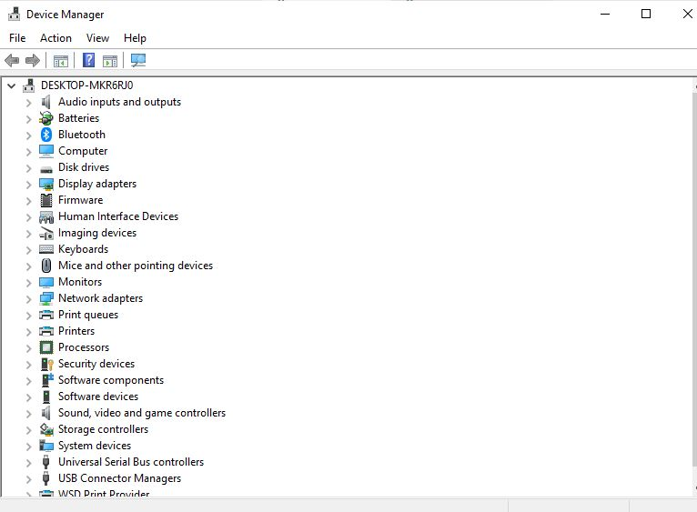
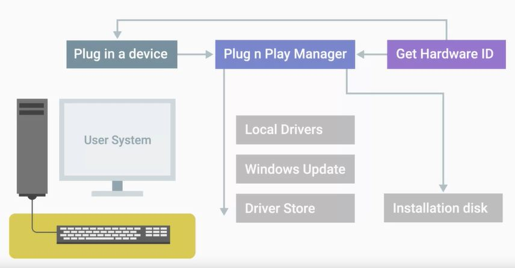

# WEEK 3 NOTES

 

## Software Distribution

In Windows, software is usually packaged as a **dot exe** or executable file. Executable files contain instructions for a computer to execute when they're run, like copy this file from here to here, install this program, or more generically, perform this operation.  

A **Microsoft install package** or **msi** is used to guide a program called the Windows Installer in the installation, maintenance, and removal of programs on the Windows operating system. Besides using the GUI setup wizard to guide the user in installing the program, the Windows installer also uses the msi file to create instructions on how to remove the program, if the user wants to uninstall it.  

The **Windows Store** is an application repository or warehouse, where you can download and install universal Windows platform apps. Those are the applications that can run on any compatible Windows devices like desktop PCs, or tablets. These programs use a format called **appx** to package their contents and act like a unit of distribution.  

Linux distribution or Distro, Red Hat, the packages that are used are **.rpm** or **Red Hat Package Manager packages**. 

A Debian package is packaged as a **.deb** file for Debian.

*linux*
* sudo dpkg -i atom-amd64.deb (install)
* sudo dpkg -r atom (remove)
* dpkg -l (list)
* dpkg -l | grep atom (to find what we need)

*Mobile devices:*
**App stores** are a central managed marketplace for app developers to publish and sell mobile apps.
There's one other way to install an app into a mobile OS, and that's called **side-loading**. Side-loading is where you install mobile apps directly without using an App Store. Side-loading packages is riskier than installing through an App Store, and you would generally only do this if you're an app developer. Mobile apps are **standalone** software packages. So they contain all their dependencies. When you install an app, it will already have everything it needs to run baked in.  

An **archive** is comprised of one or more files that's compressed into a single file. Package archives are basically the core or source software files that are compressed into one file. When we install software from a source archive, it's referred to as, installing from source. Popular archive types you'll see are **.tar**, **.zip**, and **.rar**. There's a very popular tools in windows for file archiving and unarchiving different file types, like .rar .zip and tar. This is the open source tool **7-zip**.

*Win*
* Compress-Archive -Path C:\dir1\MyFile C:\dir1\MyFileArch.zip

*linux*
* 7z e myArch.tar
* tar -cvf file.tar file1 file2 file3
* tar -cvf dir.tar dir1 dir2 (archive)
* tar -xvf file.tar (unarchive)

Counting on other pieces of software to make an application work is called **having dependencies** since one bit of code depends on another in order to work.  

**Library** is a way to package a bunch of useful code that someone else wrote. This code is bundled together into a single unit. In Windows, these shared libraries are called **dynamic-link libraries**, or **DLL** for short. **MSI** file  tells the Windows Installer how to put it all together. Most shared libraries and resources in Windows are managed by something called **side-by-side** assemblies or SxS. Most of these shared libraries are stored in a folder at **C:\Windows\WinSxS**. If an application needs to use a shared library to perform a task, that library will be specified in something called a Manifest. This tells Windows to load the appropriate library from the SxS folder. The SxS system also supports access to multiple versions of the same shared library automatically. 

*Win*
* Find-Package sysinternals -IncludeDependencies
* Register-PackageSource -Name chocolatey -ProviderName Chocolatey -Location https://chocolatey.org/api/v2/
* Get-PackageSource

For Linux **Package managers** come with the works to make package installation and removal easier, including installing package dependencies. If you install a standalone package, you won't automatically install its dependencies.  

Using a **Personal Package Archive** - **PPA**, you can distribute software and updates directly to Ubuntu users. Create your source package, upload it and Launchpad will build binaries and then host them in your own apt repository. That means Ubuntu users can install your packages in just the same way they install standard Ubuntu packages and they'll automatically receive updates as and when you make them.  

**GIMP** is a cross-platform image editor available for GNU/Linux, macOS, Windows and more operating systems. It is free software, you can change its source code and distribute your changes. Whether you are a graphic designer, photographer, illustrator, or scientist, GIMP provides you with sophisticated tools to get your job done. You can further enhance your productivity with GIMP thanks to many customization options and 3rd party plugins.  

**Process Monitor** is an advanced monitoring tool for Windows that shows real-time file system, Registry and process/thread activity. It combines the features of two legacy Sysinternals utilities, Filemon and Regmon, and adds an extensive list of enhancements including rich and non-destructive filtering, comprehensive event properties such as session IDs and user names, reliable process information, full thread stacks with integrated symbol support for each operation, simultaneous logging to a file, and much more. Its uniquely powerful features will make Process Monitor a core utility in your system troubleshooting and malware hunting toolkit.  

**Orca.exe** is a database table editor for creating and editing Windows Installer packages and merge modules. The tool provides a graphical interface for validation, highlighting the particular entries where validation errors or warnings occur. This tool is only available in the Windows SDK Components for Windows Installer Developers. It is provided as an Orca.msi file. After installing the Windows SDK Components for Windows Installer Developers, double click Orca.msi to install the Orca.exe file.  

#3 Device software management

A **driver** is used to help our hardware devices interact with our operating system.

*win*

search for devmgmt.mcs: 

  

  

**Plug and Play** - **PnP** is the part of Windows that enables a computer system to adapt to hardware changes with minimal intervention by the user. A user can add and remove devices without having to do manual configuration, and without knowledge of computer hardware. For example, a user can dock a portable computer and use the docking station keyboard, mouse, and monitor without making manual configuration changes. PnP requires support from device hardware, system software, and drivers. Initiatives in the hardware industry define standards for easy identification of add-in boards and system components. This **Windows Driver Kit**  - **WDK** documentation focuses on the system software support for PnP and how drivers use that support to implement PnP.

*Linux*

When a device is connected to your computer, a device file is created in the /dev directory.  
**Character devices**, like a keyboard or mouse, transmit data character by character.  
**Block devices** like USB drives, hard drives, and CD-ROMs transfer blocks of data. A data block is just a unit of data storage.  

*Win*

A **security patch** is software that's meant to fix up a security hole. When you have an operating system update with security patches it's vital that you install those patches right away. The longer you wait the more prone you are to being effected by a security hole.

Search for updates and update. Investigate Advanced options

*Linux*
* uname -r (command gives us the system information)
* sudo apt update
* sudo apt full-upgrade

What is the difference between apt update and apt upgrade? “apt-get update” updates the package sources list to get the latest list of available packages in the repositories and “apt-get upgrade” updates all the packages presently installed in our Linux system to their latest versions

