# WEEK 4 NOTES

 

## Filesystem Types

A **filesystem** is used to keep track of files and file storage on a disk.

  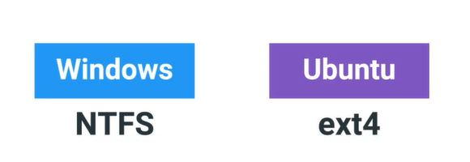

Filesystems have different compatibilities with different OSes. Most of the time, cross operating system support is minimal at best. Let's say you have a USB drive that's using an NTFS filesystem. Both Windows and Linux's Ubuntu can read and write to the USB drive. But if you have an ext4 USB drive, it'll only work on Ubuntu and not on Windows, at least without the help of third party tools.  

  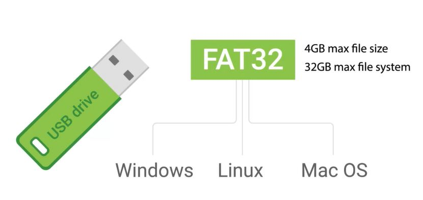

  

## Disk Anatomy

**Components** of the disk that allow you to store and retrieve files:  
A storage disk can be divided into something called **partitions**. A partition is just a piece of the disk that you can manage.
To add a filesystem to a disk, first you need to create a partition. Let's say you want to have two partitions on a disk, one for a Windows OS and one for a Linux OS. Instead of using two machines to use both operating systems, you can just use one machine and switch between the two OSs on boot-up. You can also add different filesystems on different partitions of the same disk. Partitions essentially act as their own separate sub-disks, but they all use the same physical disk. One thing to call out is that, when you format a filesystem on a partition, it becomes a **volume**. Volume and partition are sometimes mistakenly used synonymously, but we want to make sure that you understand this distinction.  
The other component of a disk is a **partition table**. A partition table tells the OS how the disk is partitioned. The table will tell you which partitions you can boot from, how much space is allocated to partition, etc. There are two main partition table schemes that are used, **MBR**, or **Master Boot Record**, and **GPT**, or **GUID Partition Table**. These schemes decide how to structure the information on partitions. MBR is a traditional partition table, and it's mostly used in the Windows OS. MBR only lets you have volume sizes of 2 terabytes or less. It also uses something called **primary partitions**. You can only have four primary partitions on a disk. If you want to add more, you have to take a primary partition and make it into something known as an **extended partition**. Inside the extended partition, you can then make something called a **logical partition**. It's a little odd to get at first, but that's just how the partition table was created.  
MBR is an old standard, and it's slowly being faded out by the next partition table scheme - GPT. *GPT is becoming the new standard for disks*. You can have a volume size greater than 2 terabytes, and it only has one type of partition. You can make as many of them as you want in a disk. In an earlier lesson, we learned about a new **BIOS** standard called **UEFI** that's become the default BIOS for newer systems. **To use UEFI booting, your disk has to use the GUID Partition Table**.

  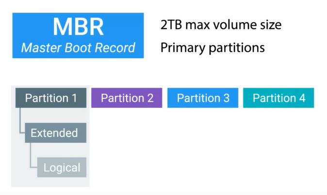

  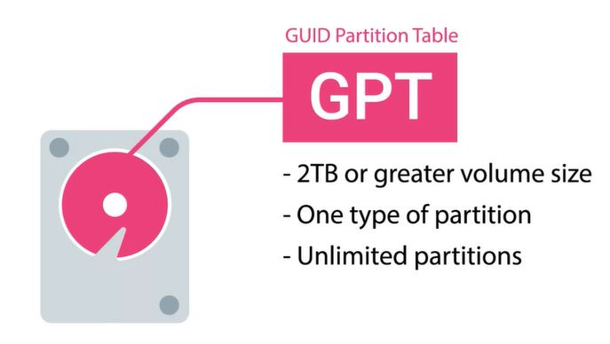

Windows ships with a great native of tool called the **Disk Management Utility**.

 *Win*

Search for Management

  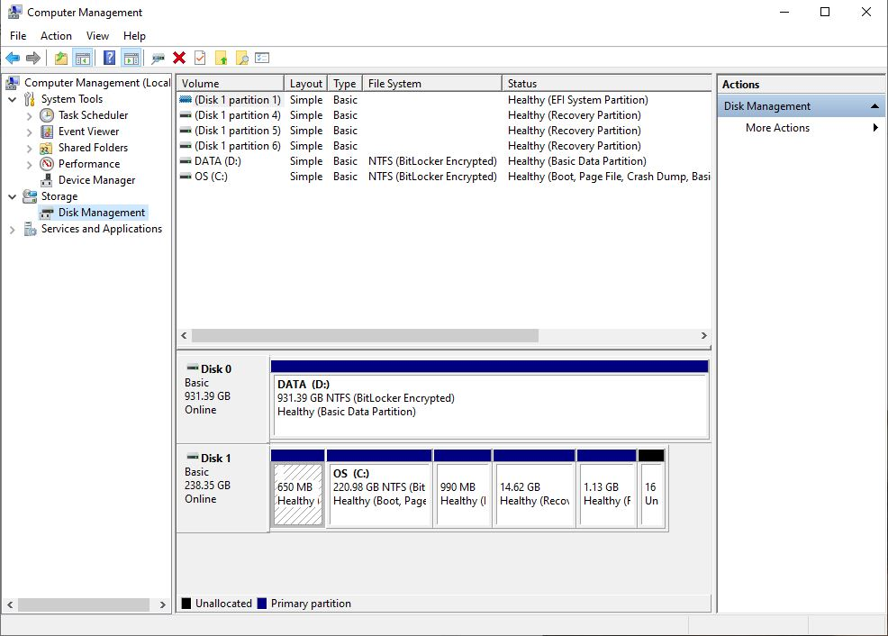

To format - right click on the partition and choose format.  
The difference between a quick format and a full format is that in a full format, Windows will do a little extra work to scan the disk or USB drive in our case, for errors or bad sectors. 

*Win*
* cmd -> Diskpart

  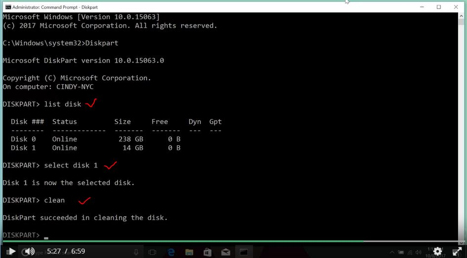

  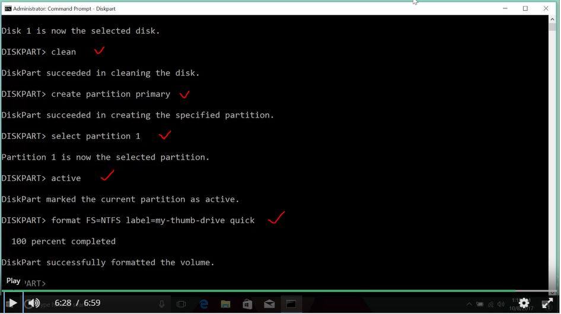

In IT, when we refer to **mounting** something like a file system or a hard disk, it means that we're making something accessible to the computer.

*Linux*
* sudo parted -l

  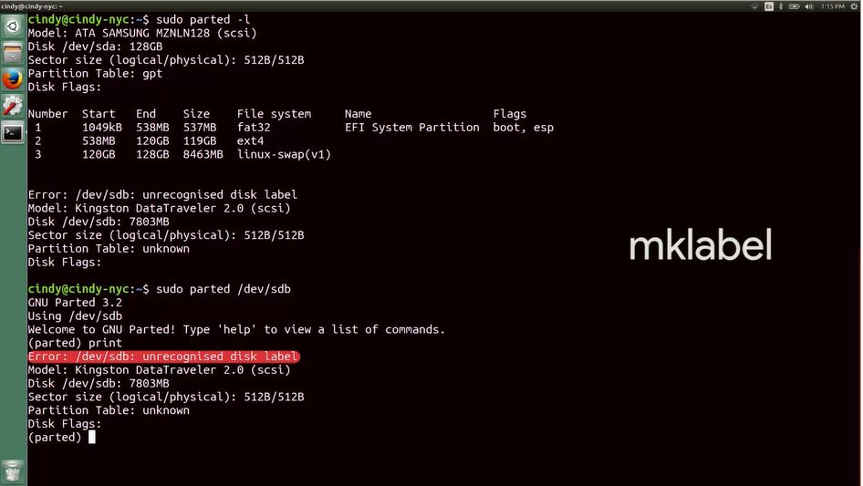

  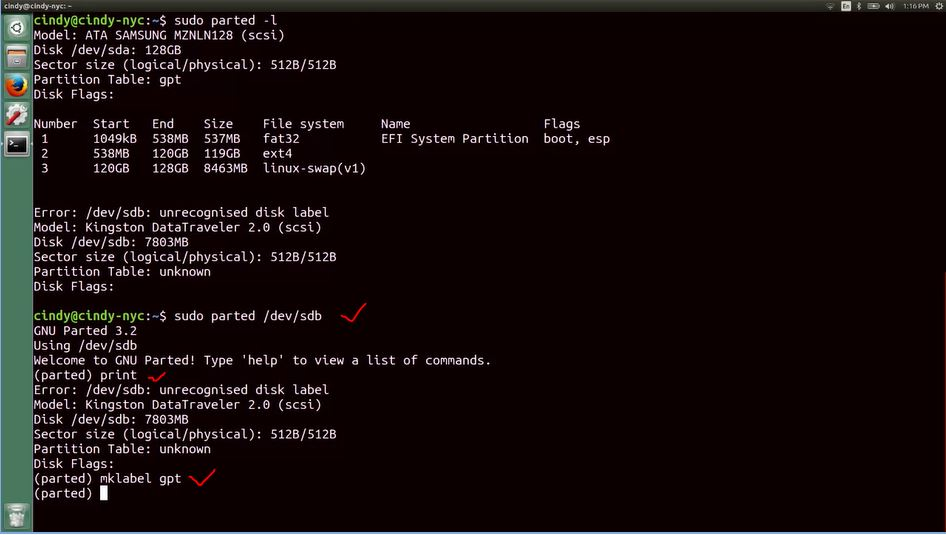

  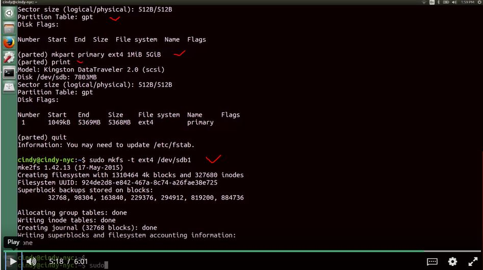

## Linux: Mounting and Unmounting a Filesystem

  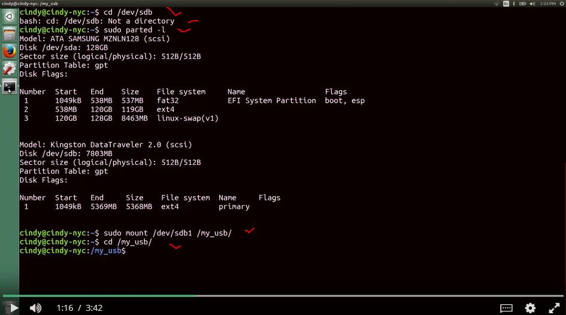

  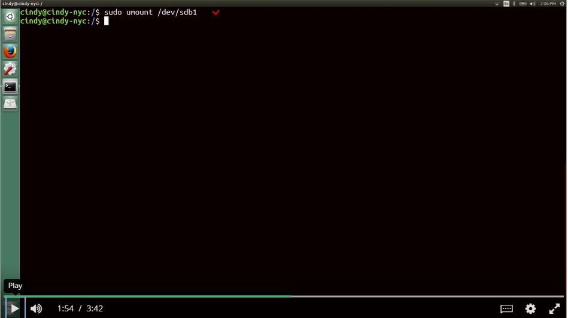

We'd get an error saying the device is not a directory. To resolve this, we need to create a directory on our computer and then mount the file system of our USB drive to this directory.  
We actually don't need to explicitly mount a file system using the mount command. Most operating systems actually do this for us automatically, when we plug in a device like a USB drive.  

**Virtual memory** is how our OS provides the physical memory available in our computer (like RAM) to the applications that run on the computer. It does this by creating a mapping, a virtual to physical addresses. 

**Swap**
When a particular page of data isn't being used by an application, it gets evicted. Which means it gets copied out of memory onto the hard drive. This is because accessing data on RAM is fast, much faster than the hard drive where space is at a premium. Because of this, the operating system wants to keep the most commonly accessed data pages in RAM. It then puts stuff that hasn't been used in a while on the disk.

  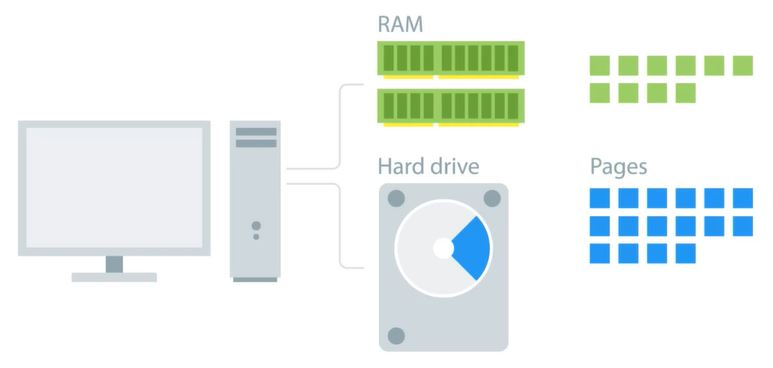

In Windows, pages saved to disk are stored in a special hidden file on the root partition of a volume called **pagefile.sis**.

  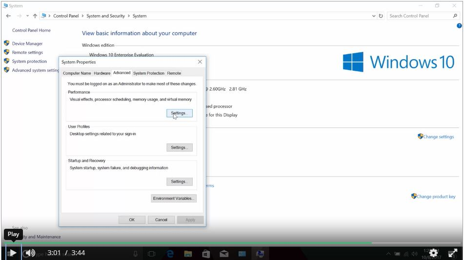

  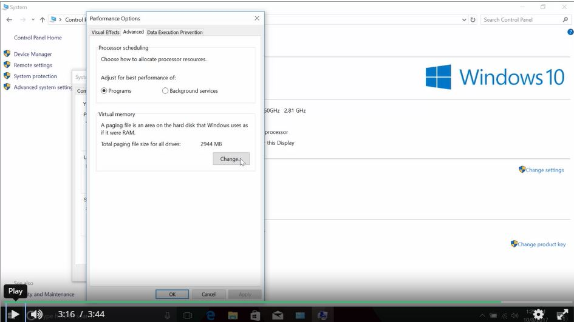

In Linux, the dedicated area of the hard drive used for virtual memory is known as **swap space**. We can create swap space by using the new disk partitioning tools.

  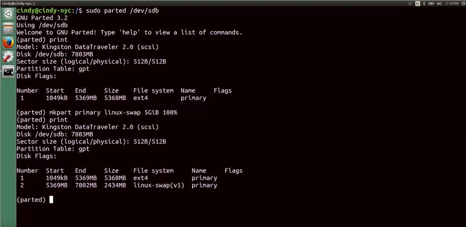

  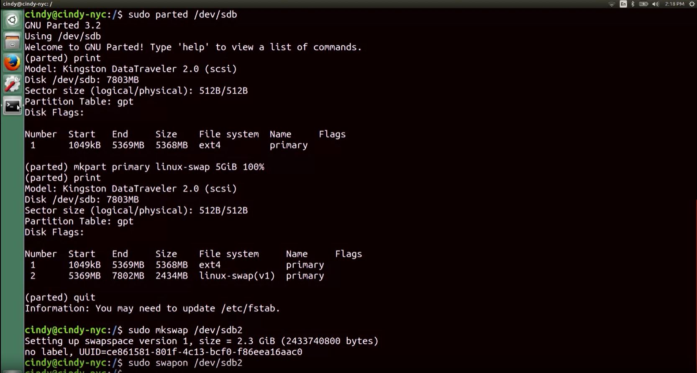

 **NTFS file system** is the native file system format of windows. NTF uses something called The **Master File Table** or **MFT** to keep everything straight. Every file on a volume has at least one entry in the MFT, including the MFT itself. Usually, there's a one-to-one correspondence between files and MFT records.

  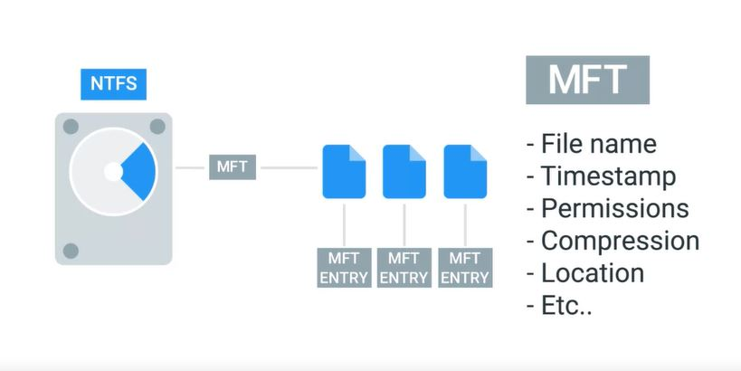

 When you create files on an NTFS file system, entries get added to the MFT. When files get deleted, their entries in the MFT are marked as Free so they can get reused. One important part of a file's entry in the MFT is an identifier called the** file record number**. This is the index of the files entry in the MFT. A special type of file we should mention in Windows is called a **shortcut**. A shortcut is just another file and another entry in the MFT. But it has a reference to some destination, so that when you open it up, you can get taken to that destination. You can create a shortcut by right-clicking on the target file and selecting the Create Shortcut option.

*Win*
* mklink file1Link file1.txt

 We say the operating system treats the **symbolic link** just like the original file. There's another type of link worth mentioning called a **hard link**. When you create a hard link in NTFS, an entry is added to the MFT that points to the linked file record number, not the name of the file. This means the file name of the target can change and the hard link will still point to it.

  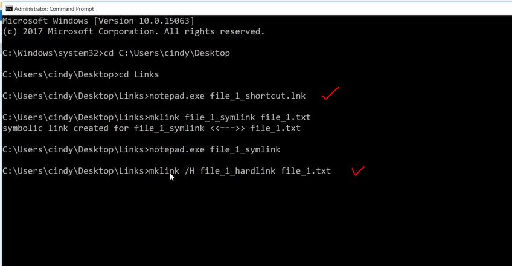

In Linux, metadata and files are organized into a structure called an **inode**. Inodes are similar to the Windows NTFS MFT records. We store inodes in an **inode table** and they help us manage the files on our file system. The inode itself doesn't actually store file date or the file name, but it does store everything else about a file. 
**Shortcuts** in Linux are referred to as **softlinks**, or **symlinks**. They work in a similar way symbolic links work in Windows, in that they just point to another file.  

  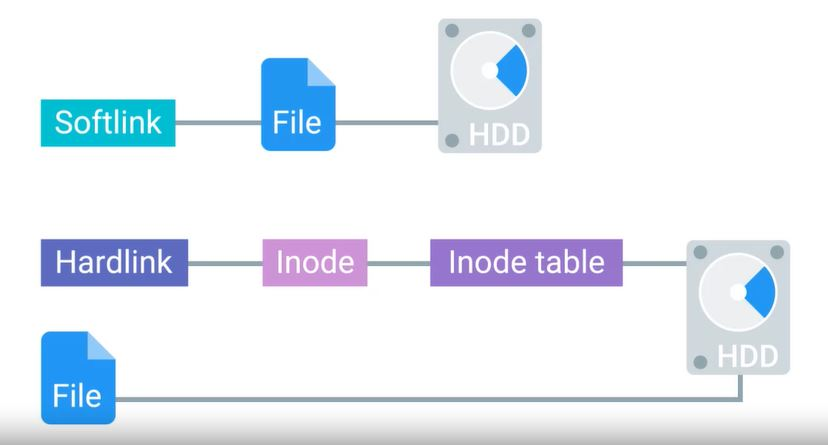

  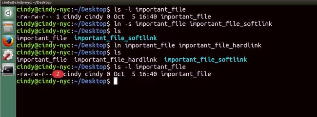

*Win*
To check disk usage, you can open up the computer management utility. Then head to the disk management console. From there, right click on the partition you're interested in and select properties.

In the disk management console, you might notice a button that says disk **cleanup**. If you press this button, Windows will launch a program called **CleanManager.exe** which will do a little housekeeping on your hard drive to try and free up some space. This housekeeping includes things like deleting temporary files, compressing old and rarely used files, cleaning up logs and emptying the recycle bin. Another task related to disk health is called **defragmentation**. The idea behind disc defragmentation is to take all the files stored on a given disk and reorganize them into neighboring locations. Having files ordered like this will make life easier for rotating hard drive disks that use an actuator arm to write to and read from a spinning disk. A process called **Trim** to reclaim unused portions of the solid state disk.

*Linux*
* du -h (disk usage)
* df (disk free)

A **data buffer** is a region of RAM that's used to temporarily store data while it's being moved around. So when you copy something from your OS to your USB drive, it first gets copied to a data buffer because RAM operates faster than hard drives.  

The NTFS file system has some advanced features built into it that can help minimize the danger of corruption, as well as, try to recover when the file system does get damaged. One of these features, through a process called **journaling**, logs changes made to a file metadata into a log file called the **NTFS log**. In addition to journaling, NTFS and Windows implements something called **self-healing** - mechanism makes changes to minor problems and corruptions on the disk automatically in the background. It does this while Windows is running so you don't need to perform a reboot.

  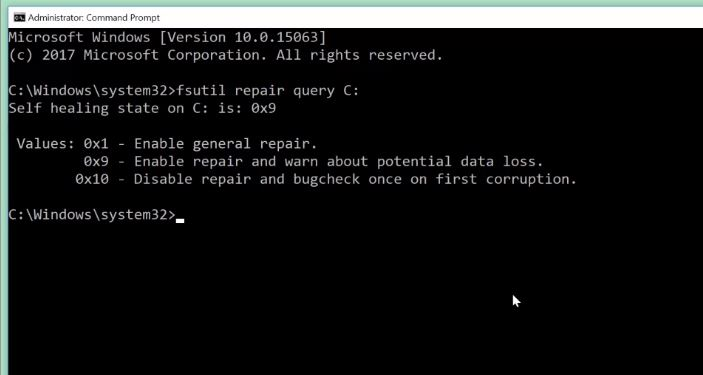

  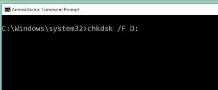

*Linux*

  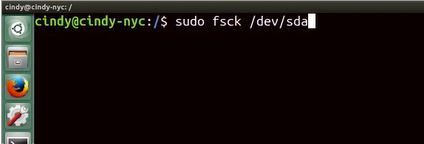

*Linux*
* lsblk (gathers information about all devices attached to the system, and prints them out using a tree-like structure)