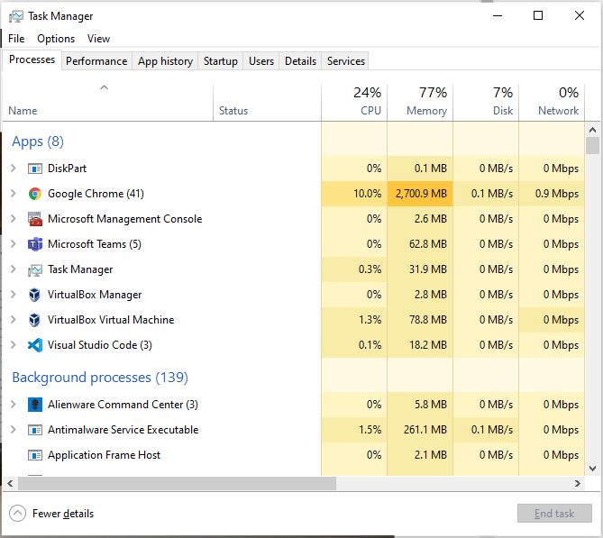
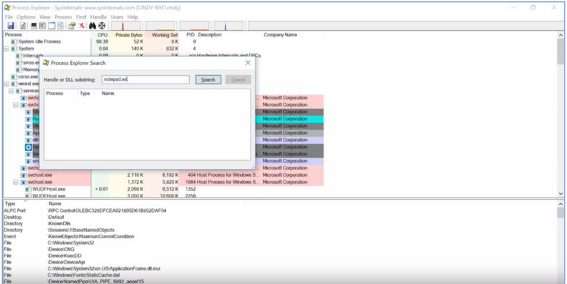
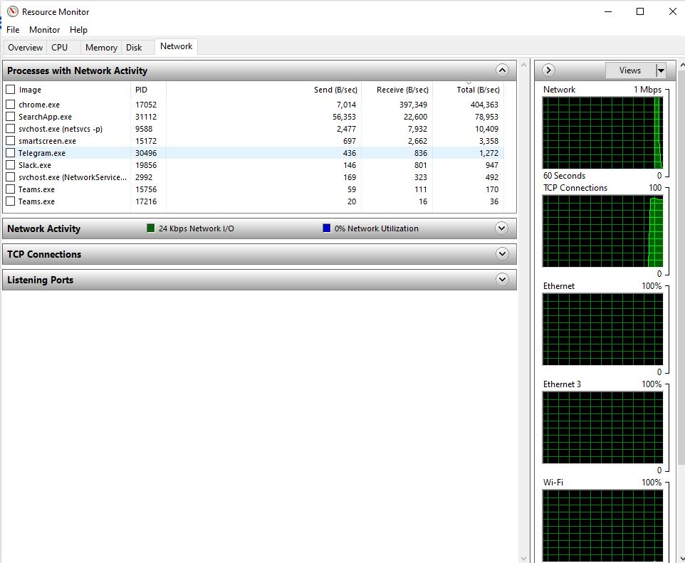

# WEEK 5 NOTES

 

When you open up an application like a word processor, you're launching a process. That processes get in something called a **process ID** to uniquely identify it from other processes.  
Besides, the visible processes that we start, like our music player or word processor, there are also not so visible processes running. These are known as **background processes**, sometimes referred to as **daemon processes**. Background processes are processes that run in the background. We don't really see them, and we don't interact with them, but our system needs them to function. They include processes like scheduling resources, logging, managing networks, and more.  

When Windows boots up or starts, the first non-kernel user mode that starts is the **Session Manager Subsystem** or **smss.exe**. The smss.exe process is in charge of setting some stuff up for the OS to work. It then kicks off the log-in process called **winlogon.exe** appropriately enough, along with the **Client/Server Runtime Subsystem** called **csrss.exe**, which handles running the Windows GUI and command line council.

 In Windows, each new process that's created needs a parent to tell the operating system that a new process needs to be made. The child process inherit some things from its parent like variables and settings, which we can collectively refer to as an **environment**. This gives the child process a pretty good start in life, but after the initial creation step, the child is pretty much on its own.  
 
**Task kill utility** can find and halt a process in a few ways. One of the more common ways is use an identification number, known as the process id or PID to tell task kill which process you'd like stopped. One way to do this is to kill notepad again by specifying the PID using taskkill/pid and then the PID number. Taskkill/pid, this is the process id of notepad.  

*Win*
* taskkill /pid 852 (This will send the termination signal to the process identified by the PID)

In Linux when you start up your computer, the kernel creates a process called **init**, which has a PID of one. Init starts up other processes that we need to get our computer up and running.  

On the Windows operating system, the **task manager** or **taskmgr.exe** is one method of obtaining process information. You can open it with the **strl + shift + escape** key combination or by locating it using the start menu.

  

*Win*
* tasklist
* Get-Process

*Linux*
* ps -x
* ps -ef (look process info)
* ls -l /proc
* cat /proc/123/status

 A **signal** is a way to tell a process that something's just happened. You can generate a signal with special characters on your keyboard and through other processes and software. One of the most common signals you'll come across is called **SIGINT**, which stands for signal interrupt. You can send this signal to a running process with the CTRL+C key combination. (For win & Linux)  

**Process Explorer** is a utility Microsoft created let IT support specialists, systems administrators, and other users look at running processes.  
Download from https://docs.microsoft.com/en-us/sysinternals/downloads/process-explorer

  

**MUI** stands for multilingual user interface  

In Linux the kill command without any flags sends a termination signal or **SIGTERM**. This will kill the process, but it'll give it some time to clean up the resources it was using. If you don't give the process a chance to clean up some of the files it was working with, it could cause file corruption.  
The **SIGKILL** signal will kill your process with a lot of metaphorical fire. Using a **SIGTERM** is like telling your process, ''Hey there process, I don't really need you to complete right now, so could you just stop what you're doing?'' And using SIGKILL is basically telling your process, ''OK, it's time to die.'' The signal does its very best to make sure your process absolutely gets terminated and will kill it without giving it time to clean up. To send a SIGKILL signal, you can add a flag to the kill command dash kill for SIGKILL. So, let's open up Firefox one more time. 

*Linux*
* kill -KILL 12345

To put it on pause by sending the **SIGTSTP** signal for terminal stop, which will put your process in a suspended state. To send this, you can use the kill command with the flag dash TSTP

*Linux*
* kill -TSTP 12345

  

*Win*
* Get-Process | Sort CPU -Descending |Select -First 3 -Property ID,ProcessName,CPU

A useful command to find out what your system utilization looks like in real time is the **top** command. Top shows us the top processes that are using the most resources on our machine. We also get a quick snapshot of total tasks running or idle, CPU usage, memory usage, and more.

*Linux*
* top
* uptime
* lsof (This command is great for tracking down those pesky processes that are holding open files.)