# WEEK 6 NOTES

 

## Remote Access

**Remote connection** allows us to manage multiple machines from anywhere in the world.  

**SSH** or **secure shell** is a protocol implemented by other programs to securely access one computer from another. To use SSH, you need to have an **SSH client** installed on the computer you're connecting from along with an **SSH server** on the computer you're trying to connect to. Keep in mind that when we say SSH server, we don't mean another physical machine that serves a data. *An SSH server is just software*. On the remote machine, the SSH server is running as a background process. It constantly checks if a client is trying to connect to it, then will authenticate its requests. The most popular program to use SSH within Linux is the OpenSSH program. We can use SSH from a Windows machine using the popular Open Source program **PuTTY**.  

The alternative is using an **SSH authentication key**. SSH keys come in a set of two keys called private and public keys. You can use one key to lock the safe, but it won't unlock it. The other key can then only unlock the safe but not lock it. You can lock something with the public key, but you can only unlock it with a private key and vice versa. This ensures that whatever is in the safe is available to only those with the public and private keys.  

  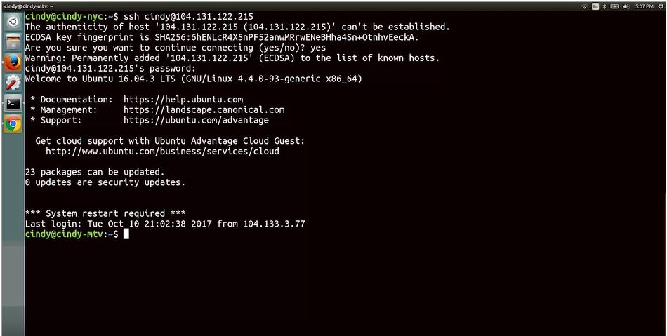

Another way that you can connect securely to remote machine is through **VPN**. A VPN is a **Virtual Private Network**, it allows you to connect to a private network like your work network over the internet. Think of it as a more sophisticated SSH with a lot more setup. It allows you to access resources like shared file servers and network devices as if you are connected to your work network.  

**PuTTY** is a free open-source software that you can use to make remote connections through several network protocols including SSH. PuTTY also comes with a tool called **Plink** or **PuTTY link** which is built into the command line after PuTTY is installed. You can use Plink to make remote SSH connections too. SSH can be super useful especially if you want to connect from a computer running Windows to a Linux-based operating system running remotely.  

  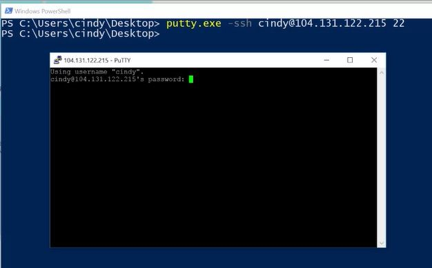

Microsoft actually provides another way to connect to other Windows computers called the **Remote Desktop Protocol** or **RDP**. There are also RDP clients for Linux and OS 10 too, like **RealVNC** and **Microsoft RDP** on Mac.  

RDP provides users with a graphical user interface to remote computers, provided the remote computer has enabled incoming RDP connections. A client program called the **Microsoft Terminal Services Client** or **mstsc.exe** is used to create RDP connections to remote computers. You can enable remote connections on your computer by opening up the start menu, right clicking on "This PC", then selecting "Properties". From there, select "Remote Settings",and then pick an option from the remote desktop portion of the panel. There are some security implications that come with allowing people to remotely connect to your computer. You should only let users who you trust do this. Once you've allowed connections on the remote computer and provided you're on the list of users allowed to access it, you can use the Remote Desktop Protocol client mstsc.exe to connect to it from anywhere else on the network. Search for mstsc and connect.  

  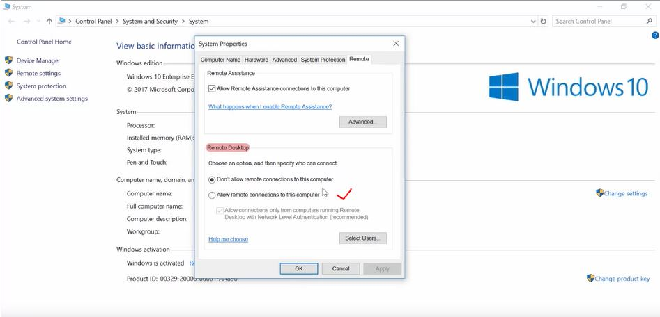

**scp**, or *secure copy*, is a command you can use in Linux to copy files between computers on a network.  It utilizes SSH to transfer the data.  

  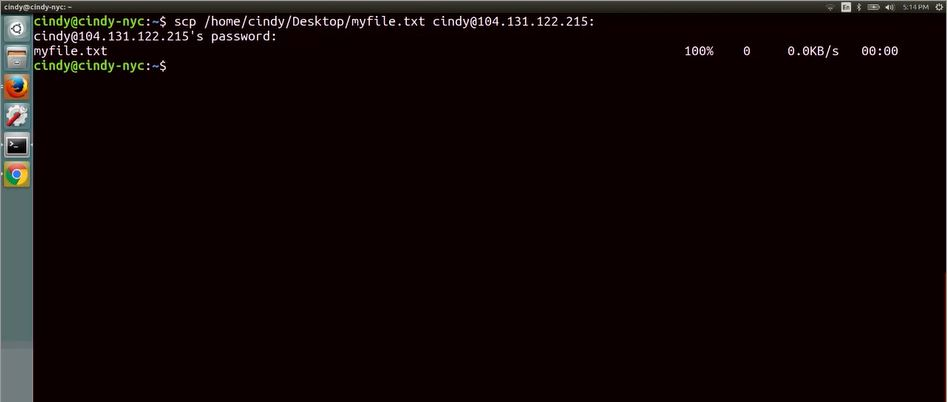

In Win the PuTTY package comes with a tool called the **PuTTy Secure Copy Client**, or **pscp.exe**. You can use it to copy files in a very similar way to the Linux SCP. command.

  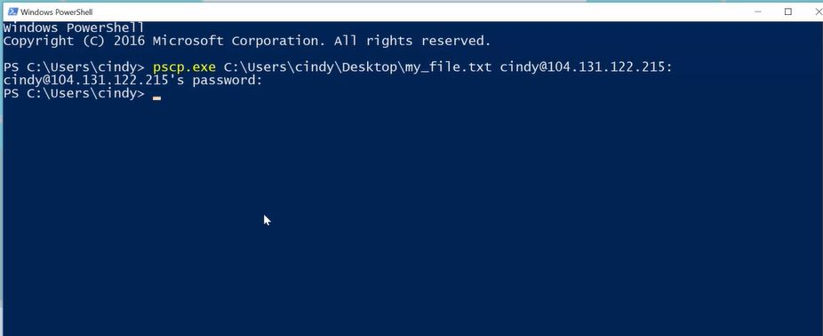

If you shared the folder, you can access it from other computers. Start by opening up This PC, Then going into the Computer tab. And from here, you can map the folder directly to your computer with the map network drive option.

  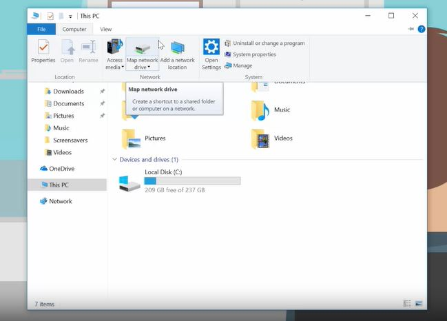

  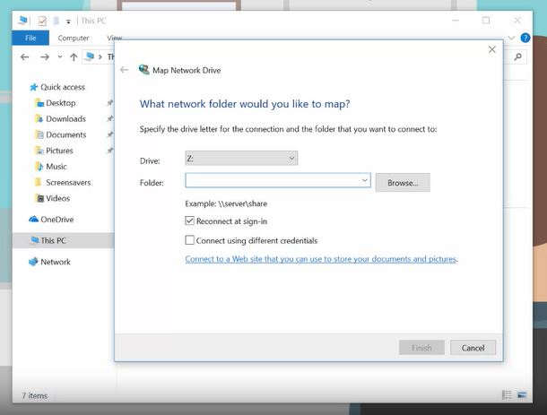

  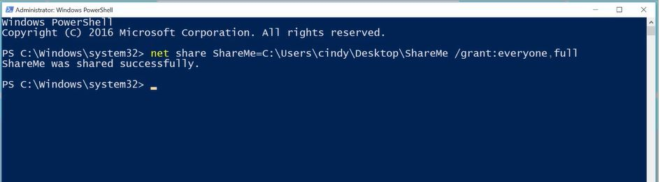

## Virtualization

A virtual instance is just a single virtual machine. The popular opensource virtualization software is **Virtual Box**, that used to to manage virtual instances.

  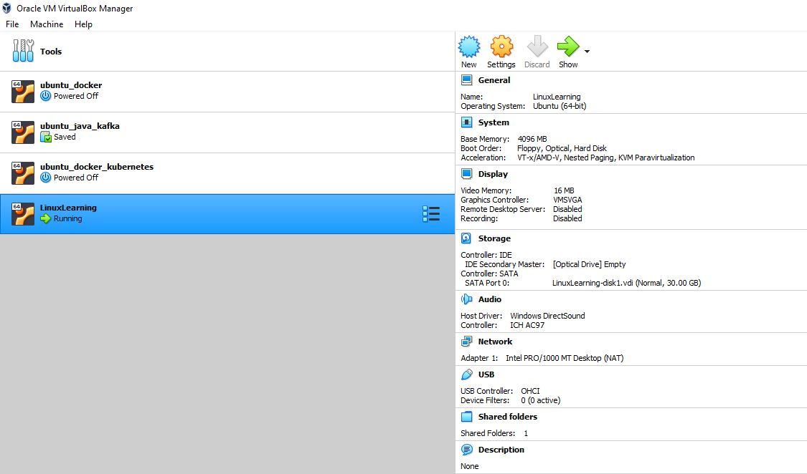

## Logging

The act of creating log events is called **logging**.  

Win: Serch for Event Viewer or eventvwr.mcs

  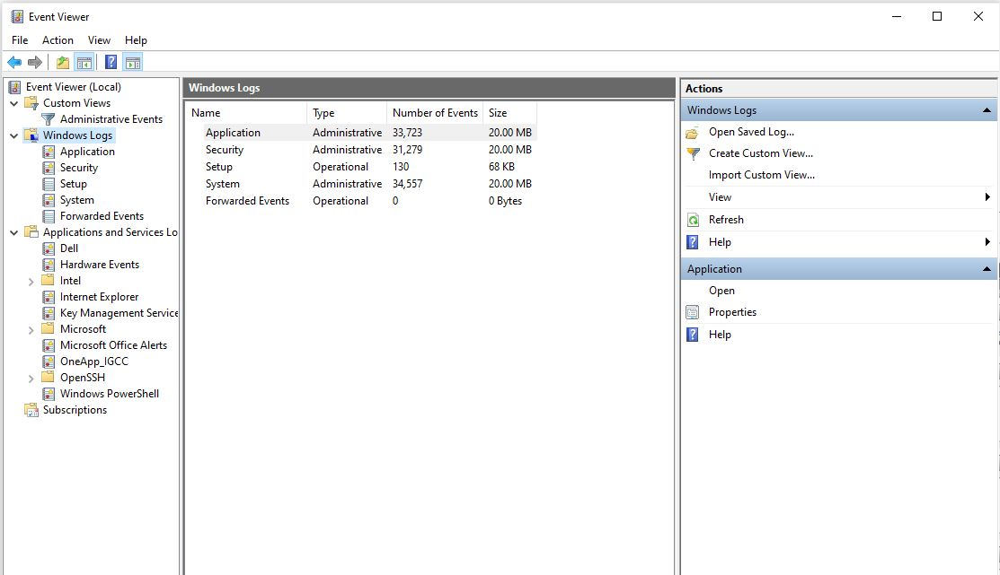

Linux: 

  

Logs in Linux are stored in the **/var/log** directory. **/var** directory stands for variable, meaning, files that constantly change are kept in this directory, and it turns out that logs are constantly changing.
* **/var/log/kern.log** - kernel messages are logged here. 
* **/var/log/dmesg** - system startup messages are logged here. If you encounter an issue at, let's say, boot up, this is a good place to check for information. 
* The one log file that logs pretty much everything on your system is a **/var/log/syslog file**. The only thing that sys log doesn't log by default are off events. 
* When troubleshooting issues with user machines, **/var/log/syslog** will usually contain the most comprehensive information about your system, so that should be your first stop. Log files output a lot of events. 
* Our systems also do a good job of cleaning out log files to make room for new ones. They use something called **log rotation** to do this. In Linux, the utility rotate logs is called **log rotate**. You can change your log rotation settings to make sure not to delete events that are that old. If you find yourself managing many systems and want to be able to parse their logs in one central location, you can use something called **centralized logging**. 
* The **Unix epoch time** is used to represent, then, it's the number of seconds since midnight on January first, 1970, a sort of zero hour for Unix based computers to anchor their concept of time. This means that 1501538594 represents the date, time, Monday, July 31st. 30314 Pacific Standard Time.

## Operating System Deployment

One tool we can use to image computer is a **disk cloning tool**. It makes a copy of an entire disk and allows you to back up a current machine or set up a new one.  One of the many disk cloning tools out there is the open source software **Clonezilla**. It can be used to backup and restore a single machine or many machines simultaneously. A popular commercial imaging tool is **Symantec Ghost**.  One option is **disk-to-disk cloning** where you connect an external hard drive to the machine you want to clone. You can connect a hard drive like your HDDs and SSDs into something known as an **external hard drive dock**. These devices are great IT tools that kind of look like toasters. Once you connect your external hard drive, you can use any disk cloning tool of your choice.  

Let's make a copy of the USB drive I have connected in my laptop then save it as an image file. 

  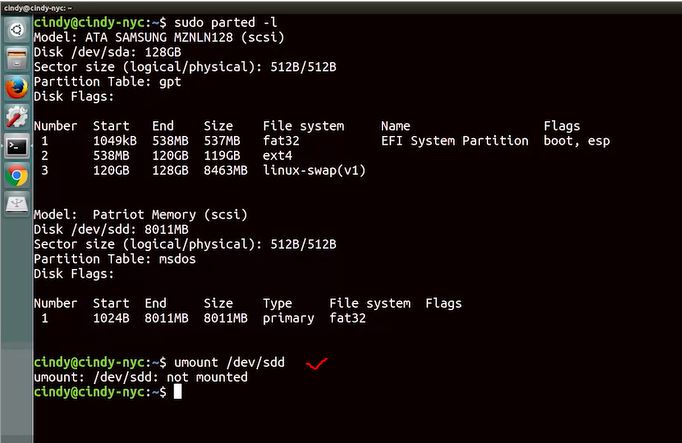

  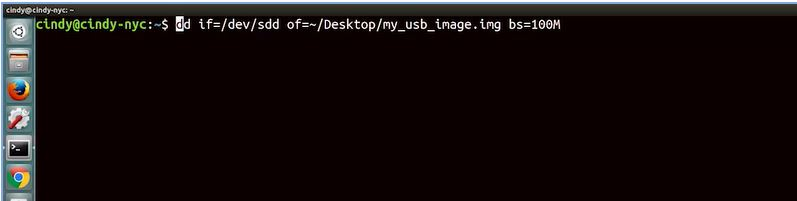

Mobile device:
A **factory reset** returns the device back to the state it was in when the device well shipped from the factory. In Android and iOS you need the primary account credentials in order to perform a factory reset. This is so stolen devices can not be easily factory reset and then resold. If the mobile device won't boot or doesn't have a good enough data connection to download the update itself. In these cases you can **reflash** or **overwrite the OS of the device from a computer**.  

The basic steps are: 
* one, download the update to a computer; 
* two, attach the mobile device to a computer using a USB cable; 
* and then three run some software on the computer that will re-flash the mobile device.

