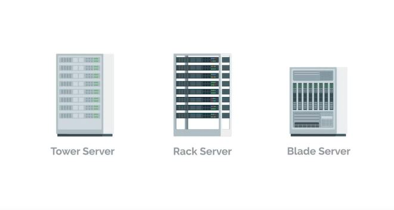
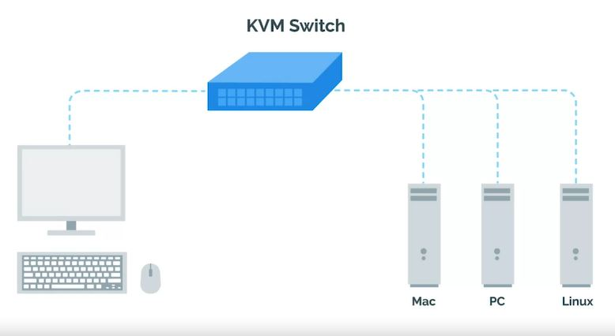
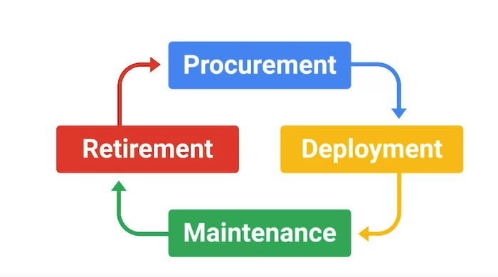

# WEEK 1 NOTES

 

## Introduction to System Administration and IT Infrastructure Services

**IT infrastructure** encompasses the software, the hardware, network, and services required for an organization to operate in an enterprise IT environment. Without an IT infrastructure, employees wouldn't be able to do their jobs and the whole company will crumble before it even get started. So organizations employ the help of someone like a systems administrator to manage the company's IT infrastructure.   

A **server** is essentially software or a machine that provides services to other software or machines.

 Server hardware can come in lots of different forms. They can be towers that sit upright, they look very similar to the desktops we've seen. Those towers can be put in a closet or can sit on the table if you want them to. But, what if you needed to have 10 servers? The **towers** would start taking up way too much space. Instead, you can use **rack** servers which lay flat and are usually mounted in a 90 inch wide server rack. If you needed even more space, you could use **blade** servers that are even slimmer than racks. There are other types of form factors for servers but these are the most common ones.  

  

A **KVM switch** (keyboard, video and mouse) is a hardware device that allows a user to control multiple computers from one or more[1] sets of keyboards, video monitors, and mice.  

  

**Cloud computing** is the concept that you can access your data, use applications, store files, et cetera, from anywhere in the world as long as you have an internet connection. But the Cloud isn't a magical thing. It's just a network of servers that store and process our data.

There are few common policy questions that come up in most IT settings that you should know. 
* Should users be allowed to install software? Probably not. 
* Should users have complex passwords with certain requirements? It's definitely a good rule of thumb to create a complex password.
* Should you be able to view non-work related websites like Facebook? That's a personal call.
* If you hand out a company phone to an employee, should you set a device password? Absolutely. P
* Whenever policies are decided upon, have to be documented somewhere. It's supercritical to maintain good documentation. 

  

There are four main stages of the **hardware lifecycle**. 
* **Procurement**. This is the stage where hardware is purchased or re-used for any employee. 
* **Deployment**. This is where hardware is set up so that the employee can do their job. 
* **Maintenance**. This is the stage where software is updated and hardware issues are fixed if and when they occur. 
* **Retirement**. In this final stage, hardware becomes unusable or no longer needed and it needs to be properly removed from the fleet. 

First, a new employee is hired by the company, human resources tells you to provision a computer for them and set up their user account. Next, you allocate a computer you have from your inventory or you order a new one if you need it. When you allocate hardware you may need to tag the machine with a sticker so they can keep track of which inventory belongs to the organization. Next, you image the computer with the base image for further using a streamlined method that we discussed in our last course, operating systems and you. Next, you name the computer with a standardised host name. This helps with managing machines. More on that when we talk about directory services later. In regards to the name itself, we talked about using a format such as username-location, but other host name starters can be used. After that, you install software the user needs on their machine. Then the new employee starts and you streamline the setup process for them by providing instructions on how to log into their new machine, get email etc. Eventually, if a computer sees a hardware issue, a failure, you look into it and think through the next steps. If it's getting too old, you'll have to figure out where to recycle it and where to get new hardware. Finally, if a user leaves the company you'll also have to remove their access from IT resources and wipe the machine so that you can eventually re-allocate it to someone else.  

A **batch update** - once every month or so, you update all your servers with the latest security patches. You have to find time to take their services offline, perform the update, and verify that the new update works with the service.  

**A six-steps related to the troubleshooting process:**

  

Avoid using administrator rights for tasks that don't require them.  
With Great Power Comes Great Responsibility.  

In Linux **script** can be used to record a group of commands as they're being issued along their output. In Windows Power-Shell it is **Start-Transcript**.  

*Win*
* Start-Transcript -Path C:\Transcript.txt

Reverting to the previous state is called a **rollback**.  

If you are going to be performing an action that needs to be done graphically and you can document what you are doing, you can use a specialized tool like **recordMyDesktop**
for Linux, or general video tools like **OBS** or **VLC**.

http://recordmydesktop.sourceforge.net/about.php  
https://obsproject.com/  
https://www.videolan.org/vlc/index.html  

* By **production** in an infrastructure context, we call the parts of the infrastructure where certain services are executed and serve to its users production.
* The **test environment** is usually a virtual machine running the same configuration as a production environment, but isn't actually serving any users of the service.
* If you're in charge of an important service that you need to keep running during a configuration change, need to have a secondary or a **stand-by machine**. This machine will be exactly the same as a production machine, but won't receive any traffic from actual users until you enable it to do so. 

**Reproduction case** means you're creating a roadmap to retrace the steps that led the user to an unexpected outcome. Like reaching an error page.

