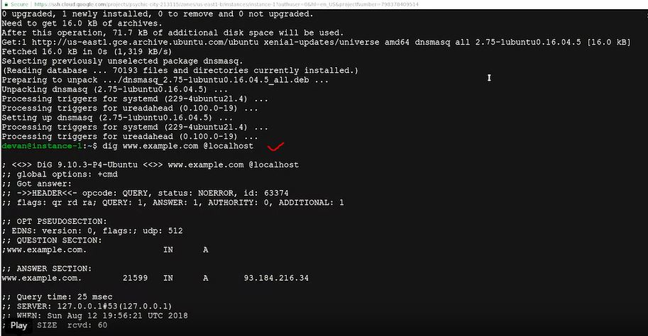

# WEEK 2 NOTES

 

## Types of IT Infrastructure Services

  

If you don't want to be responsible for managing the hardware tasks and updating your server operating systems security patches and updates, you can use the Cloud alternative to maintain your own infrastructure, which is called **Infrastructure as a Service**, or **IaaS**. IaaS providers give you pre-configured virtual machines that you can use just as if you had a physical server. Some popular IaaS providers are, Amazon Web Services and their Elastic Compute Cloud or EC2 instances, Linode, which runs out virtual servers, Windows Azure, and Google Compute Engine

  

If your company is large, networking is usually taken care of by a dedicated team. But in smaller companies, you'll probably be responsible for setting up the network. Network can be integrated in an IaaS provider, but in recent years, it's also been branched off into its own Cloud service, **Networking as a Service** or **NaaS**. NaaS allows companies to offshore their networking services so that they don't have to deal with the expensive networking hardware. Companies also won't have to set up their own network security, manage their own routing, set up a WAN and private internets, and so on.

  

You have to deal with things like licences, security, updates, and maintenance for each machine. The Cloud alternative to maintaining your own software is known as **Software as a Service**, or **SaaS**. Instead of installing a word processor on every machine, you can use Microsoft Office 365 or Google G suite. These are both services that you can purchase that allow you to edit word documents, process spreadsheets, make presentations and more, all from a web browser. 

  

The programming development environment will also have to be installed on every machine that needs it. If you want an all-in-one solution to building and deploying a web application, you can use something called **Platform as a Service**, or **PaaS**. This includes an entire platform that allows you to build code, store information in a database, and serve your application from a single platform. Popular options for PaaS are, Heroku, Windows Azure, and Google App Engine. 

  

The last IT infrastructure service we'll discuss is the management of users, access and authorization. A **directory service**, centralizes your organizations users and computers in one location so that you can add, update, and remove users and computers. Some popular directory services that you can set up are Windows Active Directory, OpenLDAP, and we'll dive a little deeper into both of these later on in this course. Directory services can also be deployed in the Cloud using Directory as a Service, or DaaS providers. 

  

**Server operating systems** are regularly operating systems that are optimized for server functionality. This includes functions like allowing more network connections and more RAM capacity. Most operating systems have versions specifically made for servers. In windows, you have **Windows Server**. In Linux, many distributions come with server counter protests like **Ubunta server**, which is optimized for server use. Mac OS is also available in **Mac OS Server**. Server operating systems are usually more secure and come with additional services already built in. So, you don't have to set up these services separately.  

There are two ways you can run your services, either on dedicated hardware or on a virtualized instance on a server.  
When you virtualize a server you're putting lots of virtual instances on one server. Each instance contains a service.  
In Linux, the most popular remote access tool is OpenSSH.  

  

  

  

**Network services**

* A network service that's commonly used in organization is a **file transfer service**. 
* **FTP** is a legacy way to transfer files from one computer to another over the Internet, and it's still in use today. It's not a super secure way to transfer data because it doesn't handle data encryption. The FTP service works much like RSH service. Clients that want to access an FTP server have to install an FTP client. On the FTP server, we install the software that allows us to share information located in the directory on that server. FTP is primarily used today to share web content. If you use a website host provider, you might see that they have an FTP connection already available for use so they can easily copy files to and from your web site. 
* **SFTP** is a secure version of FTP, so it makes sense to choose this option over FTP. During this SFTP process, data is sent through SSH and is encrypted. 
* **TFTP** stands for trivial FTP. It's a simpler way to transfer files than using FTP. TFTP doesn't require user authentication like FTP, so any files that you store here should be generic and not need to be secure. A popular use of TFTP is to host installation files. 

* *FTP TCP port 21*
* *SFTP TCP port 22*
* *TFTP UDP port 69

One method of booting a computer is **PXE** or **PXE boot**, which stands for **preboot execution**. This allows you to boot into a software that's available over the network. A common use case for organization that want to install software over a network is to keep operating system installation files in a TFTP server. That way, when you perform a network boot, you can be automatically launched into the installer. This is more efficient than having to carry around a USB with an operating system image.  

**Network time protocol** or **NTP** is used to keep the clock synchronized on machines connected to a network. In the IT world, machines need to have accurate time across a network for a lot of reasons. There are some security services like **Kerberos** and **network authentication protocol** that depend on the time being consistent across the network to work.  

An **Intranet** is an internal network inside a company. It's accessible if you're on a company's network. Intranets can provide a wide range of information, and are meant to improve productivity by giving employees a greater medium to share information. Think of it like the company's website, that's only accessible to people on the company network.  
Another internal support service that's widely used is a **proxy server**. Proxy server acts as an intermediary between a company's network and the Internet. They receive network traffic and relay that information to the company network. Proxy servers can also be used to monitor and log internal company network activity.  

**DNS** is what maps human understandable names to IP addresses. 

Hosts files and networking allows us to map IP addresses to hosts things manually. In Linux, our host file is code etc/hosts.  

**DHCP** - **Dynamic Host Configuration Protocol**. 

Unable to Resolve a Hostname or Domain Name like google.com

*Linux*
* ping www.google.com
* nslookup www.google.com (nslookup gives us the name server of a host or domain name)
* sudo vim /etc/hosts

The programs run as background processes are known as **daemons**, or just services. This means, that the program doesn't need to interact with the user through the graphical interface or the command line interface, to provide the necessary service. The operating system ensures that the program is running. Each service has one or more configuration files.

Ckeck NTP status:

  

  

In windows:

  

  

* On *Windows*, most of the configuration is stored in the **registry**. This can be modified using graphical wizards or using the **set service** command. 
* On *Linux*, the configuration files for the installed services are located in the **/etc** directory. And while some software may ship graphical configuration editors, you typically have to edit the configuration files with a text editor. 

  

**Lftp** is an ftp client program that allows us to connect to an ftp server.
In order for our service to re-read the configuration, we need to tell it to **reload**. Reloading means that the service re-reads the configuration file without having to stop and start.  

In smaller set-ups you may be better off having a centralized solution that handles all services - **dnsmasq** - a program that provides DNS, DHCP, TFTP and PXE services in a simple package.

  

Once we've installed dnsmasq it's immediately enabled with the most basic functionality. *It provides a cache for DNS queries*. This means that you can make DNS requests to it, and you'll remember the answer so your machine doesn't need to ask an external DNS survey each time you make the query. In order to check this functionality, we'll use the **dig** command, which lets us query DNS servers and see their answers. So, let's ask our DNS server running in local host for the address of www.example.com. We do this by running dig www.example.com @localhost. The part after the at sign indicates which DNS server we want to use. Here, we have the reply from our query. Our DNS server is telling us the IP address for the domain example.com. 

  

  

  

  

  

A **DHCP** server is usually set up on a machine or a device that has a static IP address configured to the network interface which is being used to serve the DHCP queries. That interface is then connected to the physical network that you want to configure through DHCP, which can have any number of machines on it. In real life, the DHCP server and the DHCP client usually run on two separate machines. 

  

  

