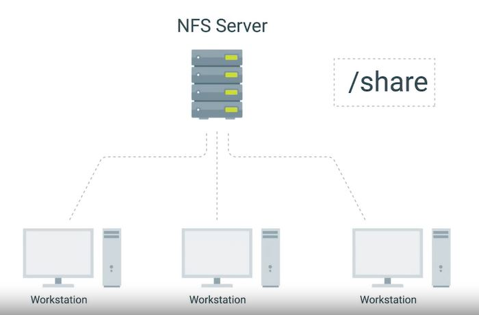
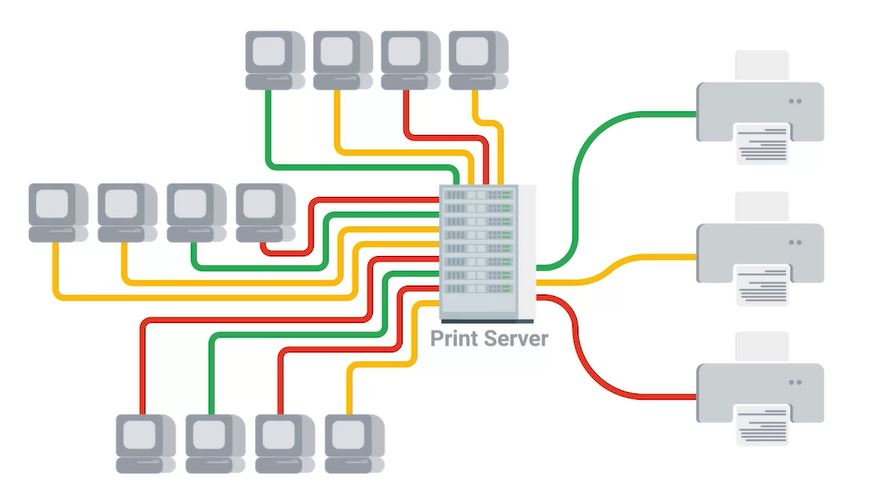
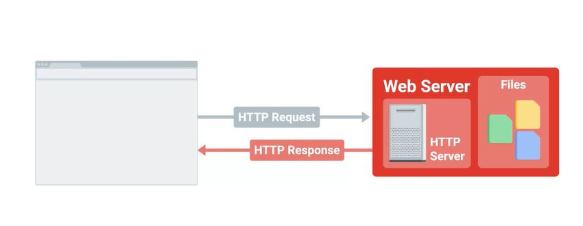
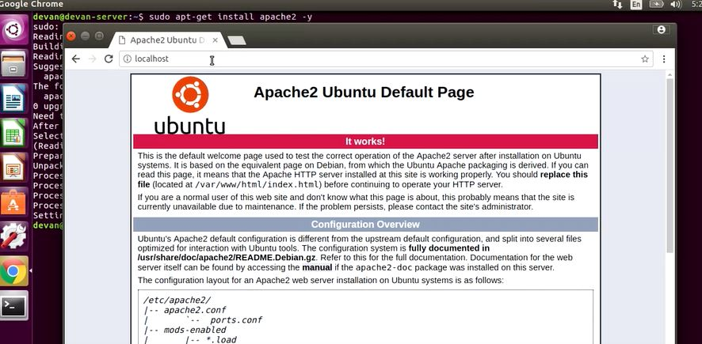

# WEEK 3 NOTES

 

## Software Services

* **Internet Channel Relay** or **IRC**, which is a protocol that's used for chat messages. IRC operates in a client and server model, so lots of IRC client software can be used to connect to an IRC server.
* **Paid for options** are another method of instant communication. There are a lot more sophisticated and advanced chat applications out there that offer Enterprise support. A few popular options are **HipChat** and **Slack**. 
* There are also other communication protocols called **open IM protocols** that are widely used and integrated into different communication applications. 
* One of the most popular communication protocols is **XMPP** or **Extensible Messaging and Presence Protocol**. It's an open source protocol used in instant messaging applications and social networking services. XMPP is even used in Internet of Things applications, among other things. A few popular and free applications that use XMPP are **Pidgin** and **Adium**. 

The **A record** is used for hostnames, but for email servers we use **MX**, for the mail exchange record.  

* There are lots of email protocols. The more common ones are **POP3**, **IMAP**, and **SMTP**.  
* **Post Office Protocol**, or POP version 3, is an email protocol that downloads email from an email server onto your local device. It then deletes the email from the email server. If you want to retrieve your email through POP3, you can only view it from one device.
* **IMAP**, or **internet message access protocol** allows to download emails from your email server onto multiple devices. It keeps your messages on the email server. This email protocol is one of the more popular ways to retrieve email. 
* **Simple mail transfer protocol**, or **SMTP**, which is a protocol used for sending emails. 
* While POP3 and IMAP and other protocols can be used to retrieve email, there's only really one email protocol for sending email, SMTP.

**HTTPS**, or **Hypertext Transfer Protocol Secure** is a secure version of **HTTP**. It makes sure the communication your web browser has with the website is secured through encryption. HTTPS is also referred to as HTTP over TLS or HTTP over SSL.  

**Transport Layer Security** protocol, or **TLS**, which is the most popular way to keep communications secure over a network. TLS is widely used to keep web browsing secure, but it can be used in a lot of other applications, too.   

**Secure Socket Layer** protocol, or **SSL** is a way of securing communication between a web server and client. But it's pretty old and insecure, so it's been deprecated in favor of TLS.  

**Certificates** as a way to verify that something is trustworthy.  

* **FAT32** is a popular FAT system that's compatible with Windows, Linux, and Mac OSes. But it has severe limitations on the amount of data you can store on a volume. 
* **NFS** **Network File System** enables files to be shared over network

  

**Samba** services are similar to NFS since she can centrally share and manage files services. Also, all major operating systems can use a Samba file sharing. The only reason you might want to consider Samba over NFS, is because it works better with Windows operating systems. **SMB** is a protocol that Samba implements.  

A relatively affordable solution for FAT storage hardware is to use a **network attached storage** or **NAS**. Instead of setting up a dedicated server like you would other services. NASes are computers that are optimized for file storage. They usually come with an operating system best stripped down in order just to serve files over a network. They also come with lots of storage space.  

  

* In the *Windows* server operating system, there's a **Print and Document Services** that can be enabled. All you have to do is add your network printer to the service and install the drivers for those printers.
* In *Linux*, a common print server that's usually pre-installed on machines is CUPS or **Common UNIX Printing System**

A **web server** stores and serves content to clients through the Internet. You can access web service using a domain name like Google dot com. A web server itself stores web files and runs an HTTP service or HTTP server, that processes HTTP requests. 

  

The most widely used is the **Apache HTTP server**, most commonly referred to as Apache. Apache is a free and open source. It helps serve a large percentage of web pages on the Internet. 

  

**Databases** allow us to store query, filter, and manage large amounts of data.

Knowing common **HTTP status code** comes in handy when you're troubleshooting website error. They usually tell you useful information that can help you isolate the root cause. **404** Not Found A 404 error indicates that the URL you entered doesn't point to anything. Developer tool can show the status codes. (Network tab) HTTP status codes that start with **4xx** indicate an issue on the client-side. **5xx** indicates an issue on the server-side. Request is successful, which is denoted by the codes that begin with **2xx**.

A **data centers house** a large assortment of machines, and different types of machines are used for different services. When you use **Software as a Service** or **SaaS**, the software is already pre-configured and the user isn't deeply involved in the cloud configuration. If you choose a cloud email solution like **gmail**, a cloud storage solution like **Dropbox** or a cloud productivity suite like **Microsoft Office 365**, there are only a small number of options for you to select or customize. The cloud provider manages everything related to the service for you including; deciding whether VMs are hosted, ensuring that it has enough capacity to serve your needs, forming back as frequently and reliably and more. When you use Infrastructure as a Service or **IaaS** on the other hand, you're hosting your own services in the cloud. You need to decide how you want the infrastructure to look depending on what you want to run on it. When you set up cloud resources, you need to consider **regions**. A region is a geographical location containing a number of data centers. Each of these data centers is called a zone, and each zone is independent of the others. If one of them fails for some reason, the others are still available and services can be migrated without visibly affecting users. 

A **load balancer** ensures that each VM receives a balanced number of queries.  
**Autoscaling** allows the service to increase or reduce capacity as needed, while the service owner only pays for the cost of the machines that are in use.  
 Most cloud providers include **monitoring** and **alerting** solutions as part of their services. 
