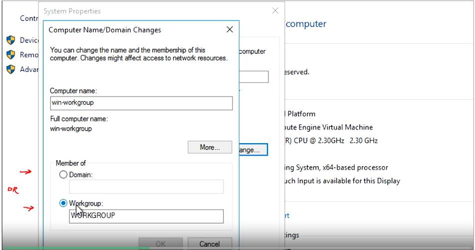
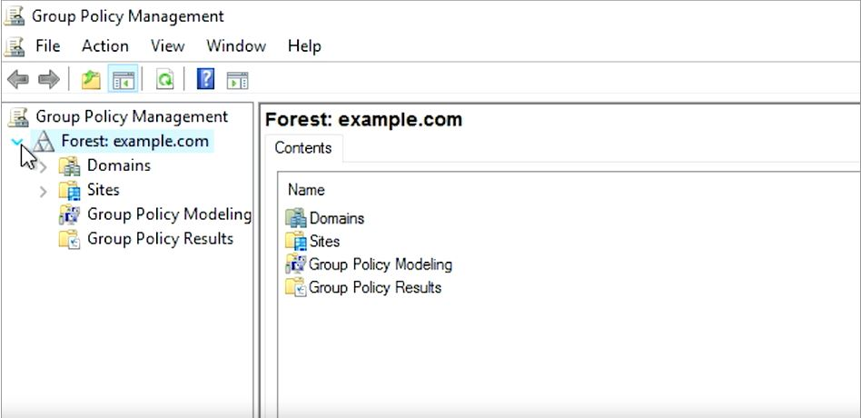

# WEEK 4 NOTES

 

## Directory Services

A **directory server** contains a lookup service that provides mapping between network resources and then network addresses. It's used to organize and look up organizational objects and entities ranging from things like user accounts, user groups, telephone numbers, and network shares. Instead of managing user accounts and computer information locally on every machine, all that information can be stored on a directory server for easy access and management.  

The ideal enterprise quality directory server should support **replication**. This means that the store directory data can be copied and distributed across a number of physically distributed servers but still appear as one unified data store for querying and administering. A replication is important because it provides redundancy by having multiple servers available simultaneously.  

Directory services are useful for organizing data and making it searchable for an organization. This is achieved through the use of a hierarchal model of objects and containers. The **containers** are referred to as **organizational units** or **OUs**, and they can contain objects or more organizational units. This is similar in organizational structure to a file system. OUs are like folders which can contain individual files or objects for a directory service. OUs can also contain additional folders.   

  

**Directory services** became an open network standard for interoperability among different software vendors.  

* **Directory Access Protocol** or **DAP**
* **Directory System Protocol** or **DSP**
* **Directory Information Shadowing Protocol** or **DISP**
* **Directory Operational Bindings Management Protocol** or **DOP**
* Alternatives to DAP were designed to allow clients to access the X.500 directory. The most popular was **lightweight directory access protocol** or **LDAP**.
* The first is Microsoft's implementation, which is referred to as **Active Directory** or **AD**. It has some customization and added features for the Windows platform. 
* There are also open source implementations of directory services using **LDAP**. A popular example of this is **OpenLDAP**.  OpenLDAP supports a wide range of platforms like Windows, Unix, Linux and various Unix derivatives. 
* In addition to the server software, there are also client tools used for accessing and administering a directory server, **Microsoft Office Active Directory Users and Computers** or **ADUC**, which works well with Microsoft Active Directory Server. There are also other more open tools that can be used to interface with a lot of other directory server implementations. 
* Along with clients for administering and managing a directory server, there are also client applications that can interface with and query a directory server. All major OS platforms support integrating into a directory server for log in and authentication purposes. The advantage here is that this allows for centralized management of user accounts. 
* **Centralized management** is a central service that provides instructions to all of the different parts of my IT infrastructure. Directory services are one of these services.
* Directory services provides centralized authentication, authorization, and accounting, also known as **AAA**.

  

 If you are a systems administrator, then you might have permission to do things like creating user accounts and resetting passwords. *You are allowed to do that because of your role as a systems administrator*. If you add another systems administrator to your organization, you don't want to have to find out all of the things that a sysadmin should have access to, then grant them individual account access to each of those resources. That would just take forever. Instead, *we'll create a group of sysadmins and add all system administrators to that group. Then we can give the systems administrators' group access to any resources they need. If you or another person change roles in the company, then all you have to do is change the groups that you are a part of, not the rights that you have to directly access resources.* We call this **role-based access control**, or **RBAC**.

**Active Directory** and its group policy objects, which are a way to manage the configuration of Windows machines. There are also dedicated configuration management frameworks, like **Chef**, **Puppet** or **SCCM**, that can be used for super simple or super powerful configuration management. 

**LDAP** or **lightweight directory access protocol** is used to access information in directory services like over a network. Two of the most popular directory services that use LDAP are active directory and openLDAP,

  

  

**LDAP entry format** - **LDAP notation** is used for entries in directory services to describe attributes using values.

**LDIF fields**  
* **dn** 
*distinguished name*
This refers to the name that uniquely identifies an entry in the directory.
* **dc**
*domain component*
This refers to each component of the domain. For example www.mydomain.com would be written as DC=www,DC=mydomain,DC=com
* **ou**
*organizational unit*
This refers to the organizational unit (or sometimes the user group) that the user is part of. If the user is part of more than one group, you may specify as such, e.g., OU= Lawyer,OU= Judge.
* **cn**
*common name*
This refers to the individual object (person's name; meeting room; recipe name; job title; etc.) for whom/which you are querying. 

There are three common ways to authenticate. 
* The first is **anonymous**, 
* then **simple**, 
* and the last is **SASL**, or **simple authentication and security layer**. 

* When using anonymous binding, you aren't actually authenticating at all, depending on how it's configured anyone could potentially access that directory, just like our public phone book example. 
* When you use simple authentication you just need the directory entry name and password, this is usually sent in plain text, meaning it's not secure at all. 
* **Kerberos** is a network authentication protocol that is used to authenticate user identity, secure the transfer of user credentials, and more.
* Another authentication method that's commonly used is SASL authentication. This method can employ the help of security protocols like TLS, in Kerberos. SASL authentication requires the client and the directory server to authenticate using some method. One of the most common methods for this authentication is using **Kerberos**. 

## Active Directory

* **Active Directory**, or **AD**, the native directory service for Microsoft Windows. 
* AD not just provide directory services and centralized authentication. It also becomes the central repository of **group policy objects**, or **GPOs**, which are ways to manage the configuration of Windows machines.
* **Active Directory Administrative Center**, or **ADAC**.

  

  

Everything that you see in Active Directory is an **object**. Some objects are **containers**, which can contain other objects. Several of the default containers are just called containers, and they serve as default locations for certain types of objects. Another type of container is called an **organizational unit**, or **OU**. You can think of an OU like a folder or a directory for organizing objects within a centralized management system.  

**ADAC** tells us what kind of object each of these are and gives us a description for some of them. The very first node in this tree is our **domain**. A domain will have a short name like example, and a DNS name like example.com. Objects, particularly computers in the domain, will be given a DNS name that lives in the domain's DNS zone. There's actually one level of hierarchy above a domain - a Forest. If you look at the logical shape of a domain, it looks like a tree, so the name even makes sense. *A forest contains one or more domains.* Accounts can share resources between domains in the same forest.  

  

**Domain controllers** provide several services on the network. They host a replica of the Active Directory database and group policy objects. DCs also serve as DNS servers to provide name resolution and service discovery to clients. They provide central authentication through a network security protocol called Kerberos.  
**A flexible single-master operations**, or also known as **FSMO role**.  

Domain admins are the administrators of the Active Directory domain. The Administrator account is the only member of this group in a new domain.
Since a domain can control the configuration of all of the computers that are bound to it, domain admins can become local administrators of all of those machines too.

  

Enterprise Admins are administrators of the Active Directory domain. They also have a permission to make changes to the domain that affect other domains in multi-domain forest. The administrator account is the only member of this group in a new domain. Enterprise Admin accounts should only be needed on a very occasion like when Active Directory Forest is being upgraded to a new version.

  

Domain Users is a group that contains every user account in the domain. If you want to give access to a network resource to everyone in the domain, you don't need to grant access to every individual account. You can use to Domain Users. Each computer that's joined to the domain has an account too. 

  

Domain Computers contains all computers joined to the domain except domain controllers. Domain Controllers contains all domain controllers in the domain.  

  

Create new user:

  

The **security acount manager** or **SAM**, is a database in windows that stores user names and password. This is where SamAccountName comes from. 

  

The option user must change password at the next login is checked, and then choose a random password for her, like so.  

Down at the bottom of the console is a Windows PowerShell history pane that we can expand to see the commands that are being run by **ADAC**.

  

When we need to describe the full path of an object in AD, we'll often use LDAP notation.

  

Create new group

  

* They are two categories of group in active directory. The most common one is called a **security group**. Security groups can contain user accounts, computer accounts or other security groups. 
* The **default groups**, like domain users and domain admins are security groups. They're used to grant or deny access to IT resources. 
* The other type of group is called a **distribution group**. A distribution group, is only designed to group accounts and contacts for email communication. You can't use distribution groups for assigning permission to resources. 
* **Group scope** has to do with the way that group definitions are replicated across domains.  
* https://docs.microsoft.com/en-us/previous-versions/windows/it-pro/windows-server-2003/cc755692(v=ws.10)?redirectedfrom=MSDN

Helping users with password issues is a common task for an I.T support specialist. Once a user changes their password in active directory, that change is effective on every machine that they're permitted to log onto. AD doesn't store the user's password. Instead, it stores a one-way cryptographic **hash** of the password. 

  

  

If a person has used the **NTFS** encrypting file system or **EFS** feature to encrypt files, they can lose access to those files if their password is reset.  

Joining the computer to Active Directory means two things: 
* that AD knows about the computer and has provisioned a computer account for it, 
* that computer knows about the Active Directory domain and authenticates with it.

Computer -> system property -> Change settings -> change -> 

  

  

Active Directory domain has a **functional level** that describes the features that it supports. 

  

Get-AdForest
Get-ADDomain

  

**Directory services** are databases that are used to store information about objects. The objects represent things in your network that you want to be able to reference or manage. One of these object types in AD is **group policy object**, or **GPO**.  
**GPO** is a set of policies and preferences that can be applied to a group of objects in the directory. GPOs contain settings for computers and user accounts.   
* Using group policies you can create log in and log off Scrubs and apply them to users and computers. 
* You can configure the event log telling the computer what events should be logged and where the logs should be sent. 
* You can say how many times someone can enter the wrong password before their account is locked. 
* You can install software that you want to be available, and block software that you don't want to run. 
* You can create as many group policy objects as you want. 
* When you link a GPO, all of the computers or users under that domain, site, or OU will have that policy applied. You can use other tools like security filtering and WMI filters to make group policies apply more selectively. 
* A Group Policy Object can contain Computer Configuration, User Configuration, or both.
* **Policies** are settings that are reapplied every few minutes, and aren't meant to be changed even by the local administrators.
* By default, policies in the GPO will be reapplied on the machine every 90 minutes. 
* Group policy preferences, on the other hand, are settings that, in many cases, are meant to be a template for settings. System administrators will choose settings that should be the default on computers that apply the GPO. But someone using the computer can change the settings from what's defined in the policy, and that change won't be overwritten. 
* The **Windows Registry** is a hierarchical database of settings that Windows, and many Windows applications, use for storing configuration data.

  

The most important tool we'll use for creating and viewing group policy object is called the **group policy management console** or **GPMC**. You can find this in the tools menu of server manager or by running **gpmc.mse** from the command line. 

  

These aren't AD containers we all use. There are management interfaces that only show up in GPMC. The group policy objects container will hold all of the GPOs that are defined in the domain. The WMI Filters container is used to define powerful targeting rules for your GPOs. These filters use properties of **Windows Management Instrumentation** or **WMI** objects to decide whether or not a GPO should apply to a specific computer. Group policy objects can only be linked to domain, sites, and OUs Group policy result is a troubleshooting tool that's used to figure out what group policies apply to computer and user in your network.

  

**Group policy objects** note in **GPMC** and take a quick look at a GPO that already exist. In a brand new Active Directory domain, they'll be two GPOs that are automatically created: the **default domain controller policy** and the **default domain policy**. The default domain policy is, as you might guess, a default GPO that is linked to the domain. It applies to all of the computers and users in the domain. The default domain control policy is linked to the domain control's OU and applies, you guessed it, to the domain controllers. What we're looking at here is a settings report for the default domain policy. This GPO is designed to enforce policy decisions that we want to make for the entire domain. 

  

**Advanced group policy management** or **AGPM**, which is a set of add-on tools from Microsoft that give you some added provision control abilities in GPMC. 

When computers processing the Group Policy Objects that apply to it, all of these policies will be applied in a specific order based on a set of **precedents rules**. GPOs are applied based on the containers that contain the computer and user account. GPOs that are linked to the least specific or largest container are applied first. GPOs that are linked to the most specific or smallest container are applied last. First, any GPOs linked at the AD site are applied then any link at the domain. And then any OUs in order from parent to child. If more than one policy tries to set the same policy or preferences, then the most specific policy wins.  

When you add all of the group policies together for a specific machine and apply precedence rules to them, we call that the **Resultant Set of Policy** or **RSoP** for that machine. When you're troubleshooting group policy, you often compare an RSoP report, pronounced "Haar sope" to what you expect to be applied to that computer. There are a lot of ways to get RSoP report  

One of the most common issues you might encounter is when a user isn't able to log into their computer or isn't able to authenticate to the Active Directory domain. There are many reasons this might happen.  

*Now, why is DNS so important?* In order for the computer to contact a domain controller, it needs to find one first. This is done using **DNS records**. The domain computer will make a **DNS request** for the **SRV records** matching the domain that it's been bound to. If a computer can't contact its DNS servers, or if those DNS servers don't have the SRV records that the computer is looking for, then it won't be able to find the domain controller. The SRV records that we're interested in are _ldap._tcp.dc._msdcs.DOMAIN.NAME, where domain name is the DNS name of our domain.  

  

  

* You can manually force a domain computer to re-sync by using the **w32tm/rsync** command. 
* A common issue that you might have to troubleshoot is when a GPO-defined policy or a preference fails to apply to a computer. 
* You can force all GPOs to be applied completely and immediately with **gpupdate/force**. 
* If you want to be really thorough, you can run **gpupdate/force/sync**. Adding the /sync parameter will make you log off and reboot the computer. 
* Replication failure is another reason that a GPO might fail to apply as expected. 

  

  

  

Configuring policies for your mobile devices using **Mobile Device Management** or **MDM**. The mobile operating system takes MDM profiles or policies that contains settings for the device. You can use MDM profiles to do a whole bunch of things. 
* You can pre-configure device settings to make things easier for your end users like automatically installing apps and pre-configuring wireless networks. 
* You can also enforce security settings like turning on encryption of the device's storage, and requiring as lock screen. 
* MDM solutions will also let you remote wipe a mobile device. A remote wipe is a factory reset that you can trigger from your central MDM rather than having to do it in person on the device. 
* If a device is stolen, you can use the remote wipe capability to ensure that no personal or proprietary data is stolen. 

The MDM policy settings are specific to each mobile OS. But those policies can be created and distributed using an **Enterprise Mobility Management** or **EMM** system. To enroll a device in mobile device management, you'll sign into the EMM system. That system will then push MDM policies down to the device. A large number of EMM systems can manage MDM policies for Android, iOS or both.  

Popular directory service that's used today is the free and open source service **OpenLDAP**. OpenLDAP, which stands for **lightweight directory access protocol** operates very similar to Active Directory. Using **LDAP notation** or **LDAP data interchange format**, or **LDIF**, you can authenticate, add, remove users, groups, computers and so on in a directory service. OpenLDAP can be used on any operating system, including Linux, macOS, even Microsoft Windows. However, since Active Directory is Microsoft's propriety software for directory services, we recommend that you use that on Windows instead of OpenLDAP. But its helpful to know that OpenLDAP is open source so it can be used on a variety of platforms.   

  

  

  

  

  

  

https://steemit.com/education/@hungryengine/week-4-google-it-support-professional-certificate-27-or-course-4-system-administration-and-it-infrastructure-services-part-3