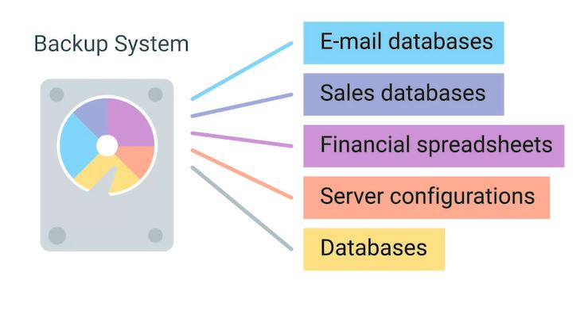
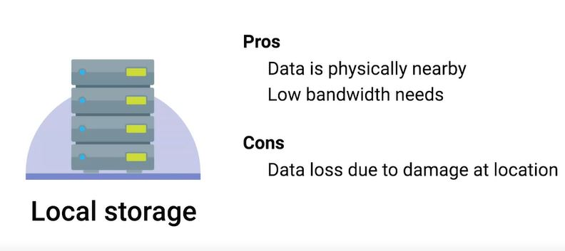
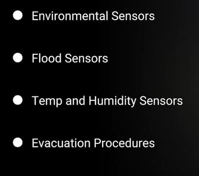
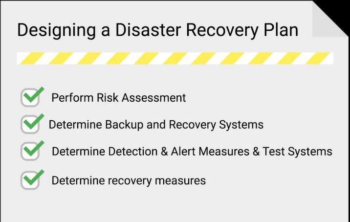
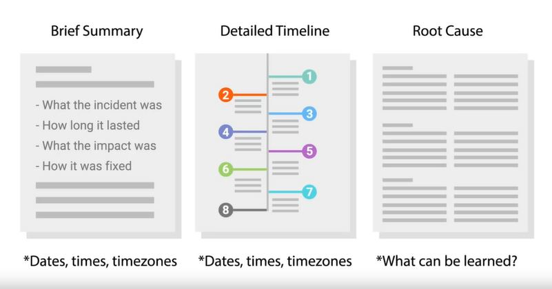
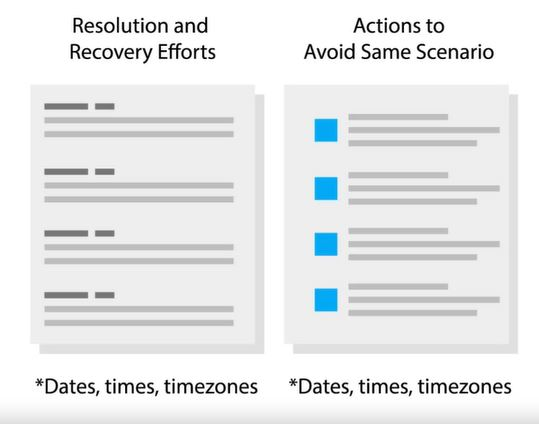

# WEEK 5 NOTES

## Data Recovery

**Data recovery** is the process of trying to restore data after an unexpected event that results in data loss or corruption.  

The best way to be prepared for a data-loss event is to have a well-thought out disaster plan and procedure in place. Disaster plans should involve making regular backups of any and all critical data that's necessary for your ongoing business processes.  

A **post-mortem** is a way for you to document any problems you discovered along the way, and most importantly, the ways you fixed them so you can make sure they don't happen again. 

  

This is why offsite backups are strongly recommended. This involves making backups of critical data and sending the backup data offsite to remote systems in a different physical location. This could be another backup server that you control in a different office, or a cloud hosted backup service. But there are trade offs. Offsite backups better prepare us for catastrophic events that can wipe out data from an entire office, but sending data offsite means that you need to transmit the data outside of your network. This means you need to consider things like encryption and bandwidth. Your internet connection will be used to transmit the backup data. Depending on how much data you're sending off site and how fast the internet connection is, this could take a lot of time. Another important thing to consider is encryption of backups. Since backups will often contain sensitive and confidential business data, it's important the data is handled securely and stored in a way that prevents unauthorized access. When sending data offsite is especially important to make sure that data is being transmitted securely, preferably encrypted via TLS. But that's not all. The resulting backup data that's stored should also be encrypted at rest. This is just good security practice. 

  

Backup solutions available - command line utility **rsync**. Rsync isn't explicitly a backup tool, but it's very commonly used as one. It's a file transfer utility that's designed to efficiently transfer and synchronize files between locations or computers. Rsync supports compression and you can use SSH to securely transfer data over a network. Using SSH, it can also synchronize files between remote machines making it super useful for simple automated backups.  
Apple has a first party backup solution available for their, Mac operating systems called it **Time Machine**. It operates the using an incremental backup model. Time Machine supports restoring an entire system from backup or individual files. It even allows restoring older versions of backup files.  
Microsoft also offers and first party solution called **Backup and Restore**. This has two modes of operation, as a file based version where files are backed up to a zip archive. Or there's the system image where the entire disk saved block by block to a file. File based backup support, either complete backups or incremental ones. System image backups support differential mode, only backing up blocks on the disk that have changed since the last backup.  

**Restoration procedures** should be documented and accessible so that anyone with the right access can restore operations when needed.   

*it's a good practice to perform infrequent full backups, while also doing more frequent differential backups.*   

**RAID** stands for Redundant Array of Independent Disks, it's a method of taking multiple physical disks and combining them into one large virtual disk. There are lots of types of RAID configuration called levels. RAID is not a replacement for backups.  

A **disaster recovery plan** is a collection of documented procedures and plans on how to react and handle an emergency or disaster scenario, from the operational perspective. This includes things that should be done before, during and after a disaster. The goal of the disaster recovery plan is to minimize disruption to business and IT operations, by keeping downtime of systems to a minimum and preventing significant data loss.  

**Preventative measures** cover any procedures or systems in place that will proactively minimize the impact of a disaster.  

**Detection measures** are meant to alert you and your team that a disaster has occurred that can impact operations.  

  

**Corrective or recovery measures** are those enacted after disaster has occurred. These measures involve steps like restoring lost data from backups or rebuilding and reconfiguring systems that were damaged.

When one system in a redundant pair suffers a failure, it's called a **single point of failure**. This is because it only takes one failure now to completely take the system down.  

A **risk assessment** allows you to prioritize certain aspects of the organizations that are more at risk if there's an unforeseen event. Risk assessment can involve brainstorming hypothetical scenarios and analyzing these events to understand how they'd impact your organization and operations.

  

We create a **post-mortem** after an incident, an outage, or some event when something goes wrong, or at the end of a project to analyze how it went. This report documents, in detail, what exactly happened leading up to, during, and after the event or project. It tries to highlight things that went well and things that didn't. The purpose of a post-mortem is to learn something from an event or project, not to punish anyone or highlight mistakes. 

  

  

