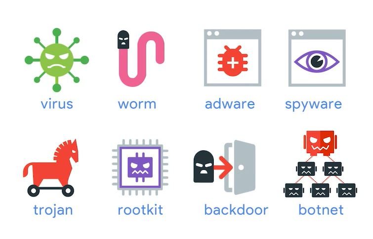

# WEEK 1 NOTES

 

## Malicious Software

**CIA** - confidentiality, integrity, and availability.
 

 
* **Confidentiality** means keeping things hidden.
* **Integrity means** keeping our data accurate and untampered with.
* **Availability** means that the information we have is readily accessible to those people that should have it. 

* **Risk** the possibility of suffering a loss in the event of an attack on the system. 
* **Vulnerability** is a flaw in the system that could be exploited to compromise the system. 
* **0-day vulnerability** or **zero day** for short is a vulnerability that is not known to the software developer or vendor, but is known to an attacker. The name refers to the amount of time the software vendor has had to react to and to fix the vulnerability, zero days.
* **Exploit** - software that is used to take advantage of a security bug or vulnerability. Attackers will write up exploits for vulnerabilities they find in software to cause harm to the system.
* **Threat** - the possibility of danger that could exploit a vulnerability. Threats are just possible attackers, sort of like burglars.
* **A hacker** in the security world is someone who attempts to break into or exploit a system. 
* There are actually *two common types of hackers*. 
* **Black hat hackers** -  who try to get into systems to do something malicious. 
* **White hat hackers** -  who attempt to find weaknesses in a system, but also alert the owners of those systems so that they can fix it before someone else does something malicious.
* **Attack** - an actual attempt at causing harm to a system.
 

 

  

* **Malware** is a type of malicious software that can be used to obtain your sensitive information or delete or modify files. The most common types of malware are *viruses*, *worms*, *adware*, *spyware*, *Trojans*, *root kits*, *backdoors*, *botnets*

* The **virus** attaches itself to some sort of executable code like a program. When the program is running, it touches many files, each of which is now susceptible to being infected with the virus. So, the virus replicates itself on these files, does the malicious work it's intended to do, and repeats this over and over until it spreads as far as it can.
*  **Worms** are similar to viruses except that instead of having to attach themselves onto something to spread, worms can live on their own and spread through channels like the network.
* **Adware** is just software that displays advertisements and collects data. 
* A **Trojan** is malware that disguises itself as one thing but does something else. 
* **Spyware** is the type of malware that's meant to spy on you. Which could mean monitoring your computer screens, key presses, webcams, and then reporting or streaming all of this information to another party, it's not good. 
* **A keylogger** is a common type of spyware that's used to record every keystroke you make. It can capture all of the messages you type, your confidential information, your passwords, and even more. 
* **Ransomware** is a type of attack that holds your data or system hostage until you pay some sort of ransom.
* There is Malware out there that can utilize someone else's machine to perform a task that is centrally controlled by the attacker. These compromised machines are known as **Bots**. If there are a collection of one or more Bots, we call that network of devices a **Botnet**. Botnets are designed to utilize the power of the Internet-connected machines to perform some distributed function. Take mining Bitcoin, for example, mining Bitcoin requires a machine to perform some computation that takes up your machine's resources.
* A **backdoor** is a way to get into a system if the other methods to get in a system aren't allowed, it's a secret entryway for attackers. Backdoors are most commonly installed after an attacker has gain access to your system and wants to maintain that access. 
A **rootkit** is a kit for root, meaning a collection of software or tools that an admin would use. It allows admin level modification to an operating system. A rootkit can be hard to detect because it can hide itself from the system using the system itself.
* A **logic bomb** is a type of Malware that's intentionally installed, after a certain event or time has triggered, it will run the malicious program. 

## Network attacks

* **DNS Cache Poisoning attack** works by tricking a DNS server into accepting a fake DNS record that will point you to a compromised DNS server. It then feeds you fake DNS addresses when you try to access legitimate websites. 
* **A man-in-the-middle attack** is an attack that places the attacker in the middle of two hosts that think they're communicating directly with each other.
* A common man-in-the-middle attack is a **session hijacking** or **cookie hijacking**. 
* Another way a man-in-the-middle attack can be established is a **rogue access point attack**. A rogue AP is an access point that is installed on the network without the network administrator's knowledge. 
* A final man-in-the-middle method will cover is called an **evil twin**. It's similar to the rogue AP example but has a small but important difference. The premise of an evil twin attack is for you to connect to a network that is identical to yours.

* A **Denial-of-Service**, or **DoS attack**, is an attack that tries to prevent access to a service for legitimate users by overwhelming the network or server. Think about how you normally get on a website. 
* **The Ping of Death** or **POD**, is a pretty simple example of a DoS attack. It works by sending a malformed ping to a computer. The ping would be larger in size than what the internet protocol was made to handle. So it results in a buffer overflow. 
* Another example is **a ping flood**, which sends tons of ping packets to a system. More specifically, it sends ICMP echo requests, since a ping expects an equal number of ICMP echo replies. If a computer can't keep up with this, then it's prone to being overwhelmed and taken down. 
* Similar to a ping flood is a **SYN flood**. To make a TCP connection, a client sends a SYN packet to a server it wants to connect to. Next, the server sends back a SYN-ACK message, then the client sends in ack message. In a SYN flood, the server is being bombarded with the SYN packets. The server is sending back SYN-ACK packets but the attacker is not sending ack messages. This means that the connection stays open and is taking up the server's resources. Other users will be unable to connect to the server which is a big problem. Since the TCP connection is half-open, we also refer to SYN floods as **half-open attacks**.
* A DoS attack using multiple systems, is called **a distributed denial-of-service** attack or **DDoS**. DDoS attacks need a large volume of systems to carry out an attack and they're usually helped by botnet attackers. In that scenario, they can gain access to large volumes of machines to perform an attack.
 
## Other Attacks

* A common security exploit that can occur in software development and runs rampant on the web is the possibility for an attacker to inject malicious code - **injection attacks**.
* **Cross-site scripting**, or **XSS attacks**, are a type of injection attack where the attacker can insert malicious code and target the user of the service. XSS attacks are a common method to achieve a session hijacking. 
* Another type of injection attack is a **SQL injection attack**. Unlike an XSS that targets a user, a SQL injection attack targets the entire website if the website is using a SQL database. 
* A common attack that occurs to gain access to an account is a **password attack**, that utilize software like password crackers that try and guess your password.
* A common password attack is **a brute force attack**, which just continuously tries different combinations of characters and letters until it gets access. Since this attack requires testing a lot of combinations of passwords, it usually takes a while to do this.(Prevents by CAPTCHA)
* Another type of password attack is **a dictionary attack**. A dictionary attack doesn't test out brute force combinations like ABC1 or capital ABC1. Instead, it tries out words that are commonly used in passwords, like password, monkey, football. 
* **Social engineering** is an attack method that relies heavily on interactions with humans instead of computers. 
* A popular type of social engineering attack is a **phishing attack**. Phishing usually occurs when a malicious email is sent to a victim disguised as something legitimate. 
* Another variation of phishing is **spear phishing**. Both phishing schemes have the same end goals, but spearfishing specifically targets individual or group. The fake emails may contain some personal information like your name, or the names of friends or family. So they seem more trustworthy. 
* Another popular social engineering attack is **email spoofing**. *Spoofing is when a source is masquerading around as something else.* Think of an email spoof. This is what happens when you receive an email with a misleading sender address.
* One attack happens through actual physical contact. This is called **baiting**, which is used to entice a victim to do something. For example, an attacker could just leave a USB drive somewhere in hopes that someone out there will plug it into their machine to see what's on it. But they've just installed malware on the machine without even knowing it. 
* Another popular attack that can occur offline is called **tailgating**, which is essentially gaining access into a restricted area or building by following a real employee in. In most corporate environments, building access is restricted through the use of a keycard or some other entry method. But a tailgater could use social engineering tactics to trick an employee into thinking that they're there for a legitimate reason like doing maintenance on the building, or delivering packages. 