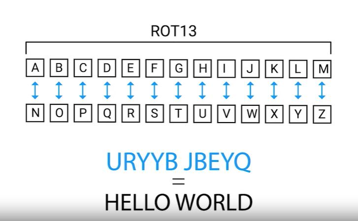
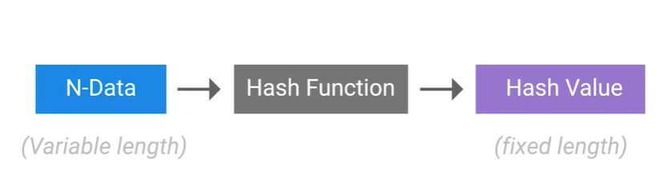
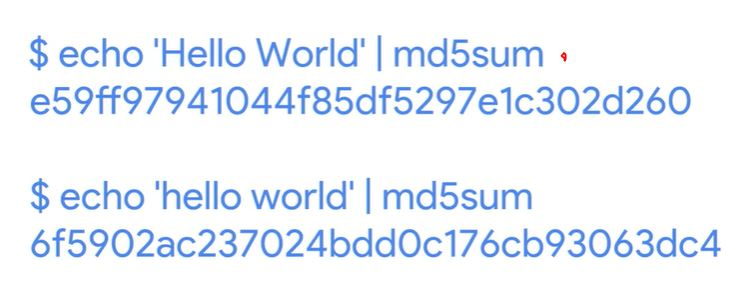
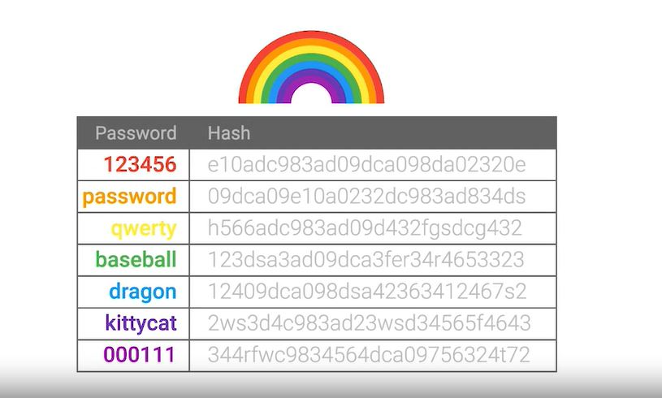
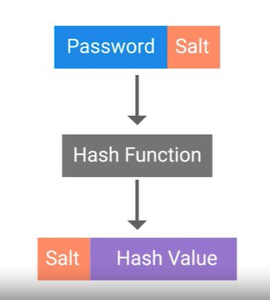
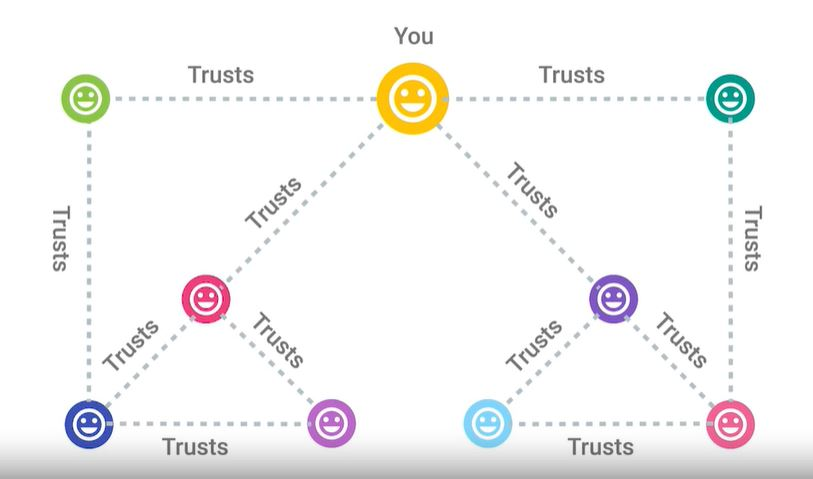
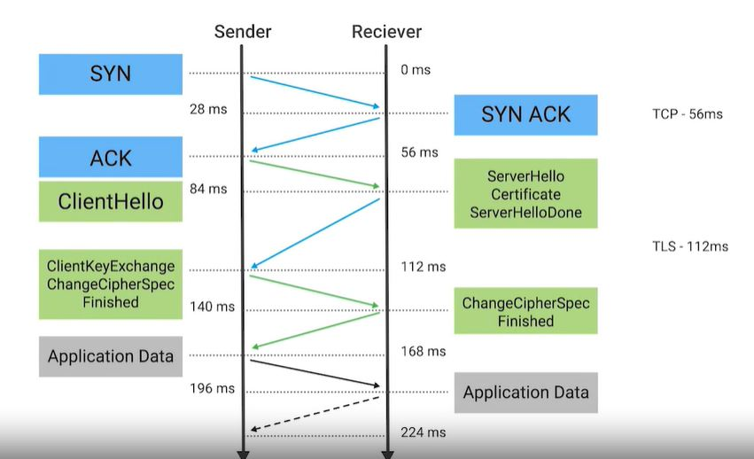
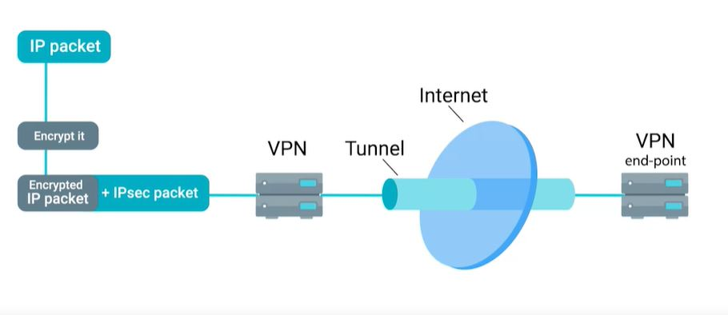
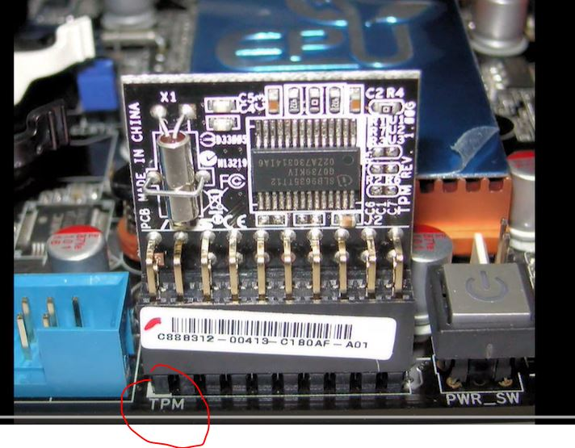
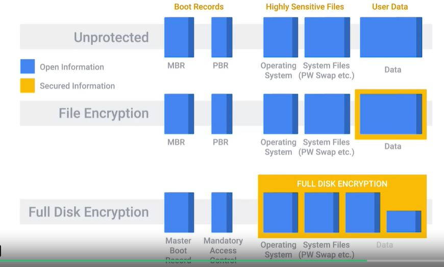

# WEEK 2 NOTES

 

* symmetric encryption
* asymmetric encryption
* hashing

## Symmetric encription

* **Cryptography** - hiding messages from potential enemies
* **Encryption** is the act of taking a message, called **plaintext**, and applying an operation to it, called a **cipher**. So that you receive a garbled, unreadable message as the output, called **ciphertext**. * The reverse process, taking the garbled output and transforming it back into the readable plain text is called **decryption**. 

* A cipher is actually made up of two components, *the encryption algorithm* and *the key*. 
* **The encryption algorithm** is the underlying logic or process that's used to convert the plaintext into ciphertext. 
* **The key** introduces something unique into your cipher.

* *Security through obscurity* - if no one knows what algorithm were using or general security practice, then we're safe from attackers. 

* **Kerckhoff's principle**- this principle states that a cryptosystem, or a collection of algorithms for key generation and encryption and decryption operations that comprise a cryptographic service should remain secure, even if everything about the system is known except for the key. What this means is that even if your enemy knows the exact encryption algorithm you use to secure your data, they're still unable to recover the plaintext from an intercepted ciphertext

* **Shannon's maxim** or the enemy knows the system. The implications are the same.

* The system should remain secure, even if your adversary knows exactly what kind of encryption systems you're employing, as long as your keys remain secure. 

* The study of this practice is referred to as **cryptology**.

* The opposite of this looking for hidden messages or trying to decipher coded message is referred to as **cryptanalysis**. 

* **Frequency analysis** is the practice of studying the frequency with which letters appear in ciphertext. The premise behind this type of analysis is that in written languages, certain letters appear more frequently than others, and some letters are more commonly grouped together than others.

* **Steganography** is a related practice but distinctly different from cryptography. It's the practice of hiding information from observers, but not encoding it.

* These types of encryption algorithms are called **symmetric** because they *use the same key to encrypt and decrypt messages*.

* A substitution cipher is an encryption mechanism that replaces parts of your plaintext with ciphertext.

* A well-known example of a substitution cipher is the **Caesar cipher**, which is a substitution alphabet. In this case, you're replacing characters in the alphabet with others usually by shifting or rotating the alphabet, a set of numbers or characters. The number of the offset is the key.

* Another popular example of this is referred to as R O T 13 or ROT-13, where the alphabet is rotated 13 places, but really ROT-13 is a Caesar cipher that uses a key of 13. 

  

* There are two more categories that symmetric key ciphers can be placed into. They're either **block ciphers** or they're **stream ciphers**. This relates to how the ciphers operate on the plaintext to be encrypted. A stream cipher as the name implies, takes a stream of input and encrypts the stream one character or one digit at a time, outputting one encrypted character or digit at a time. 

* **A stream cipher** takes a stream of input and encrypts the stream one character or one digit at a time, outputting one encrypted character or digit at a time. So, there's a one- to-one relationship between data in and encrypted data out. (Faster, but less secure)

* The other category of symmetric ciphers is *block ciphers*. The cipher takes data in, places that into a bucket or block of data that's a fixed size, then encodes that entire block as one unit. If the data to be encrypted isn't big enough to fill the block, the extra space will be padded to ensure the plaintext fits into the blocks evenly. 

* To avoid key reuse, **initialization vector** or **IV** is used. That's a bit of random data that's integrated into the encryption key and the resulting combined key is then used to encrypt the data. 

**DES**
* One of the earliest encryption standards is **DES**, which stands for **Data Encryption Standard**.
* DES was adopted as an official **FIPS**, **Federal Information Processing Standard** for the US.
* DES is a symmetric block cipher that uses 64-bit key sizes and operates on blocks *64-bits* in size. Though the key size is technically 64-bits in length, 8-bits are used only for parity checking, a simple form of error checking. This means that real world key length for DES is only 56-bits.

* **Key length** is super important in cryptography since it essentially defines the maximum potential strength of the system.

* In 2001 - **AES**, **Advanced Encryption Standard**. AES is also the first and only public cipher that's approved for use with top secret information by the United States National Security Agency. AES is also a symmetric block cipher similar to DES in which it replaced. But AES uses *128-bit blocks*, twice the size of DES blocks, and supports key lengths of *128-bit*, *192-bit*, or *256-bit*. Because of the large key size, brute-force attacks on AES are only theoretical right now, because the computing power required (or time required using modern technology) exceeds anything feasible today. 

*  An important thing is speed and ease of implementation. Ideally, an algorithm shouldn't be overly difficult to implement because complicated implementation can lead to errors and potential loss of security due to bugs introduced in implementation. Speed is important because sometimes data will be encrypted by running the data through the cipher multiple times. 

* **RC4**, or **Rivest Cipher 4**, is a symmetric stream cipher that gained widespread adoption because of its simplicity and speed. RC4 supports key sizes from 40-bits to 2,048-bits. So the weakness of RC4 aren't due to brute-force attacks, but the cipher itself has inherent weaknesses and vulnerabilities that aren't only theoretically possible, there are lots of examples showing RC4 being broken. 

* For this reason, most major web browsers have dropped support for RC4 entirely, along with all versions of SSL, and use **TLS** instead. 

* The preferred secure configuration is TLS 1.2 with AES GCM, a specific mode of operation for the AES block cipher that essentially turns it into a stream cipher. **GCM**, or **Galois/Counter Mode**, works by taking randomized seed value, incrementing this and encrypting the value, creating sequentially numbered blocks of ciphertexts. The ciphertexts are then incorporated into the plain text to be encrypted. GCM is super popular due to its security being based on AES encryption, along with its performance, and the fact that it can be run in parallel with great efficiency. 

## Public Key or Asymmetric Encryption

* Asymmetric or public key ciphers.
* Asymmetric encryption systems - different keys are used to encrypt and decrypt.

1. Generate a private key  
2. Using this private key, a public key is derived.  
*The strength of the asymmetric encryption system comes from the computational difficulty of figuring out the corresponding private key given a public key.*   
3. Next - they exchange public keys.
4. Ready to begin exchanging secure messages.
5. First uses Seconds's public key to encrypt the message and then send the ciphertext. 
6. Second can then use his private key to decrypt the message and read it, because of the relationship between private and public keys and vice versa

### The three concepts that an asymmetric cryptosystem grants us are confidentiality, authenticity, and non-repudiation.
* **Confidentiality** is granted through the encryption-decryption mechanism. Since our encrypted data is kept confidential and secret from unauthorized third parties. 
* **Authenticity** is granted by the digital signature mechanism, as the message can be authenticated or verified that it wasn't tampered with. 
* **Non-repudiation** means that the author of the message isn't able to dispute the origin of the message. In other words, this allows us to ensure that the message came from the person claiming to be the author.
 
* *Asymmetric encryption allows secure communication over an untrusted channel, but with symmetric encryption, we need some way to securely communicate the shared secret or key with the other party.* 
 
While asymmetric encryption works really well in untrusted environments, it's also computationally more expensive and complex. On the other hand, symmetric encryption algorithms are faster, and more efficient, and encrypting large amounts of data. In fact, what many secure communications schemes do is take advantage of the relative benefits of both encryption types by using both, for different purposes. An asymmetric encryption algorithm is chosen as a key exchange mechanism or cipher. What this means, is that the symmetric encryption key or shared secret is transmitted securely to the other party using asymmetric encryption to keep the shared secret secure in transit. Once the shared secret is received, data can be sent quickly, and efficiently, and securely using a symmetric encryption cipher. 

 

### MACs or Message Authentication Codes
A **MAC** is a bit of information that allows authentication of a received message, ensuring that the message came from the alleged sender and not a third party masquerading as them. It also ensures that the message wasn't modified in some way in order to provide data integrity. 

**HMAC** or a **Keyed-Hash Message Authentication Code**. HMAC uses a cryptographic hash function along with a secret key to generate a MAC. Any cryptographic hash functions can be used like Shahwan or MD5 and the strength or security of the MAC is dependent upon the underlying security of the cryptographic hash function used. The MAC is sent alongside the message that's being checked. The Mac is verified by the receiver by performing the same operation on the received message, then comparing the computed MAC with the one received with the message. If the MACs are the same, then the message is authenticated.  

There are also MACs based on symmetric encryption ciphers, either block or stream like DES or AES, which are called **CMACs** or **Cipher-Based Message Authentication Codes**. The process is similar to HMAC, but instead of using a hashing function to produce a digest, a symmetric cipher with a shared keys used to encrypt the message and the resulting output is used as the MAC. A specific and popular example of a **CMAC** though slightly different is **CBC-MAC** or **Cipher Block Chaining Message Authentication Codes**. CBC-MAC is a mechanism for building MACs using block ciphers. This works by taking a message and encrypting it using a block cipher operating in CBC mode. CBC mode is an operating mode for block ciphers that incorporates a previously encrypted block cipher text into the next block's plain text. So, it builds a chain of encrypted blocks that require the full, unmodified chain to decrypt. This chain of interdependently encrypted blocks means that any modification to the plain text will result in a different final output at the end of the chain, ensuring message integrity.  

**RSA** - name for the initials of the three co-inventors. Ron Rivest, Adi Shamir and Leonard Adleman.  

**DSA** or **Digital Signature Algorithm** is another example of an asymmetric encryption system.  

Another popular key exchange algorithm is **DH** or Diffie-Hellman named for the co-inventors  

**Elliptic curve cryptography** or **ECC** is a public key encryption system that uses the algebraic structure of elliptic curves over finite fields to generate secure keys.  

Both Diffie-Hellman and DSA have elliptic curve variants, referred to as ECDH and ECDSA, respectively.  

## Hashing

**Hashing** or a **hash function** is a type of function or operation that takes in an arbitrary data input and maps it to an output of a fixed size, called a hash or a digest.

  

* You feed in any amount of data into a hash function and the resulting output will always be the same size. But the output should be unique to the input, such that two different inputs should never yield the same output.

* Hash table in context of software engineering - a type of data structure that uses hashes to accelerate data lookups. 

* Hashing can also be used to identify duplicate data sets in databases or archives to speed up searching of tables or to remove duplicate data to save space.

* Cryptographic hash functions should be one directional.

* The ideal *cryptographic hash function should be **deterministic***, meaning that the same input value should always return the same hash value. 

* **Hash collisions** - two different inputs mapping to the same output.

* Many popular hash functions are actually based on modified block ciphers. 

  

### Popular hashing functions

* **MD5** is a popular and widely used hash function designed in the early 1990s as a cryptographic hashing function. It operates on a 512 bit blocks and generates 128 bit hash digests. 

* **SHA-1** hash - a more secure alternative. SHA-1 is part of the secure hash algorithm suite of functions (1995). It operates a 512 bit blocks and generates 160 bit hash digest. SHA-1 is used in popular protocols like TLS/SSL, PGP SSH, and IPsec. SHA-1 is also used in version control systems like Git, which uses hashes to identify revisions and ensure data integrity by detecting corruption or tampering. 

* **SHA-2** (2010)

* **SHA-3**

* **MIC** - message integrity check. 

* **MAC** - message authentication check, 

* **Autentification** server side saved hash of the password and compared it with the entered password.

* **Rainbow tables** - are used by bad actors to help speed up the process of recovering passwords from stolen password hashes. A rainbow table is just a pre-computed table of all possible password values and their corresponding hashes. The idea behind rainbow table attacks is to trade computational power for disk space by pre-computing the hashes and storing them in a table. 

  

 * A **password salt** is additional randomized data that's added into the hashing function to generate the hash that's unique to the password and salt combination.

  

## Cryptography Applications

* **PKI** - **Public Key Infrastructure**.

* PKI is a system that defines the creation, storage and distribution of digital certificates. A digital certificate is a file that proves that an entity owns a certain public key. A certificate contains information about the public key, the entity it belongs to and a digital signature from another party that has verified this information.

* The entity that's responsible for storing, issuing, and signing certificates is referred to as **CA**, or **Certificate Authority**.

* *A central repository is needed to securely store and index keys and a certificate management system of some sort makes managing access to storage certificates and issuance of certificates easier.*

### There are a few different types of certificates that have different applications or uses. 
* **SSL** or **TLS server certificate** - a certificate that a web server presents to a client as part of the initial secure setup of an SSL, TLS connection. 
* **Self Sign Certificate** - certificate has been signed by the same entity that issued the certificate.
* **SSL** or **TLS client certificate** - optional component of SSL, TLS connections and is less commonly seen than server certificates. These are certificates that are bound to clients and are used to authenticate the client to the server, allowing access control to a SSL, TLS service. These are different from server certificates in that the client certificates aren't issued by a public CA
* **Code signing certificates** which are used for signing executable programs. This allows users of these signed applications to verify the signatures and ensure that the application was not tampered with. It also lets them verify that the application came from the software author and is not a malicious twin.

* *PKI is very much dependent on trust relationships between entities, and building a network or chain of trust*. This chain of trust has to start somewhere and that starts with the Root Certificate Authority. These root certificates are self signed because they are the start of the chain of trust. So there's no higher authority that can sign on their behalf. This Root Certificate Authority can now use the self-signed certificate and the associated private key to begin signing other public keys and issuing certificates. It builds a sort of tree structure with the root private key at the top of the structure. If the root CA signs a certificate and sets a field in the certificate called CA to true, this marks a certificate as an intermediary or subordinate CA. What this means is that the entity that this certificate was issued to can now sign other certificates. And this CA has the same trust as the root CA. An intermediary CA can also sign other intermediate CAs. You can see how this extension of trust from one root CA to intermediaries can begin to build a chain. A certificate that has no authority as a CA is referred to as an End Entity or Leaf Certificate. Similar to a leaf on a tree, it's the end of the tree structure and can be considered the opposite of the roots. In order to bootstrap this chain of trust, you have to trust a root CA certificate, otherwise the whole chain is untrusted. This is done by distributing root CA certificates via alternative channels. Each major OS vendor ships a large number of trusted root CA certificates with their OS. And they typically have their own programs to facilitate distribution of root CA certificates. Most browsers will then utilize the OS provided store of root certificates. 

* The **X.509** standard is what defines the format of digital certificates. It also defines a certificate revocation list or CRL which is a means to distribute a list of certificates that are no longer valid. The X.509 standard was first issued in 1988 and the current modern version of the standard is version **3**.   

* The fields defined in X.509 certificate are, the version, what version of the X.509 standard certificate adheres to. 

* **Serial number** - a unique identifier for their certificate assigned by the CA which allows the CA to manage and identify individual certificates.

* **Sertificate Signature Algorithm**, this field indicates what public key algorithm is used for the public key and what hashing algorithm is used to sign the certificate. 

* **Issuer Name**, this field contains information about the authority that signed the certificate. 

* **Validity**, this contains two subfields, Not Before and Not After, which define the dates when the certificate is valid for.

*  **Subject**, this field contains identifying information about the entity the certificate was issued to. 

* **Subject Public Key Info**, these two subfields define the algorithm of the public key along with the public key itself. 

* **Certificate signature algorithm**, same as the Subject Public Key Info field, these two fields must match.
 
* **Certificate Signature Value**, the digital signature data itself. 

*A Web of Trust is where individuals instead of certificate authorities sign other individuals' public keys.*
*Before an individual signs a key, they should first verify the person's identity through an agreed upon mechanism.*

  

**HTTPS** is the secure version of HTTP, the Hypertext Transfer Protocol
HTTPS can also be called HTTP over **SSL** or **TLS** since it's essentially encapsulating the HTTP traffic over an encrypted, secured channel utilizing SSL or TLS. 

**TLS** is a generic protocol to permit secure communications and authentication over a network. TLS is also used to secure other communications aside from web browsing, like VoIP calls such as Skype or Hangouts, email, instant messaging, and even Wi-Fi network security. 

### TLS grants us three things. 
1. A secure communication line, which means data being transmitted is protected from potential eavesdroppers. 
2. The ability to authenticate both parties communicating, though typically, only the server is authenticated by the client. 
3. The integrity of communications, meaning there are checks to ensure that messages aren't lost or altered in transit. 

  

* **The session key** is the shared symmetric encryption key using TLS sessions to encrypt data being sent back and forth.

* The **SSH**, or **secure shell**, is a secure network protocol that uses encryption to allow access to a network service over unsecured networks. 

* **PGP** stands for Pretty Good Privacy. PGP is an encryption application that allows authentication of data along with privacy from third parties relying upon asymmetric encryption to achieve this.

* **VPN**, or **Virtual Private Network** solution - is a mechanism that allows you to remotely connect a host or network to an internal private network, passing the data over a public channel, like the Internet. You can think of this as a sort of encrypted tunnel where all of our remote system's network traffic would flow, transparently channeling our packets via the tunnel through the remote private network. A VPN can also be point-to-point, where two gateways are connected via a VPN

### VPN solutions using different approaches and protocols with differing benefits and tradeoffs.

* **IPsec**, or **Internet Protocol Security**, is a VPN protocol that was designed in conjunction with IPv6. 

  

### *IPsec supports two modes of operations*, **transport mode** and **tunnel mode**. 
* When transport mode is used, only the payload of the IP packet is encrypted, leaving the IP headers untouched. Heads up that authentication headers are also used. Header values are hashed and verified, along with the transport and application layers. This would prevent the use of anything that would modify these values, like NAT or PAT. 
* In tunnel mode, the entire IP packet, header, payload, and all, is encrypted and encapsulated inside a new IP packet with new headers. While not a VPN solution itself, L2TP, or Layer 2 Tunneling Protocol, is typically used to support VPNs.

* While not a VPN solution itself, L2TP, or Layer 2 Tunneling Protocol, is typically used to support VPNs. A common implementation of L2TP is in conjunction with IPsec when data confidentially is needed, since L2TP doesn't provide encryption itself. It's a simple tunneling protocol that allows encapsulation of different protocols or traffic over a network that may not support the type of traffic being sent. L2TP can also just segregate and manage the traffic. ISPs will use the L2TP to deliver network access to a customer's endpoint, for example. 

* Secure communication is established using **Encapsulating Security Payload**. It's a part of the IPsec suite of protocols, which encapsulates IP packets, providing confidentiality, integrity, and authentication of the packets. Once secure encapsulation has been established, negotiation and establishment of the L2TP tunnel can proceed. L2TP packets are now encapsulated by IPsec, protecting information about the private internal network. 

### An important distinction to make in this setup is the *difference between the tunnel and the secure channel*. 
* The tunnel is provided by L2TP, which permits the passing of unmodified packets from one network to another. 
* The secure channel, on the other hand, is provided by IPsec, which provides confidentiality, integrity, and authentication of data being passed.

**OpenVPN** can operate over either TCP or UDP, typically over port 1194. 

* **Trusted Platform Module** or **TPM** is a hardware device that's typically integrated into the hardware of a computer, that's a dedicated crypto processor. TPM offers secure generation of keys, random number generation, remote attestation, and data binding and sealing. A TPM has unique secret RSA key burned into the hardware at the time of manufacture, which allows a TPM to perform things like hardware authentication. This can detect unauthorized hardware changes to a system. Remote attestation is the idea of a system authenticating its software and hardware configuration to a remote system. 

  

* An evolution of secure elements is the **Trusted Execution Environment** or **TEE** which takes the concept a bit further. It provides a full-blown isolated execution environment that runs alongside the main OS. This provides isolation of the applications from the main OS and other applications installed there. It also isolates secure processes from each other when running in the TEE

* **Full Disk Encryption** or **FDE** is the practice of encrypting the entire drive in the system. Not just sensitive files in the system. This allows us to protect the entire contents of the disk from data theft or tampering. Now, there are a bunch of options for implementing FDE. Like the commercial product **PGP**, **Bitlocker** from Microsoft, which integrates very well with TPMs, **Filevault 2** from Apple, and the open source software **dm-crypt**, which provides encryption for Linux systems. An FDE configuration will have one partition or logical partition that holds the data to be encrypted.

  

