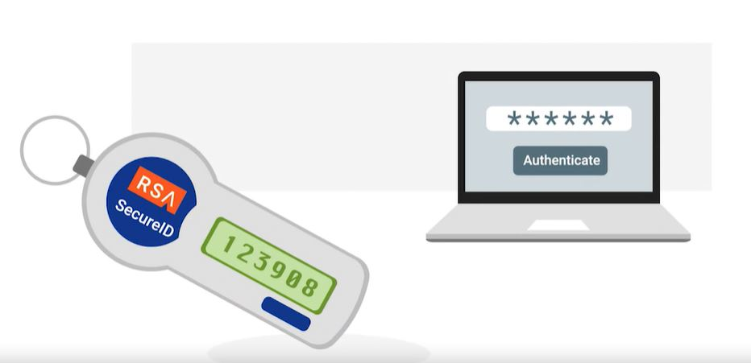
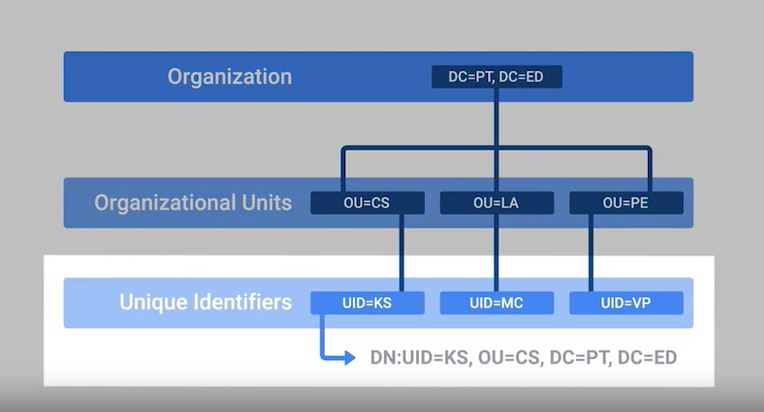
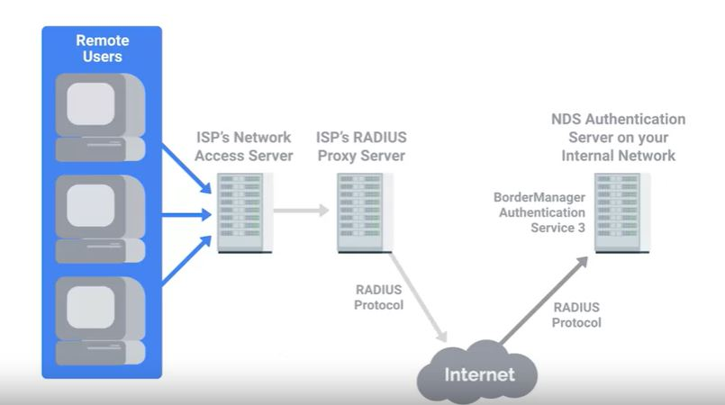
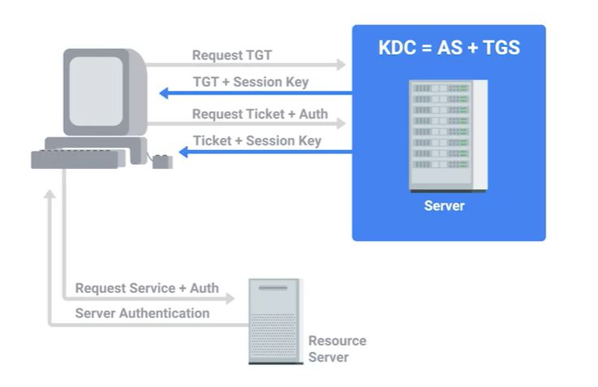
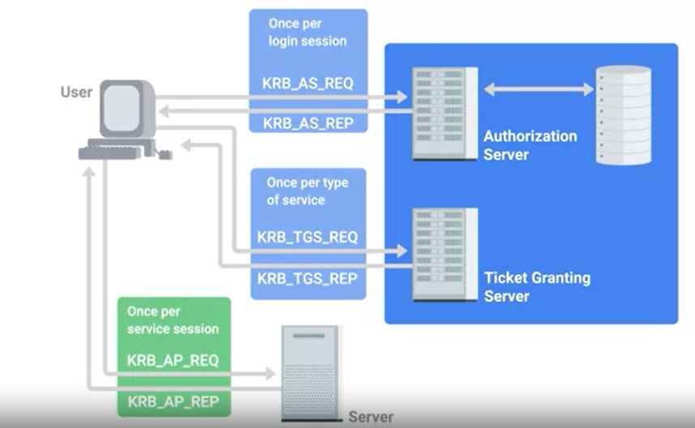
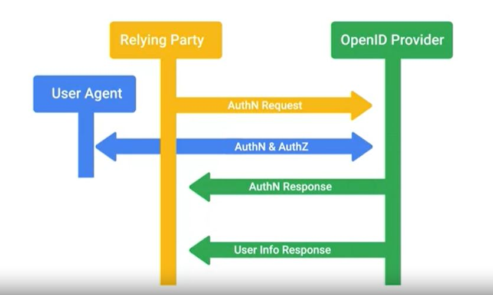
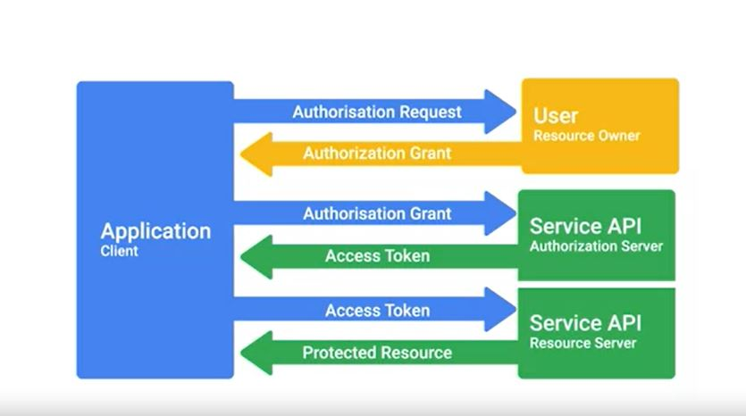
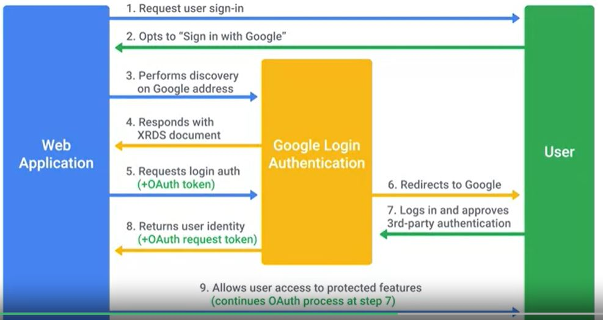
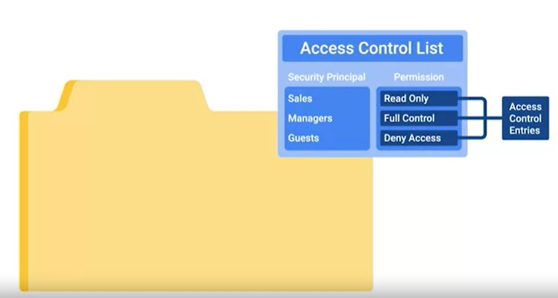
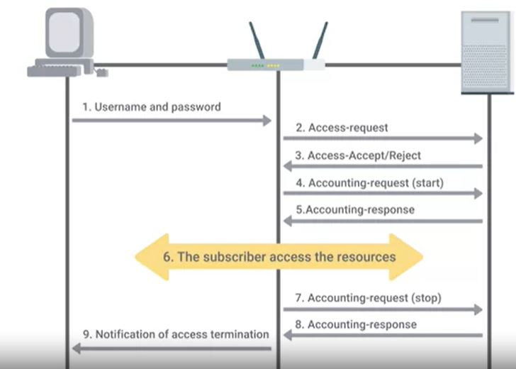

# WEEK 3 NOTES

AAA - Authentication, Authorization, Accounting.

## Authentication 

* **Identification** is the idea of describing an entity uniquely. 
* Proving you are who you claim to be - that's the process we call **authentication**. 

**authn** for authentication and **authz** for authorization.

* *Incorporating good password policies into an organization is key to ensuring that employees are securing their accounts with strong passwords*. 
* *A good password policy system would enforce length requirements, character complexity, and check for the presence of dictionary words, which would undermine the strength of passwords. *

* **Multifactor authentication** is a system where users are authenticated by presenting multiple pieces of information or objects.

## The many factors that comprise a multifactor authentication system can be categorized into three types. 
1. Something you know (Password/PIN)
2. Something you have (ATM/Bank card)
3. Something you are. (piece of biometric data - fingerprint or iris scan)

* **Physical token**s can take a few different forms. It generates a short-lived token.The number is commonly called a **One-Time-Password** or **OTP** since it's short-lived and constantly changing value. An example of this is the **RSA SecurID** token. It's a small, battery-powered device with an LCD display, that shows a One-Time-Password that's rotated periodically.

  

* This is a **time-based token** sometimes called a **TOTP**, and operates by having a secret seed or randomly generated value on the token that's registered with the authentication server. 

* **Network Time Protocol** or **NTP**

* **Counter-based tokens**, which use a secret seed value along with the secret counter value that's incremented every time a one-time password is generated on the device.

* Another very common method for handling multifactor today, is that the **delivery of one-time password tokens using SMS**. But this has been subject to some criticism, because of the observed attacks through this channel.

* The other category of multifactor authentication is **biometrics authentication** is the process of using unique physiological characteristics of an individual to identify them. By confirming the biometric signature, the individual is authenticated. 

* An evolution of physical tokens is the **U2F** or **Universal Second Factor**. U2F incorporates a challenge-response mechanism, along with public key cryptography to implement a more secure and more convenient second-factor authentication solution. U2F tokens are referred to as security keys and are available from a range of manufacturers. 

* In order to issue client certificates, an organization must set up and maintain CA infrastructure to issue and sign certificates.

* **Certificate revocation** list or a **CRL**. This is a signed list published by the CA which defines certificates that have been explicitly revoked. 

* **LDAP**, or **Lightweight Directory Access Protocol**, is an open industry-standard protocol for accessing and maintaining directory services. Because LDAP uses a tree structure called a **Data Information Tree**, objects will have one parent and can have one or more children that belong to the parent object. In LDAP language, we call these folders **Organizational Units**, or **OUs**. Unique identifier for each entry - **Distinguished Name**, or **DN**. Many implementations of LDAP servers, like Active Directory from Microsoft and OpenLDAP for open source implementations.

  

**RADIUS** or **Remote Authentication Dial-In User Service**, is a protocol that provides AAA services for users on a network. It's a very common protocol used to manage access to internal networks, WiFi networks, email services and VPN services. RADIUS servers can verify user authentication information stored in a flat file or can plug into external sources like SQL databases, LDAP, Kerberos or Active Directory. Once the RADIUS server has evaluated the user authentication request, it replies with one of three messages access reject, access challenge or access accept.

  

  

**Kerberos** is a network authentication protocol that uses tickets to allow entities to prove their identity over potentially insecure channels to provide mutual authentication. It also uses symmetric encryption to protect protocol messages from eavesdropping and replay attacks. Today Kerberos supports AES encryption, and implements checksums to ensure data integrity and confidentiality. 

* **AS** or **Authentication Server** which includes the user ID of the authenticating user. 

* **Ticket Granting Service** or **TGS**.

* **Ticket Granting Service** or **TGS**.

* **Ticket Granting Ticket** or **TGT**.

  

* **TACACS+** it stands for **Terminal Access controller Access-Control System Plus**. It's a Cisco developed AAA protocol

* **Single Sign-On** or **SSO** is an authentication concept that allows users to authenticate once to be granted access to a lot of different services and applications. Since reauthentication for each service isn't needed, users don't need multiple sets of usernames and passwords across a mix of applications and services. SSO is accomplished by authenticating to a central authentication server, like an LDAP server. This then provides a cookie, or token that can be used to get access to applications configured to use SSO. Kerberos is actually a good example of an SSO authentication service. 

  

* An example of an SSO system is the **openID**, the centralized authentication system. 

  

## Authorization

* While **authentication** is related to verifying the identity a user, **authorization** pertains to describing what the user account has access to or doesn't have access to. 

* One very popular open standard for authorization and access delegation is **OAuth**, used by companies like Google, Facebook, and Microsoft. 

* **OAuth** is an open standard that allows users to grant third-party websites and applications access to their information without sharing account credentials. This can be thought of as a form of access delegation because access to the user's account is being delegated to the third party.

  

* OAuth permissions can be used in phishing style attacks to gain access to accounts without requiring credentials to be compromised.

* It's important to distinguish between **OAuth** and **OpenID**. *OAuth* is specifically an authorization system and **OpenID** is an authentication system. Though they're usually used together, OpenID Connect is an authentication layer built on top of OAuth 2.0 designed to improve upon OpenID and build better integration with OAuth authorizations. 

  

* An **access control list** or **ACL**, is a way of defining permissions or authorizations for objects. The most common case you may encounter deals with file system permissions. 

  

* These individual access permissions per object are called **Access Control Entries** and they make up the ACL. 

## Accounting

* **Accounting** means keeping records of what resources and services your users access or what they did when they were using your systems. A critical component of this is auditing, which involves reviewing these records to ensure that nothing is out of the ordinary. 

* A critical component of this is **auditing**, which involves reviewing these records to ensure that nothing is out of the ordinary. If we're watching and recording usage of our systems, but never actually checking the usage data, that's not super useful. 

* **TACACS+** is a device access AAA system that manages who has access to your network devices and what they do on them.

  

