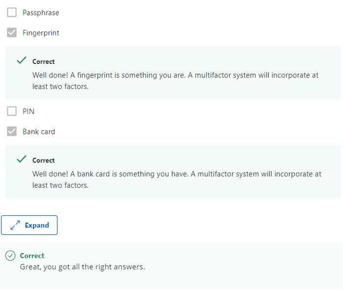

# AAA Security

## Question 1

*Authentication is concerned with determining ___.*

* Validity
* Access
* **Identity**
* Eligibility 

> Authentication is concerned with confirming the identities of individuals.

## Question 2

*The two types of one-time-password tokens are __ and __. Check all that apply.*

* **Time-based**
* **Counter-based**
* Password-based
* Identity-based 

> An OTP generator token can be time-based, staying in sync with the server using time.

## Question 3

*Security Keys utilize a secure challenge-and-response authentication system, which is based on ___.*

* **Public key cryptography**
* Shared secrets
* Symmetric encryption
* Steganography.

> Security keys use public key cryptography to perform a secure challenge response for authentication.

## Question 4

*Kerberos uses __ as authentication tokens.*

* Cryptographic keys
* **Tickets**
* Certificates
* Passwords
 
> Kerberos issues tickets, which represent authentication and authorization tokens.

## Question 5

*Your bank set up multifactor authentication to access your account online. You know your password. What other factor combined with your password qualifies for multifactor authentication? Check all that apply.*

  

## Question 6

*An organization needs to setup a(n) _____ infrastructure to issue and sign client certificates.*

* LDAP
* **CA**
* CRL
* ID

> An organization needs to setup a Certificate Authority (CA) infrastructure to issue and sign client certificates.

## Question 7

*A network admin wants to use a Remote Authentication Dial-In User Service (RADIUS) protocol to allow 5 user accounts to connect company laptops to an access point in the office. These are generic users and will not be updated often. Which of these internal sources would be appropriate to store these accounts in?*

* LDAP
* SQL database
* Active Directory
* **Flat file**

>  A flat file is an internal source that can store user accounts on a RADIUS server.

## Question 8

What are the benefits of using a Single Sign-On (SSO) authentication service? Check all that apply.

* **One set of credentials for the user**
* **Reduce likelihood of passwords being written down**
* **Reduce overhead of password assistance**
* **Reduce time spent on re-authenticating to services**

> Single Sign-On (SSO) reduces the time spent on re-authenticating to services. 

## Question 9

*Which of these are examples of a Single Sign-On (SSO) service? Check all that apply.*

* **OpenID**

> You got it! OpenID is an example of a decentralized Single Sign-On (SSO) service.

* Relying Parties

* **Kerberos**

> Kerberos is an example of a centralized Single Sign-On (SSO) service.

* Tokens

## Question 10

*A(n) _____ defines permissions or authorizations for objects.*

* **Access Control List**
* Network Access Server
* Access Control Entries
* Extensible Authentication Protocol

> An Access Control List (ACL) defines permissions or authorizations for objects.

## Question 11

*A network admin deployed a Terminal Access Controller Access Control System Plus (TACACS+) system so other admins can properly manage multiple switches and routers on the local area network (LAN). The system will keep track and log admin access to each device and the changes made. This “logging” satisfies which part of the three As of security?*

* Authentication
* Authorization
* Administration
* **Accounting**

> Keeping track of access and changes, through "logging”, satisfies the "Accounting" part of the three As of security.