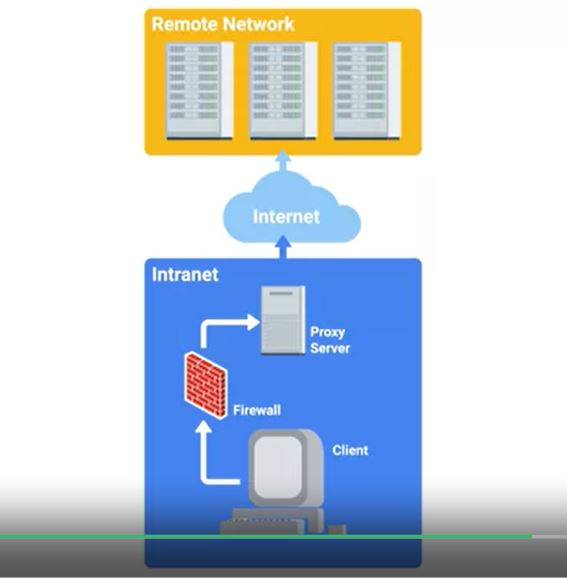

# WEEK 4 NOTES

## Secure Network Architecture

* **Network hardening** is the process of securing a network by reducing its potential vulnerabilities through configuration changes, and taking specific steps. 

* **Implicit deny** is a network security concept where anything not explicitly permitted or allowed should be denied.

* **Analyzing logs** is the practice of collecting logs from different network and sometimes client devices on your network, then performing an automated analysis on them. 

* **Logs analysis systems** are configured using **user-defined rules** to match interesting or a typical log entries. 

* **Normalizing logged data** is an important step, since logs from different devices and systems may not be formatted in a common way. 

* **Correlation analysis** is the process of taking log data from different systems, and matching events across the systems. 

* Investigating and recreating the events that happened once a compromise is detected is usually called a **post fail analysis**, since it's investigating how a compromise happened after the breach is detected.

* One popular and powerful logs analysis system is **Splunk**, a very flexible and extensible log aggregation and search system.

* **Flood guards** provide protection against Dos or denial of service attacks. 

  

* There's another threshold called the **activation threshold**. When this one is reached, it triggers a pre-configured action. This will typically block the identified attack traffic for a specific amount of time. This is usually a feature on enterprise grade routers or firewalls, though it's a general security concept. 

* A common open source flood guard protection tool is **Fail2ban**. It watches for signs of an attack on a system, and blocks further attempts from a suspected attack address. 

* **Network separation** or **network segmentation** is a good security principle for an IT support specialists to implement. 

  

  

* To protect against this **rogue DHCP(Dynamic Host Configuration Protocol) server attack**, enterprise switches offer a feature called **DHCP snooping**. A switch that has DHCP snooping will monitor DHCP traffic being sent across it. It will also track IP assignments and map them to hosts connected to switch ports. This basically builds a map of assigned IP addresses to physical switch ports. This information can also be used to protect against IP spoofing and ARP poisoning attacks. DHCP snooping also makes you designate either a trusted DHCP server IP, if it's operating as a DHCP helper, and forwarding DHCP requests to the server, or you can enable DHCP snooping trust on the uplinked port, where legitimate DHCP responses would now come from. Now any DHCP responses coming from either an untrusted IP address or from a downlinked switch port would be detected as untrusted and discarded by the switch.

  

* **Dynamic ARP inspection** or DAI is another feature on enterprise switches that prevents this type of attack.

  

* To prevent IP spoofing attacks, **IP source guard** or **IPSG** can be enabled on enterprise switches along with DHCP snooping. 

* **802.1X** - the IEEE standard for encapsulating EAP or Extensible Authentication Protocol traffic over the 802 networks. This is also called **EAP over LAN** or **EAPOL**,

* **EAP-TLS** is one of the more common and secure EAP methods.

  

* **EAP-TLS** is an authentication type supported by EAP that uses TLS to provide mutual authentication of both the client and the authenticating server. 

  

* *Network software hardening techniques*- firewalls, proxies, and VPNs

  

*  VPNs are commonly used to provide secure remote access, and link two networks securely. 

  

* Proxies can be really useful to protect client devices and their traffic. 

  

* A reverse proxy can be configured to allow secure remote access to web based services without requiring a VPN. 

  

* Lots of popular proxy solutions support a reverse proxy configuration - HAProxy, Nginx, and even the Apache Web Server. 

## Wireless Security

* The first security protocol introduced for Wi-Fi networks was **WEP** or **Wired Equivalent Privacy**. It was part of the original 802.11 standard introduced back in 1997. WEP was intended to provide privacy on par with the wired network, that means the information passed over the network should be protected from third parties eavesdropping. 

  

* WEP authentication originally supported two different modes, **Open System authentication** and **Shared Key authentication**. 

* The **open system mode** didn't require clients to supply credentials. Instead, they were allowed to authenticate and associate with the access point. But the access point would begin communicating with the client encrypting data frames with the pre-shared WEP key. If the client didn't have the key or had an incorrect key, it wouldn't be able to decrypt the frames coming from the access point or AP.

* **Shared key authentication** worked by requiring clients to authenticate through a four-step challenge response process. This basically has the AP asking the client to prove that they have the correct key. Here's how it works. The client sends an authentication request to the AP. The AP replies with clear text challenge, a bit of randomized data that the client is supposed to encrypt using the shared WEP key. The client replies to the AP with the resulting ciphertext from encrypting this challenge text. The AP verifies this by decrypting the response and checking it against the plain text challenge text. If they match, a positive response is sent back.

  

* The replacement for WEP from the Wi-Fi Alliance was **WPA** or **Wi-Fi Protected Access**. WPA was designed as a short-term replacement that would be compatible with older WEP-enabled hardware with a simple firmware update.

### **TKIP** or the **Temporal Key Integrity Protocol**. 
TKIP implemented three new features that made it more secure than WEP. 
1. a more secure key derivation method was used to more securely incorporate the IV into the per packet encryption key. 
2. a sequence counter was implemented to prevent replay attacks by rejecting out of order packets. 
3. a 64-bit MIC or Message Integrity Check was introduced to prevent forging, tampering, or corruption of packets.

  

* *Under WPA, the pre-shared key is the Wi-Fi password you share with people when they come over and want to use your wireless network.*

* The passphrase is fed into the **PBKDF2** or **Password-Based Key Derivation Function 2**, along with the Wi-Fi networks **SSID** as a salt. This is then run through the HMAC-SHA1 function 4096 times to generate a unique encryption key. The SSID salt is incorporated to help defend against rainbow table attacks. The 4096 rounds of HMAC-SHA1 Increase the computational power required for a brute force attack. I should call out that the pre-shared key can be entered using two different methods. 

**CCMP** or **Counter Mode CBC-MAC Protocol**. 

  

* **Pairwise Transient Key** or **PTK**. The PTK is generating using the PMK, AP nonce, Client nonce, AP MAC address, and Client MAC address. They're all concatenated together, and run through a function.

* The AP will also transmit the **GTK** or **Groupwise Transient Key**.

  

* The WPA and WPA2 standard also introduce an **802.1x authentication to Wi-Fi networks**. It's usually called **WPA2-Enterprise**. The non-802.1x configurations are called either **WPA2-Personal** or **WPA2-PSK**, since they use a pre-shared key to authenticate clients.

* *WPS supports PIN entry authentication, NFC or USB for out-of-band exchange of the network details, or push-button authentication.* 

* *WPA2 is a really robust security protocol. It's built using best in class mechanisms to prevent attacks and ensure the confidentiality of the data it's protecting.*

* If 802.1X is too complicated for a company, the next best alternative would be WPA2 with AES/CCMP mode.

* A long and complex passphrase that wouldn't be found in a dictionary would increase the amount of time and resources an attacker would need to break the passphrase. 

* If your company values security over convenience, you should make sure that WPS isn't enabled on your APs. 

## Network Monitoring

  

* **Port Mirroring**, allows the switch to take all packets from a specified port, port range, or the entire VLAN and mirror the packets to a specified switch port. 

* Monitor mode, allows us to scan across channels to see all wireless traffic being sent by APs and clients.

* There are a number of open source wireless capture and monitoring utilities, like **Aircrack-ng** and **Kismet**.

### Wireshark and tcpdump

  

  

  

* Like logs analysis, **traffic analysis** is also an important part of network security. Traffic analysis is done using packet captures and packet analysis. Traffic on a network is basically a flow of packets.

**Intrusion Detectionand Prevention Systems** or **IDS/IPS**. IDS or IPS systems operate by monitoring network traffic and analyzing it.

* The difference between an IDS and an IPS system, is that **IDS is only a detection system**. It will only log an alert. But an IPS system can adjust firewall rules on the fly, to block or drop the malicious traffic when it's detected. IDS and IPS system can either be host based or network based.

* IDS and IPS system can either be host based or network based. 
* In the case of a Network Intrusion Detection System or NIDS, the detection system would be deployed somewhere on a network, where it can monitor traffic for a network segment or sub net. 
* A host based intrusion detection system would be a software deployed on the host that monitors traffic to and from that host only. It may also monitor system files for unauthorized changes. 

  

* Some popular NID or NIP systems are **Snort**, **Suricata**, and **Bro NIDS**

* Placement of a NIP system or Network Intrusion Prevention system, would differ from a NIDS system. This is because of a prevention system being able to take action against a suspected malicious traffic.

  

