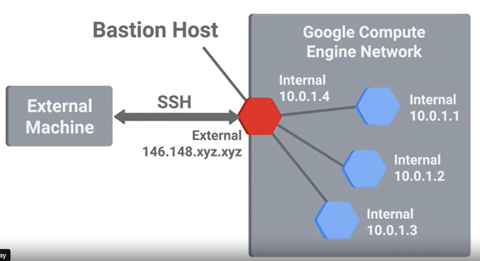
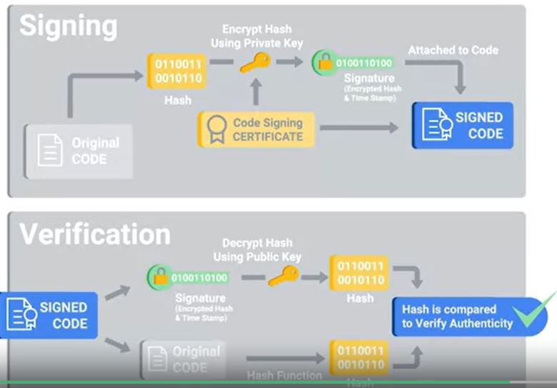
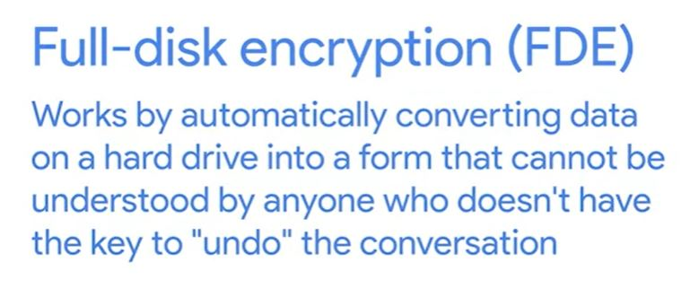
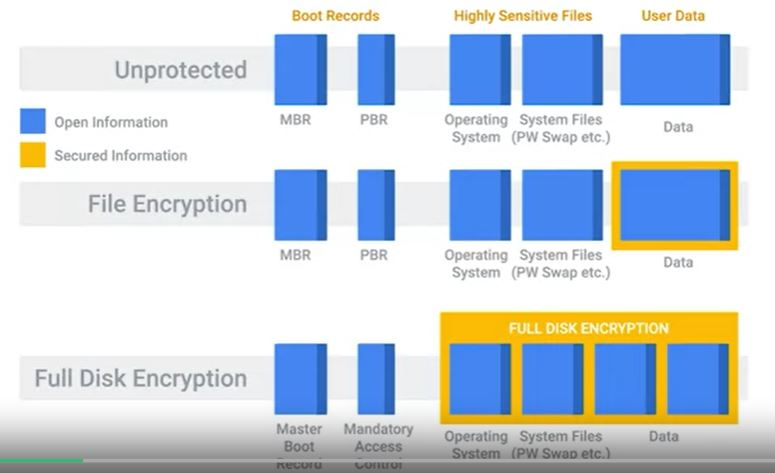

# WEEK 5 NOTES

## System Hardening

* Defense in depth is the concept of having multiple overlapping systems of defense to protect IT systems. 

*  An **attack vector** is a method or mechanism by which an attacker or malware gains access to a network or system.

* An **Attack Surface** is the sum of all the different attack vectors in a given system.

* *The less complex something is, the less likely there will be undetected flaws.*

* Another way to keep things simple is to reduce your software deployments.

* *Telnet access for a managed switch* has no business being enabled in a real-world environment. You should disable it immediately if you find it on the device. 

* Host-based firewalls are important to creating multiple layers of security. They protect individual hosts from being compromised when they're used in untrusted and potentially malicious environments.

* A host-based firewall plays a big part in reducing what's accessible to an outside attacker. 

  

* If the users of the system have administrator rights, then they have the ability to change firewall rules and configurations. 

* **Security information and event management systems** or **SIEMS** come can be thought of as a centralized log server. It has some extra analysis features too.

* An important step in logs analysis is **normalization**. This is the process of taking log data in different formats and converting it into a standardized format that's consistent with a defined log structure. 

* Once logs are centralized and standardized, you can write automated alerting based on rules.

* Some examples of logging servers and SIEMS solutions are the open source **rsylog**, **Splunk Enterprise Security**, **IBM Security Qradar**, and **RSA Security analytics**.

* Lots of unprotected systems would be compromised in a matter of minutes if directly connected to the internet without any safeguards or protections in place.

* Antivirus software will monitor and analyze things like new files being created or being modified on the system in order to watch for any behavior that matches a known malware signature. I

* Antiviruses protects against the most common attacks out there on the internet. 

* Antivirus software is just one piece of our anti malware defenses. 

* Binary whitelisting software operates off a white list. It's a list of known good and trusted software and only things that are on the list are permitted to run. Everything else is blocked. 

  

  

  

* Secure boot protocol, which is part of the UEFI specification. Secure boot uses public key cryptography to secure these encrypted elements of the boot process. It does this by integrated code signing and verification of the boot files. 

* There are first-party full-disk encryption solutions from Microsoft and Apple called **Bit Locker** and **FileVault 2** respectively. There are also a bunch of third party and open source solutions. On Linux, the **dm-crypt** package is super popular. There are also solutions from **PGP**, **TrueCrypt**, **VeraCrypt**, and lots of others.

* When you implement a full-disk encryption solution at scale, it's super important to think about how to handle cases where passwords are forgotten. 

* **Key escrow** allows encryption key to be securely stored for later retrieval by an authorized party.

* Home directory or file-based encryption only guarantees confidentiality and integrity of files protected by encryption.

* Solutions like **Microsoft's SCCM** or **Puppet Labs** in fact and tools allow administrators to get an overview of what software is installed across their fleet of many systems.

## Application Hardening

* Critical infrastructure devices should be approached carefully when you apply updates. There's always the risk that a software update will introduce a new bug that may affect the functionality of a device,

* A common recommendation or even a requirement is to only support or require the latest version of a piece of software. 

* It's generally a good idea to disallow risky classes of software by policy. Things like file sharing software and piracy-related software tend to be closely associated with malware infections. 

* Understanding what your users need to do their jobs will help shape your approach to software policies and guidelines.

* Helping your users accomplish tasks by recommending or supporting specific software makes for a more secure environment. 

* Extensions that require full access to web sites visited can be risky since the extension developer has the power to modify pages visited. 

