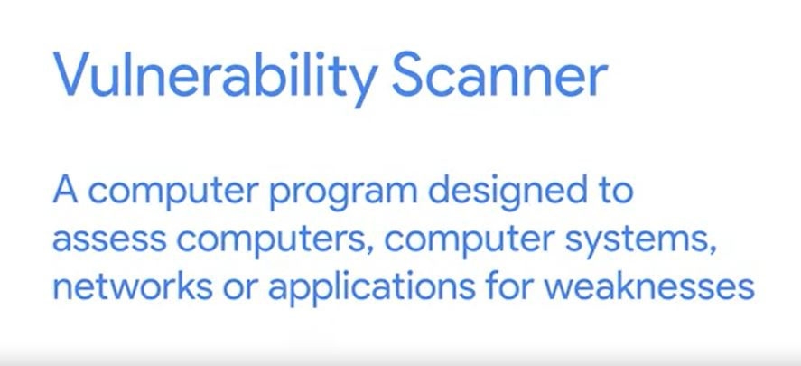
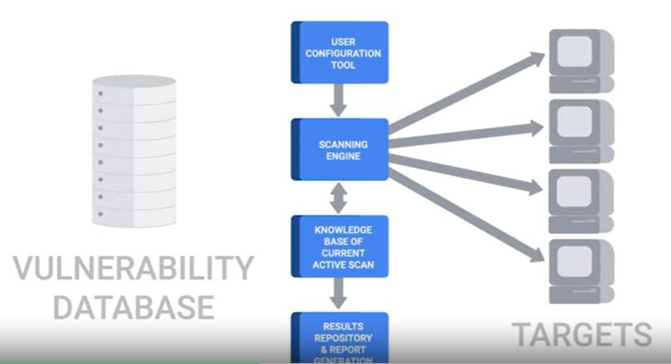

# WEEK 6 NOTES

## Risk in the Workplace

* If your company handles credit card payments, then you have to follow the PCI DSS or Payment Card Industry Data Security Standard depending on local laws.

### PCI DSS is broken into six broad objectives, each with some requirements. 
1. The first objective is to build and maintain a secure network and systems
2. The second objective category is to protect cardholder data. 
3. The third objective is to maintain a vulnerability management program. 
4. The fourth objective is to implement strong access control measures. 
5. The fifth objective is to regularly monitor and test networks. 
6. The sixth and final objective is to maintain an information security policy. 

* **Security** is all about determining risks or exposure understanding the likelihood of attacks; and designing defenses around these risks to minimize the impact of an attack. 

### *Security risk assessment starts with threat modeling*. 
* First, we identify likely threats to our systems, 
* then we assign them priorities that correspond to severity and probability.

*  High-value data usually includes account information, like usernames and passwords. Typically, any kind of user data is considered high value, especially if payment processing is involved.

  

There are lots of open source and commercial solutions: Nessus, OpenVas and Qualys.

  

* **Penetration Testing** is the practice of attempting to break into a system or network to verify the systems in place.

* Privacy policies oversee the access and use of sensitive data.

* It's good practice to apply the principle of least privilege here, by not allowing access to this type of data by default. 

* Any access that doesn't have a corresponding request should be flagged as a high-priority potential breach that needs to be investigated as soon as possible. 

## Users

* Data handling policies should cover the details of how different data is classified. 

* Once different data classes are defined, you should create guidelines around how to handle these different types of data.

* You can build the world's best security systems, but they won't protect you if the users are going to be practicing unsafe security. 

* You should never upload confidential information onto a third-party service that hasn't been evaluated by your company.

* It's important to make sure employees use new and unique passwords, and don't reuse them from other services. 

* A much greater risk in the workplace that users should be educated on is credential theft from phishing emails. 

* If someone entered their password into a phishing site or even suspects they did, it's important to change their password as soon as possible. 

* If they have sub par security, you're undermining your security defenses by potentially opening a new avenue of attack. 

* If you can, ask for a third party security assessment report. 

* Vendor Security Assessment Questionnaires: https://vsaq-demo.withgoogle.com/

* Helping others keep security in mind will help decrease the security burdens you'll have as an I.T. Support Specialist. 

## Incident Handling

* The very first step of handling an incident is to detect it in the first place. 
* The next step is to analyze it and determine the effects and scope of damage.
* Once the scope of the incident is determined, the next step is containment.

* If an account was compromised, change the password immediately. If the owner is unable to change the password right away, then lock the account. *

*  Severity includes factors like what and how many systems were compromised and how the breach affects business functions.

* The impact of an incident is also an important issue to consider. 

* Data exfiltration, is the unauthorized transfer of data from a computer. It's also a very important concern when a security incident happens. 

* **The recoverability** is how complicated and time-consuming the recovery effort will be. 

* Update firewall rules and ACLs if an exposure was discovered in the course of the investigation.

* Create new definitions and rules for intrusion detections systems that can watch for the signs of the same attack again.